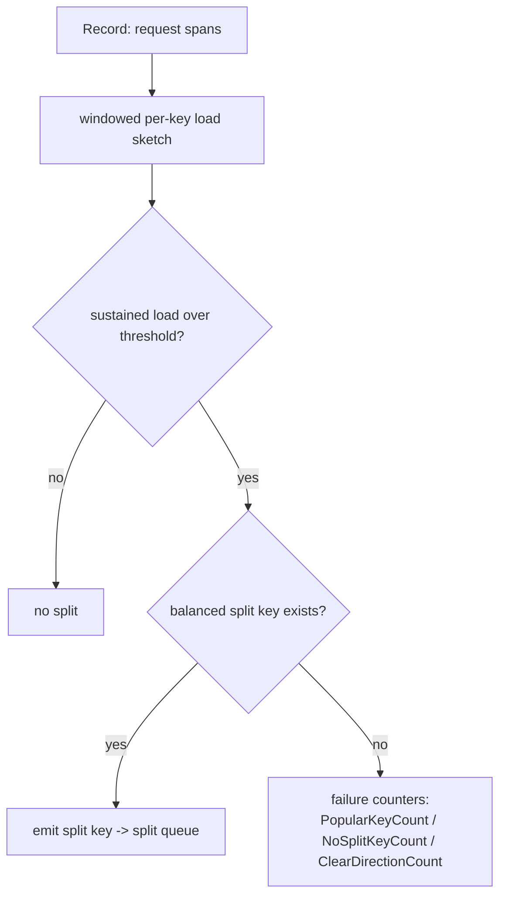

# CockroachDB rebalancing: ranges that split where the load is

CockroachDB is the production counter-design to Redis Cluster's fixed 16384 hash slots
(see [reading-redis-cluster.md](reading-redis-cluster.md)): the keyspace is one big sorted map,
chopped into contiguous **ranges** (~512 MB each, every range a Raft group — topics 15/21), and
the range boundaries *move*. Ranges split when they get too big **or too hot**, merge back when
they get small and cold, and get shuffled between stores by a two-level placement machine
(per-range **allocator** + store-level **rebalancer**). This guide walks the code that makes
those four decisions, in `~/repos/cockroach/pkg` at the SHA in the topic's pin table; every
`file:line` below was checked against that pinned tree this session.

The payoff for topic 36 is the hot-key story. Lane 1's Zipf experiment showed hashing's dead
end: with Zipf(1.0) on 16 hash shards, the hottest shard takes 14.7% of traffic (2.4× its fair
share) and no re-hashing can split a single key's load. Range partitioning *can* split between
keys — and CockroachDB's `Decider` even keeps honest counters for the moment that stops working,
when one key IS the load. This complements the topic headline (FINDINGS row 36): mod-N's 94.1%
remap on a 16→17 grow is the *placement* disaster; the Zipf hot key is the *load* disaster, and
ranges address both.

## The problem in one sentence

**Static partitioning of a skewed, shifting workload leaves some shards overloaded and others
idle; CockroachDB instead treats partition boundaries and replica placement as continuously
re-optimized outputs of observed size and load.**

Every mechanism below is a feedback loop: measure a range (bytes, QPS, CPU) or a store (aggregate
load), compare to a threshold, and emit a cheap corrective action — split, merge, lease transfer,
replica move — ordered from cheapest to most expensive.

## The concepts, step by step

### Step 1 — Range partitioning: contiguous spans you can cut anywhere

> **In:** the mod-N / hash-slot world where a key's bucket is a fixed function of its hash.
> **Out:** the **range** — a span between two boundary keys, cuttable at *any* key — which is the
> structural precondition for load-based splits (Steps 3–4) that hashing cannot do.

A **range** is the contiguous span of the sorted keyspace between two boundary keys; it is the
unit of replication (one Raft group) and placement. Hashing scatters adjacent keys to fixed
buckets; ranges keep them together, so a split is just "pick a key in the middle, write two
descriptors." The default size band is in `pkg/config/zonepb/zone.go`:

```go
// pkg/config/zonepb/zone.go:256-257 — default range size band (DefaultZoneConfig)
256  RangeMinBytes: proto.Int64(128 << 20), // 128 MB
257  RangeMaxBytes: proto.Int64(512 << 20), // 512 MB
```

```text
  Hash slots (redis):  key --CRC16--> slot 0..16383   (boundaries FIXED)
      [s0][s1][s2] ... [s16383]      hot key -> hot slot, cannot subdivide

  Ranges (cockroach):  sorted keyspace, boundaries MOVABLE
      |----r1----|--r2--|-------r3-------|-r4-|
      a          f      k                s    z
                        ^ hot? split r3 at any key between k and s
```

Because a range is a Raft group, a split is metadata-cheap: allocate a new range ID, new
descriptor, new Raft group at the boundary key. No data is copied at split time — that expense is
deferred to rebalancing (Step 7).

### Step 2 — Size-based splits: the split queue

> **In:** the range from Step 1, growing as writes accumulate.
> **Out:** the `splitQueue` size trigger — the boring baseline that keeps snapshots and Raft logs
> bounded regardless of load, and the frame into which Steps 3–4 bolt the *load* trigger.

The **split queue** is a per-store background queue that scans replicas and decides which to
split. Its `shouldQueue` (`split_queue.go:194`) asks `shouldSplitRange` (`split_queue.go:145`):
does the range exceed `RangeMaxBytes` for its zone, or does the load-split machinery (Steps 3–4)
say split? Size splits keep snapshots, backups, and Raft log truncation bounded; they are the
baseline that runs regardless of load.

### Step 3 — Load-based splits: from QPS to CPU as the signal

> **In:** the size-only trigger of Step 2, blind to heat (a 64 MB range can saturate a core).
> **Out:** the two "too hot" thresholds — QPS (legacy) and CPU (default) — that turn observed
> *load*, not bytes, into a split candidate; Step 4 then decides *where* to cut.

Size says nothing about heat. Two cluster settings in `replica_split_load.go` define "too hot"
— **QPS** (queries per second, the legacy signal) and **CPU** (attributed CPU-seconds per wall
second, the current default):

```go
// pkg/kv/kvserver/replica_split_load.go:34-56 — the two "too hot" thresholds
34   var SplitByLoadQPSThreshold = settings.RegisterIntSetting(
36       "kv.range_split.load_qps_threshold",
38       2500, // 2500 req/s
52   var SplitByLoadCPUThreshold = settings.RegisterDurationSetting(
54       "kv.range_split.load_cpu_threshold",
56       500 * time.Millisecond,
```

CPU became the default objective: 500 ms of attributed CPU per second of wall time, i.e. half a
core per range. The comment block (`replica_split_load.go:41-51`) explains the number: attributed
CPU is roughly one third of "real" usage (real ≈ 3× attributed), so in steady state at most
~cores/1.5 load splits happen per node; the value was tuned by running kv(0|95) and allocbench
and picking the best-performing threshold (issue #96869). QPS is a poor proxy — one query can be
a point read or a full scan — while CPU is the resource that actually saturates.

### Step 4 — The Decider: WHERE to split, and when no key helps

> **In:** the "this range is too hot" verdict from Step 3.
> **Out:** either a balanced split *key*, or one of three honest failure counters — the explicit
> detection of the Zipf single-hot-key case that partitioning provably cannot fix.

Crossing the threshold answers "should we split?" but not "where?" — the median of the *key
distribution* is useless if 99% of requests hit one end. **`Decider`** (`split/decider.go:155`)
holds per-replica load-split state: every request span is fed into a windowed per-key load sketch
via `Record` (`decider.go:222`, plus `RecordMax` at `:329`), and the Decider searches for a key
with ~half the observed load on each side.



The failure counters are the honest part — the `LoadSplitterMetrics` struct at
`decider.go:146-149`, incremented deep in the finder:

- **PopularKeyCount** (`decider.go:147`, incremented at `:293`) — a single key dominates; every
  candidate boundary leaves the load on one side. Splitting *cannot* help. This is the Zipf
  hot-key lesson surviving into range partitioning: when one key stands alone, the remaining tools
  are replication (spread reads) and admission control (topic 35), not partitioning.
- **NoSplitKeyCount** (`decider.go:148`, incremented at `:308`) — no balanced boundary found
  (e.g. spans straddle every candidate).
- **ClearDirectionCount** (`decider.go:149`, incremented at `:300`) — load is a moving scan front
  (sequential ingest); the "hot half" keeps shifting, so a split would go stale immediately.

### Step 5 — The merge queue: splits must be undoable

> **In:** the accumulated splits from Steps 2–4, some now stale (table shrank, spike passed).
> **Out:** the `mergeQueue` reverse gear, whose criteria mirror the split thresholds so the two
> queues can't oscillate.

Without merges, splits are a one-way ratchet: a table that shrank, or a load spike that passed,
leaves behind tiny ranges whose fixed overhead (Raft heartbeats, replica metadata, queue
scanning) accumulates forever. **`mergeQueue.shouldQueue`** (`merge_queue.go:138`) finds a range
that is small and cold, checks its *right neighbor*, and merges the pair back if the combined
range would not immediately re-split on size or load. Note the symmetry: merge criteria mirror
split criteria (with hysteresis), so the two queues don't fight.

### Step 6 — Allocator vs store rebalancer: two levels of placement

> **In:** ranges that exist and are sized (Steps 1–5) but may be mis-*placed* across stores.
> **Out:** the two-scope placement machine — a per-range **allocator** and a per-store
> **rebalancer** — and its cheapest-first ordering (lease transfer before replica move).

Placement decisions are split across two components with different scopes. The **allocator** asks
"is THIS range healthy?"; the **store rebalancer** asks "is THIS store overloaded?":

```text
  per-RANGE view                          per-STORE view
  ┌─────────────────────────┐            ┌──────────────────────────────┐
  │ Allocator               │            │ StoreRebalancer              │
  │ "is THIS range ok?"     │            │ "is THIS STORE overloaded?"  │
  │ AllocatorAction:        │            │ compare store loads;         │
  │  add / remove /         │            │  1) transfer LEASES (cheap)  │
  │  replace / rebalance    │            │  2) move replicas (snapshots)│
  │  replica, move lease    │            └──────────────────────────────┘
  └─────────────────────────┘
   fixes under-replication,               fixes aggregate imbalance the
   zone-config violations                 per-range view cannot see
```

The allocator's decision enum is `AllocatorAction`
(`allocator/allocatorimpl/allocator.go:125-127`); it repairs individual ranges (under-replicated,
wrong locality, dead store). **`StoreRebalancer`** (`store_rebalancer.go:114`; `RebalanceMode` at
`:218`) is a separate store-level loop. Its struct doc comment (`store_rebalancer.go:104-113`)
makes the key point — it is deliberately *not* a Queue, because Queues decide one replica at a
time and can't see how a replica compares to others on the store, whereas the goal here is
*store-level* balance. The phrase "motivated by store-level load imbalances" that names this loop's
work is the `Help` string on its two metrics — `rebalancing.lease.transfers`
(`store_rebalancer.go:32`) and `rebalancing.range.rebalances` (`store_rebalancer.go:41`).

It sheds load from hot stores to cold ones **lease-first**: the `rebalanceStore` doc comment
(`store_rebalancer.go:373-377`) and its numbered phases (`store_rebalancer.go:389-395`) spell out
the order — Phase (1) search for lease-transfer targets for the hottest leases; only after it runs
out of leases to transfer (Phase (2)) does it move replicas. Moving a lease shifts read and
coordination load instantly without copying a byte; moving a replica streams a snapshot.

### Step 7 — Rebalancing is itself load

> **In:** the "move a replica" action of Step 6, the expensive branch.
> **Out:** the pacing/admission-control constraint that keeps migration traffic a
> background-priority tenant — the reason a rebalancer doesn't turn imbalance into an outage.

Moving a replica means streaming a snapshot of up to ~512 MB into the target store — real disk and
network work competing with foreground queries. Snapshots are paced and throttled, and snapshot
*ingestion* is governed by the same admission-control machinery (topic 35's `io_load_listener`)
that protects foreground writes from LSM overload. The general lesson: a rebalancer without pacing
converts "imbalance" into "outage" — migration traffic must be a background-priority tenant of the
system it is healing.

### Step 8 — What M36 copies

> **In:** the four decisions traced in Steps 2–7.
> **Out:** the four design rules the M36 capstone borrows — the shape, not the Go code.

The capstone milestone borrows the shape, not the code: (1) split on a measured signal with a
threshold + hysteresis, not on key count; (2) pick the split point from observed request load, and
detect the one-hot-key case explicitly (a `PopularKeyCount`-style counter) instead of splitting
uselessly; (3) make merges mirror splits so they don't oscillate; (4) do the cheap rebalancing
action (ownership/lease move) before the expensive one (data move), and throttle the expensive one.

## Where each step lives in the code

All paths relative to `~/repos/cockroach/pkg`.

| Step | Anchor | What to read |
|---|---|---|
| 1 | `config/zonepb/zone.go:256-257` | `RangeMinBytes` (128 MB) / `RangeMaxBytes` (512 MB) defaults |
| 2 | `kv/kvserver/split_queue.go:145,:194` | `shouldSplitRange`, `splitQueue.shouldQueue` |
| 3 | `kv/kvserver/replica_split_load.go:34,:52` | QPS (2500) and CPU (500 ms) thresholds; comment `:41-51` on why 500 ms |
| 4 | `kv/kvserver/split/decider.go:146-149,:155,:222,:329` | `LoadSplitterMetrics`, `Decider`, `Record`, `RecordMax`; increments at `:293/:300/:308` |
| 5 | `kv/kvserver/merge_queue.go:138` | `mergeQueue.shouldQueue` |
| 6 | `kv/kvserver/allocator/allocatorimpl/allocator.go:125-127` | `AllocatorAction` enum |
| 6 | `kv/kvserver/store_rebalancer.go:104-113,:114,:218` | `StoreRebalancer` doc + struct, `RebalanceMode` |
| 6 | `kv/kvserver/store_rebalancer.go:32,:41,:373-377,:389-395` | metric `Help` strings; lease-first phase ordering in `rebalanceStore` |

## Questions to answer in notes.md

1. `SplitByLoadCPUThreshold` defaults to 500 ms of attributed CPU per second. Per the comment at
   `replica_split_load.go:41-51`, why does that imply at most ~cores/1.5 load splits per node, and
   what workloads was the value tuned against?
2. Walk `splitQueue.shouldQueue` (`split_queue.go:194`): how are the size trigger and the load
   trigger combined, and which produces the split *key* in each case?
3. The Decider increments `PopularKeyCount` (`decider.go:293`) vs `NoSplitKeyCount` (`:308`) vs
   `ClearDirectionCount` (`:300`) in different situations. Give a concrete workload that triggers
   each, and say what the operator's correct response is for each.
4. In `mergeQueue.shouldQueue` (`merge_queue.go:138`), what conditions must hold on the range and
   its right neighbor before a merge is attempted, and how do they mirror the split thresholds so
   split/merge don't oscillate?
5. Why does the `StoreRebalancer` try lease transfers before replica moves? Using the phase list
   at `store_rebalancer.go:389-395`, list what a lease transfer shifts versus what a replica
   rebalance costs.

## Done when

Answer each before unfolding it.

- [ ] You can explain why range partitioning can absorb a Zipf hot *span* but not a single hot
      key, and name the Decider counter that reports the latter.

  <details><summary>Answer</summary>

  Range partitioning cuts the keyspace at *any* key, so a hot *span* (many adjacent hot keys) can
  be divided until each piece fits a store — the Decider finds a boundary with ~half the load on
  each side and emits it. A single hot *key* has no such boundary: every candidate split leaves the
  key (and thus almost all the load) wholly on one side, so splitting cannot reduce the hottest
  range's load. The Decider reports exactly this as **`PopularKeyCount`** (`decider.go:147`,
  incremented at `:293`). The remaining tools are then replication (spread reads across replicas)
  and admission control (topic 35), not partitioning — the Zipf(1.0) 14.7%-hottest-shard result
  from lane 1 surviving into range-land.

  </details>

- [ ] You can trace one split end to end: threshold check in `shouldQueue` → split key from the
      Decider → new range descriptor / Raft group.

  <details><summary>Answer</summary>

  `splitQueue.shouldQueue` (`split_queue.go:194`) calls `shouldSplitRange` (`:145`), which returns
  true if the range exceeds its zone's `RangeMaxBytes` (`zone.go:257`) *or* the load-split
  machinery says so. For a load split, the `Decider` (`decider.go:155`) has been fed request spans
  via `Record` (`:222`); once sustained load clears `SplitByLoadCPUThreshold`
  (`replica_split_load.go:52`) it searches its per-key sketch for a balanced boundary and, if one
  exists, emits that key. The split queue then executes an `AdminSplit` at that key: allocate a new
  range ID and descriptor and start a new Raft group at the boundary — metadata only, no data copy
  (that cost is deferred to rebalancing, Step 7).

  </details>

- [ ] You can state the division of labor between `AllocatorAction` and `StoreRebalancer`, and why
      leases move before replicas.

  <details><summary>Answer</summary>

  `AllocatorAction` (`allocator.go:125-127`) is the *per-range* view: for one range it recommends
  add / remove / replace / rebalance a replica or move the lease, fixing under-replication and
  zone-config violations. `StoreRebalancer` (`store_rebalancer.go:114`) is the *per-store* view:
  it compares aggregate store loads and sheds load from overloaded stores — a scope the per-range
  allocator cannot see, which is why it is deliberately not a Queue (`:104-113`).

  Leases move before replicas because a lease transfer shifts read and coordination load *instantly
  and byte-free*, whereas a replica move streams a snapshot (up to ~512 MB). `rebalanceStore`
  (`store_rebalancer.go:373-377`, phases at `:389-395`) does Phase (1) lease transfers for the
  hottest leases and only falls through to Phase (2) replica rebalances when leases can no longer
  rebalance the store — cheapest corrective action first.

  </details>

- [ ] All 5 questions above are answered in `notes.md` with file:line citations.

  <details><summary>Answer</summary>

  Done when `notes.md` records your worked answers to all five questions, each anchored to a real
  `file:line` from the "Where each step lives" table (the thresholds in `replica_split_load.go`,
  the three Decider counters and their increment sites, the merge symmetry in `merge_queue.go`, and
  the lease-first phases in `store_rebalancer.go`), cross-checked against the pinned tree with
  `tools/pinned-source.py show cockroach <path>`.

  </details>

## References

- Source: `~/repos/cockroach/pkg/kv/kvserver/` — `split_queue.go`, `merge_queue.go`,
  `replica_split_load.go`, `split/decider.go`, `store_rebalancer.go`,
  `allocator/allocatorimpl/allocator.go`; `~/repos/cockroach/pkg/config/zonepb/zone.go` (pinned
  SHA in the topic's `resources/codebases.md` pin table).
- [Topic 36 README](README.md) — lane-1 Zipf numbers, milestone M36.
- [reading-redis-cluster.md](reading-redis-cluster.md) — the contrasting design: fixed hash slots
  with manual resharding vs dynamic ranges.
- Topic 35 — admission control (`io_load_listener`) governing snapshot ingestion; topics 15/21 —
  Raft: every range is a Raft group.
