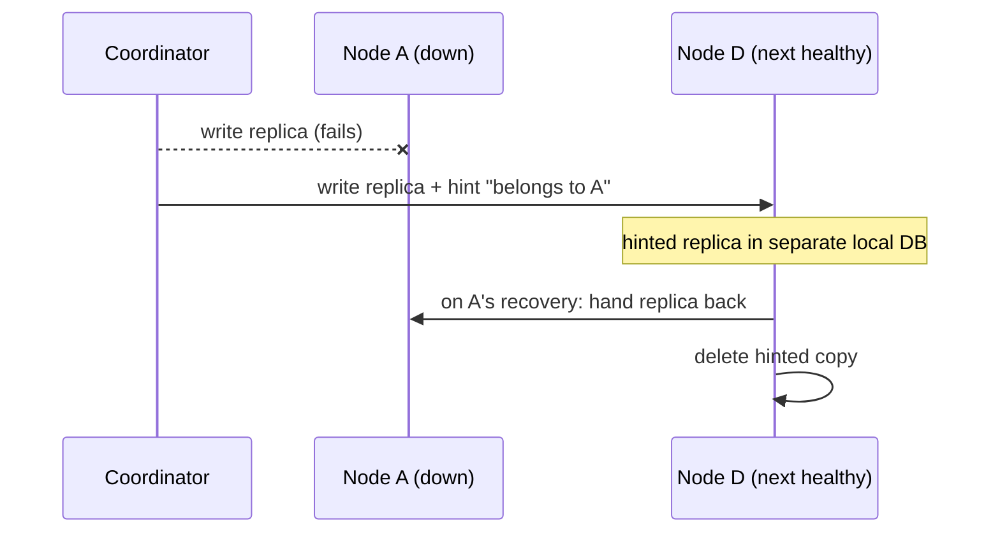

# Dynamo: the ring that taught everyone consistent hashing — and then outgrew it

Dynamo (DeCandia et al., SOSP 2007) is the paper that made consistent hashing the default answer to "how do I shard a key-value store?" — and, less famously, the paper that documented why the textbook version of consistent hashing failed in production and had to be replaced. Amazon built Dynamo around 99.9th-percentile SLAs (a typical one: 99.9% of requests within 300 ms, §2.2), which forced a "zero-hop DHT" design: every node knows enough routing state to reach the right node directly, because multi-hop routing à la Chord/Pastry adds latency variability exactly at the percentiles the SLA measures.

For this topic, read the paper as a partitioning-and-rebalancing story. The ring, virtual nodes, and especially the strategy 1 → 2 → 3 evolution in §6.2 are the main plot — that evolution ends at "fixed equal partitions, moved as whole files", which is the same destination Redis Cluster hard-coded as 16384 slots (see [reading-redis-cluster.md](reading-redis-cluster.md)) and the destination the capstone's M36 milestone copies. Vector clocks, quorums, and hinted handoff are supporting cast here; each gets one step, with topic 21 as the deeper home for replication.

Every section, figure and table cited below is from the SOSP 2007 paper as text-extracted this session; the numbers were checked against it rather than repeated from memory.

## The problem in one sentence

**How do you spread keys over a fleet where nodes constantly join, leave, and fail — moving as little data as possible each time, keeping every node's load near the mean, and never refusing a write?**

Dynamo's answer has two layers that the paper initially conflated and later separated: *partitioning* (how the key space is cut into ranges) and *placement* (which physical node stores each range). The famous ring answers both at once; the production lessons show why answering them together was a mistake.

## The concepts, step by step

### Step 1 — Hash mod N, and why "keys moved" is the metric

> **In:** nothing yet — this step fixes the metric (keys moved on growth) that judges every scheme in the paper.
> **Out:** the exact movement fraction `N/(N+1)`, worked on real N, and the reason it, not balance, is what killed the naive scheme. Step 2 spends the rest of the paper beating it.

A **shard** (or partition) is the subset of the key space one node is responsible for. The naive scheme assigns each key to a node with `node = hash(key) mod N`, where `N` is the node count: it balances load perfectly and routes in **zero hops** (the client computes the owner directly, no lookup). Its fatal flaw is **rebalancing cost** — the data that must physically move when the cluster changes size. Change `N` and almost every key is remapped.

Work the fraction exactly, because it is this topic's headline number ([FINDINGS.md](../../FINDINGS.md) row 36) and the reason the rest of the field exists. Growing from `N` to `N+1` nodes, a key `k` *stays put* only if it hashes to the same node under both moduli:

```
key k stays  ⇔  (k mod N) == (k mod (N+1))

N and N+1 are coprime, so by the Chinese Remainder Theorem the pair
(k mod N, k mod N+1) is fixed by k mod N(N+1). Equality forces both
residues to a common value r, and a residue mod N lives in 0..N−1,
so r ∈ {0, 1, …, N−1}: exactly N of the N(N+1) residues keep the key.

fraction that STAY = N / (N(N+1)) = 1/(N+1)
fraction that MOVE = 1 − 1/(N+1) = N/(N+1)
```

Run it on the sizes the bench measures (lane 1), and against consistent hashing's mirror-image cost of `1/(N+1)` (only the arcs the new node claims change hands — Step 2):

```
N → N+1     mod-N moves = N/(N+1)      ring moves = 1/(N+1)
 4 →  5       4/5   = 80.0%              1/5  = 20.0%
 8 →  9       8/9   = 88.9%              1/9  = 11.1%
16 → 17      16/17  = 94.117…% ≈ 94.1%   1/17 = 5.882…% ≈ 5.9%
```

Two facts fall out of the arithmetic. First, the two schemes are exact mirror images: mod-N moves `N/(N+1)`, the ring moves `1/(N+1)`. Second, mod-N gets *worse* as you grow — `N/(N+1) → 1` — so the scheme is most wasteful exactly when a large, busy cluster reshards. The experiments measured 80.0% at 4→5 and 94.1% at 16→17, matching the closed form to the digit.

Why it matters: every key moved is a disk read, a network transfer, a cache invalidation, and — per topic 35 — load added to a cluster that is probably being expanded *because* it is already overloaded. Dynamo's §2.3 design principles make the requirement explicit: incremental scalability (add one node with minimal impact), symmetry (no distinguished nodes), decentralization, and heterogeneity (work proportional to node capacity). Hash mod N fails the first outright.

| Scheme | Keys moved growing N→N+1 | Balance | Heterogeneity-aware |
|---|---|---|---|
| hash mod N | N/(N+1) — 80.0% measured at 4→5 | perfect | no |
| consistent hashing, 1 token/node | 1/(N+1) | poor (random arcs) | no |
| consistent hashing + vnodes | 1/(N+1), spread over all donors | good | yes (token count ∝ capacity) |

Keep Table 1 of the paper at hand while reading — it maps each problem to its technique and the advantage bought: partitioning → consistent hashing → incremental scalability; high write availability → vector clocks with read-time reconciliation; temporary failures → sloppy quorum + hinted handoff; permanent failures → anti-entropy with Merkle trees; membership and failure detection → gossip. This guide walks that table top to bottom.

### Step 2 — The consistent-hashing ring and virtual nodes

> **In:** the movement metric from Step 1, and the `1/(N+1)` target it set.
> **Out:** the ring that hits that target, plus the **token/virtual-node** vocabulary Steps 6–7 later split apart. This is the data structure everything else sits on.

**Consistent hashing** (Karger et al., STOC'97) treats the output range of the hash function as a fixed circular ring. Dynamo (§4.2) hashes each key to a 128-bit identifier with MD5 (§4.1) and stores it at the first node encountered walking **clockwise** from that point. Each node sits at a random ring position. A node's arrival or departure now affects only its immediate neighbor's arc — the `1/(N+1)` movement Step 1 wanted.

```
        hash ring (128-bit MD5 space, wraps around)

                 ┌── A ──┐
             ┌───┘       └───┐
             │      key k    │        key k hashes here,
             D       ●───────┼──────▶ walks clockwise,
             │               B        lands on node B
             └───┐       ┌───┘
                 └── C ──┘

   remove B → only keys in (A, B] move (to C); A, C, D keep everything else
```

Two problems remain with one position per node. Random positions produce arcs of very different sizes, so load is non-uniform; and a big machine and a small one get statistically identical arcs, ignoring heterogeneity. The fix is **virtual nodes**: each physical node claims *multiple* ring positions. Each such position is a **token** — a single point a node owns on the ring. Benefits per §4.2: when a node dies its load disperses evenly across all survivors (each inherits a few small arcs, not one big one); a joining node accepts roughly equal load from every existing node; and a node's token count can be set proportional to its capacity.

Note what a token *is* at this stage, because it changes later: in the original design a token is **both** a partition boundary (where one range ends and the next begins) **and** an ownership claim (who holds that range). Holding that dual role in mind now makes the strategy 1 post-mortem (Step 6) read as inevitable rather than surprising.

### Step 3 — Preference lists and N/R/W quorums (supporting cast)

> **In:** the ring and tokens from Step 2.
> **Out:** the **preference list** (which N nodes replicate a key) and the R/W numbers that read/write it. Step 4 makes this fault-tolerant; Step 5 repairs it after the fact.

Each key is replicated at **N** hosts (§4.3): the **coordinator** (the node handling the request) stores it locally and forwards to the N−1 clockwise successors. That ordered node list is the key's **preference list**. It is built by *skipping* ring positions so that it names N distinct *physical* nodes — two virtual nodes of the same machine must not count as two replicas (§4.2, "distinct physical nodes") — and it holds more than N entries so failures can be walked past. The interface above all this is minimal (§4.1): `get(key)` and `put(key, context, object)`, where the opaque `context` carries version metadata.

Reads and writes use **quorums** (§4.5) — the rule that an operation must touch enough replicas to overlap with other operations. **R** is how many replicas must answer a read, **W** how many must acknowledge a write; setting **R + W > N** guarantees any read's replica set overlaps any write's, giving quorum-like consistency. Operation latency is set by the *slowest* of the R (or W) replicas contacted, so both are usually kept below N. The common production configuration (§6) is **(N, R, W) = (3, 2, 2)**, chosen to balance performance, durability, consistency, and availability; a write coordinator writes locally and sends to the N highest-ranked reachable nodes, succeeding after W−1 further responses.

Concurrent versions are tracked with **vector clocks** (§4.4) — a list of `(node, counter)` pairs stamped on each object version, recording which nodes have updated it. When one clock dominates another (every counter ≥), reconciliation is syntactic and automatic; when two clocks are *concurrent* (neither dominates), the application merges semantically. The shopping cart takes the union of divergent carts, because "add to cart" must never be rejected — the known cost is that a deleted item can occasionally resurface after a merge. Clocks are truncated once they exceed a **threshold** (say 10 pairs, §4.4) by evicting the pair with the oldest timestamp; the paper reports this never caused a production issue. Depth on quorums and versioning lives in topic 21.

### Step 4 — Sloppy quorum and hinted handoff (supporting cast)

> **In:** the preference list and R/W quorum from Step 3.
> **Out:** the rule that a *temporary* node failure never moves data — only membership changes do. That invariant is what Steps 6–7 are protecting.

A strict quorum over a key's home replicas would be unavailable whenever those specific nodes are down — unacceptable for a store where "add to cart" must never be rejected. A **sloppy quorum** (§4.6) instead takes the first N *healthy* nodes found walking the ring, which need not be the key's usual home. If home node A is down, the write lands on the next healthy node D carrying a **hint** — a tag on the replica naming its true owner A. This is **hinted handoff**: D stores the hinted replica in a separate local database, scans it periodically, delivers it back to A when A recovers, and then deletes its copy.



The partitioning-relevant point: hints keep the durability count at N without changing the ring, so *temporary* failures never trigger rebalancing. Only membership changes move data — the whole cost model of Step 1 applies only to real joins and leaves, not to transient outages.

Two knobs deserve a note. Setting **W = 1** gives maximum write availability — a write succeeds as long as any single node in the walk is up (at the cost of durability). And because preference lists are constructed to span multiple data centers, the same walk-the-ring rule that survives a dead node also survives a dead data center, with no separate mechanism.

### Step 5 — Merkle anti-entropy, and its coupling to partitioning

> **In:** the replicas from Steps 3–4, which can silently diverge (a hint lost before delivery, a missed write).
> **Out:** the repair mechanism — and the observation that it is *keyed to ranges*, which is the first of three threads pushing toward fixed partitions (Step 7).

Hinted replicas can be lost before delivery, so Dynamo also runs **anti-entropy** (§4.7) — a background process that compares two replicas and repairs divergence. It does so with a **Merkle tree**: a tree of hashes whose leaves hash individual keys' values and whose internal nodes hash their children, so two replicas can find their differences by exchanging only a few hashes. Each node keeps one Merkle tree **per key range** (per virtual node). Two replicas exchange the root for a shared range and descend only into subtrees whose hashes differ — minimizing both bytes transferred and disk reads.

```
        range root                 compare roots: differ → descend
        /        \                 compare children: left equal → prune
   h(left half)  h(right half)     right differs → descend
                  /       \
             h(k5..k6)  h(k7..k8)  → only ship the keys under
                            ▲        the mismatched leaf
                        mismatch
```

The stated disadvantage matters for this topic: a node join or leave *changes the key ranges*, which invalidates and forces recalculation of the Merkle trees on many nodes. This is the first thread of the argument that ranges should be fixed — strategy 3 (Step 7) resolves it. Membership itself is **gossip-based** (§4.8–4.9): every node reconciles its membership history with a random peer each second, seed nodes prevent a logically partitioned ring, and failure detection is purely local (A considers B failed if B stops answering A, no distributed agreement).

### Step 6 — Strategy 1: tokens as boundaries, and what broke in production

> **In:** the original ring of Step 2, where a token is both boundary and ownership.
> **Out:** three named production failures and their single root cause — "partitioning and placement are intertwined". Step 7 is the fix for exactly this.

**Strategy 1** is the original design (§6.2, and §4.2): T random tokens per node, and the partition boundaries *are* the token values. Ranges therefore vary in size and change whenever any node joins or leaves. §6.2 lists what this did in production:

| Problem | Mechanism |
|---|---|
| Bootstrapping a node took "almost a day" during the busy holiday season | A new node "steals" key ranges; donors must *scan their local persistence store* to extract the right keys — a resource-intensive background task run at lowest priority so it does not hurt live traffic, which makes it slow |
| Merkle-tree recalculation storms | Join/leave changes many ranges (Step 5), so many nodes rebuild trees |
| No whole-keyspace snapshot/archival | Ranges are random per node; there is no clean unit to archive, so archival must retrieve keys from every node separately |

The root diagnosis, in the paper's own framing: strategy 1 **intertwines data partitioning and data placement**. The tokens simultaneously decide where the range boundaries fall (partitioning) and which node owns them (placement), so you cannot add capacity without redrawing boundaries. §6.2: "in this scenario, it is not possible to add nodes without affecting data partitioning."

### Step 7 — Strategies 2 and 3: decouple partitioning from placement

> **In:** the intertwining diagnosis from Step 6.
> **Out:** the final design — Q fixed equal partitions, Q/S tokens per node, partition-as-file — and Figure 8's verdict that it balances best. This is the destination Redis Cluster and M36 copy.

**Strategy 2** (the interim step) divides the hash space into **Q** equal-size partitions, with Q ≫ N and Q ≫ S·T (S nodes, T tokens each). Nodes still hold T random tokens, but tokens now decide only *placement*: a partition lives on the first N distinct nodes clockwise from the partition's end. Boundaries never move. This achieves the decoupling — but Figure 8 shows strategy 2 has the **worst** load-balancing efficiency of the three at the evaluated setup.

**Strategy 3** (the final design) keeps the Q equal partitions and drops random tokens: each node holds exactly **Q/S** tokens. When a node leaves, its tokens are redistributed to survivors preserving the Q/S invariant; a joining node steals tokens likewise. Node addition itself (§4.9) is confirmation-based in every strategy: the nodes that lose ranges to the newcomer offer the keys and transfer them with a confirmation round, avoiding duplicate transfers.

```
strategy 1: boundaries = random tokens        strategy 3: Q fixed equal partitions
  |--A---|-B-|----C----|A|--B--|                |A |B |C |A |B |C |A |B |C |...|
  ranges unequal, move on every join           ranges never move; only ownership
  data extracted by scanning                   of whole partitions changes;
                                               each partition = one file
```

The **load-balancing efficiency** the paper plots in Figure 8 is defined precisely (§6.2): the ratio of the *average* number of requests a node serves to the *maximum* served by the hottest node — 1.0 is perfect. Strategy 3's payoffs, all listed in §6.2: best efficiency of the three; **membership metadata reduced by three orders of magnitude** versus strategy 1 (each node stores partition-to-node assignments, not every node's token positions); faster bootstrap and recovery because partitions are fixed ranges stored as *separate files* that transfer as a unit (no scanning, no random I/O); and trivial archival (copy the partition files). The one disadvantage: join/leave now needs coordination to preserve the token invariant — the symmetric, coordination-free ring is gone.

| | Strategy 1 | Strategy 2 | Strategy 3 |
|---|---|---|---|
| Partition boundaries | the T random tokens themselves | Q fixed equal partitions | Q fixed equal partitions |
| Tokens per node | T random | T random (placement only) | exactly Q/S |
| Partitioning ↔ placement | intertwined | decoupled | decoupled |
| Load-balancing efficiency (Fig 8) | middle | worst | best |
| Membership metadata | largest | between | ~1000× smaller than strategy 1 |
| Bootstrap unit | scanned key ranges | fixed ranges | fixed ranges as whole files |

Redis Cluster is strategy 3 with the last step taken: Q fixed at 16384 and slot assignment made fully explicit and operator-visible (see [reading-redis-cluster.md](reading-redis-cluster.md)); the capstone's M36 milestone does the same.

### Step 8 — Measuring imbalance: the 15% rule and the load paradox

> **In:** any of the strategies from Steps 6–7, now running under real traffic.
> **Out:** a cheap, comparable *balance metric* (the imbalance ratio) and the counter-intuitive rule about *when* to measure it.

§6.2 defines a node as **in balance** if its request load is within **15%** of the fleet average, and tracks the **imbalance ratio** — the fraction of nodes out of balance, sampled over a 24-hour trace in 30-minute windows. The counter-intuitive result: the imbalance ratio is about **20% during low load** and drops close to **10% at high load**. Under high load many popular keys are active at once and the hash spreads them evenly; at low load — around 1/8th of peak — only a few hot keys are in play, so their random placement dominates and the fleet looks lumpy.

The same section's latency numbers explain why balance matters at the tail (§6.1): 99.9th-percentile latencies ran around **200 ms** — an order of magnitude above the average — and **write buffering** (an in-memory object buffer drained by a writer thread) cut the 99.9th percentile by a **factor of 5** at peak, for a buffer of only a thousand objects (Figure 5). The "durable write" variant recovers durability cheaply: the coordinator picks one of the N replicas to perform a synchronous durable write, since W responses are needed before acknowledging anyway.

Two takeaways for any sharded system. First, define balance as a measurable ratio against the mean and monitor the *fraction of violating nodes*, not just a max. Second, benchmark balance at low traffic, not just peak — that is where placement randomness shows.

For calibration on how rare divergence was in this design (§6.3), over a 24-hour trace of the shopping-cart service:

| Versions returned | Fraction of requests |
|---|---|
| exactly 1 | 99.94% |
| 2 | 0.00057% |
| 3 | 0.00047% |
| 4 | 0.00009% |

Divergence was driven by concurrent writers — busy robots (automated clients) — not by failures.

### Step 9 — What a graph engine should copy

> **In:** the durable lessons of Steps 6–8.
> **Out:** the specific decisions that survive into the M36 capstone, and the one that does not (hash partitioning itself).

For the Rust graph-engine capstone, the transferable lessons are almost all from Steps 6–8:

- **Fix Q up front.** M36 uses redis-style 16384 slots, so partitioning is decided once and only placement ever changes — strategy 3's core move, taken to its logical end.
- **Make the partition the unit of everything.** Transfer, Merkle tree, archival: one file (or file set) per partition, moved as a unit, so a donor never scans its store during rebalancing.
- **Treat rebalancing traffic as load to be governed.** A partition transfer competes with live queries for disk and network; topic 35's admission-control lens applies directly — strategy 1's day-long bootstrap happened *during the busy holiday season*.
- **Measure balance the Dynamo way.** The 15%-of-mean rule and the imbalance ratio are cheap to compute and directly comparable across load levels.

What a graph store cannot copy blindly is hash partitioning itself — hashing vertex IDs destroys locality for traversals, so the slot-assignment layer (strategy 3's placement freedom) matters even more: it is the knob that lets you co-locate related partitions later without re-hashing. Client-driven coordination (§6.4 — the client library polls a random node for membership every 10 seconds and routes directly, instead of a per-request state machine on a load-balancer-chosen server) also transfers to a smart-client graph protocol, removing the extra hop from every query.

## How to read the paper (with the concepts in hand)

| Paper section | What to get from it | Step |
|---|---|---|
| §2.3 design principles, §3 (zero-hop DHT, 99.9th-percentile SLAs) | Why incremental scalability and one-hop routing are requirements | 1 |
| §4.1–4.2 + Table 1 | Interface, MD5 ring, virtual nodes; Table 1 is the whole system on one page | 2 |
| §4.3–4.5 | Preference lists (N distinct physical nodes), vector clocks, R/W quorums | 3 |
| §4.6 | Sloppy quorum, hinted handoff, multi-DC preference lists | 4 |
| §4.7–4.9 | Merkle trees per key range; gossip membership; local failure detection | 5 |
| §5 | Skim: pluggable persistence (BDB, MySQL), Java, SEDA pipeline | — |
| §6, §6.1 | (3, 2, 2) config; latency percentiles; write buffering | 3, 8 |
| §6.2 | The core of this reading: strategies 1 → 2 → 3, efficiency, 15% rule | 6, 7, 8 |
| §6.3–6.4 | Divergent-version rates; client-driven coordination | 8, 9 |

Read §6.2 twice: once for the mechanics of each strategy, once asking "which property of strategy 1 causes each of the three production problems?"

## Questions to answer in notes.md

1. Strategy 1 caused three concrete production problems (day-long bootstrap, Merkle recalculation, no archival). Trace each one back to the single root cause the paper names — what exactly does "intertwining partitioning and placement" mean mechanically?
2. In strategy 2, what do the two conditions "Q ≫ N" and "Q ≫ S·T" each buy you? What goes wrong if either fails?
3. Why does a preference list skip ring positions to guarantee N distinct physical nodes, and what failure would occur if it naively took the next N vnodes?
4. Why is the imbalance ratio higher at low load (~20%) than at high load (~10%)? What does this imply about when to measure balance in your own system?
5. Strategy 3 wins on efficiency, metadata size, and transfer speed but loses the coordination-free join/leave of strategy 1. What coordination does it now require, and how does Redis Cluster's fixed-16384-slot design answer the same question?

## Done when

Answer each before unfolding it.

- [ ] You can explain, with the lane-1 numbers (80.0% vs 1/(N+1) at 4→5 nodes), why movement cost — not balance — killed hash mod N.

  <details><summary>Answer</summary>

  `node = hash(key) mod N` balances load perfectly and routes in zero hops, so balance was never its problem. Its problem is that changing N changes the *function*: a key stays only if `k mod N == k mod (N+1)`, which by CRT holds for exactly N of every N(N+1) keys, i.e. a fraction `1/(N+1)` stays and `N/(N+1)` moves. At 4→5 that is 80.0% of all keys moving (the bench measured exactly this), against consistent hashing's `1/(N+1) = 20.0%`.

  The fraction gets *worse* as the cluster grows — `N/(N+1) → 1`, 94.1% at 16→17 — so the scheme is most wasteful precisely when a large cluster reshards, which per Dynamo's §2.3 "incremental scalability" principle and topic 35's overload lens is the worst possible time to move data. Balance is free; movement is the cost that made it unusable.

  </details>

- [ ] You can state the three production failures of strategy 1 and derive each from "tokens are boundaries".

  <details><summary>Answer</summary>

  In strategy 1 (§6.2) a node's T random tokens *are* the partition boundaries, so any join or leave redraws ranges. The three failures all follow: (1) a new node must *scan the donors' persistence stores* to extract the keys of its new, arbitrary ranges — a lowest-priority background scan that took "almost a day" in the holiday season; (2) because many ranges shift, many nodes must *recompute their per-range Merkle trees* (Step 5); (3) there is *no clean archival unit* because ranges are random per node, so a full snapshot means retrieving keys from every node separately.

  The single root cause the paper names is that data partitioning and data placement are *intertwined*: the same tokens decide both where boundaries fall and who owns them, so capacity (placement) cannot change without redrawing boundaries (partitioning).

  </details>

- [ ] You can describe strategy 3 precisely (Q equal partitions, Q/S tokens per node, partitions as files) and name its one disadvantage.

  <details><summary>Answer</summary>

  Strategy 3 (§6.2) fixes the hash space into **Q equal-size partitions** and gives each of the S nodes exactly **Q/S tokens**; tokens now decide only placement, boundaries never move. A leaving node's tokens are redistributed to survivors preserving the Q/S invariant; a joiner steals them likewise. Because each partition is a fixed range it is stored as a *separate file* that transfers as a unit — no donor scan — which makes bootstrap, recovery and archival cheap, and shrinks membership metadata by three orders of magnitude versus strategy 1. Figure 8 shows it has the best load-balancing efficiency (average/max requests per node) of the three.

  Its one disadvantage: changing node membership now *requires coordination* to preserve the Q/S assignment invariant — the symmetric, coordination-free join/leave of the original ring is gone.

  </details>

- [ ] You can define the 15% imbalance ratio and explain the low-load/high-load paradox.

  <details><summary>Answer</summary>

  A node is "in balance" (§6.2) if its request load is within **15%** of the fleet average; the **imbalance ratio** is the fraction of nodes out of balance, measured over 24 hours in 30-minute windows. The paradox: the ratio is ~20% at low load and drops to ~10% at high load — imbalance *falls* as traffic rises.

  The mechanism is that hashing spreads *many* keys well but *few* keys poorly. At high load a large set of popular keys is active simultaneously, and their uniform hashing evens the load out; at low load (about 1/8th of peak) only a handful of hot keys are in play, and the randomness of where those few keys landed dominates the per-node totals. The practical lesson: measure balance at low traffic, where placement randomness is exposed, not only at peak.

  </details>

- [ ] Questions 1–5 are answered in notes.md.

  <details><summary>Answer</summary>

  The five questions target the paper's load story, not its trivia: the mechanical meaning of "intertwining" (Q1, Step 6); what each of strategy 2's two `Q ≫ …` conditions buys — Q ≫ N so every node holds several partitions for balance, Q ≫ S·T so tokens don't collide inside partitions (Q2, Step 7); why the preference list skips vnodes of the same physical node, else a "3-replica" key could sit on one machine and lose all copies to one failure (Q3, Step 3); the low/high-load imbalance paradox (Q4, Step 8); and the coordination strategy 3 trades for its balance, which Redis Cluster answers by fixing Q at 16384 and making slot ownership an explicit, gossiped table (Q5, Step 7). Each answer should cite the section it rests on.

  </details>

## References

- G. DeCandia et al., "Dynamo: Amazon's Highly Available Key-value Store", SOSP 2007. Sections cited above: §2.2 (SLAs, 300 ms), §2.3 (design principles), §3 (zero-hop DHT), §4.1–4.9 (interface, MD5 ring, vnodes, preference lists, quorums, sloppy quorum, Merkle anti-entropy, gossip), §6–§6.4 ((3,2,2), 200 ms p99.9, factor-of-5 write buffering, strategies 1–3, Figure 8, 15% imbalance rule, divergent-version table, client-driven coordination).
- D. Karger et al., "Consistent Hashing and Random Trees: Distributed Caching Protocols for Relieving Hot Spots on the World Wide Web", STOC 1997 — the `1/(N+1)` movement result.
- [Topic 36 README](README.md) — sharding, partitioning & rebalancing (lane 1: hash mod N vs consistent hashing, measured).
- [FINDINGS.md](../../FINDINGS.md) row 36 — "Growing 16 shards to 17 moves 94.1% of all keys (ideal: 5.9%)."
