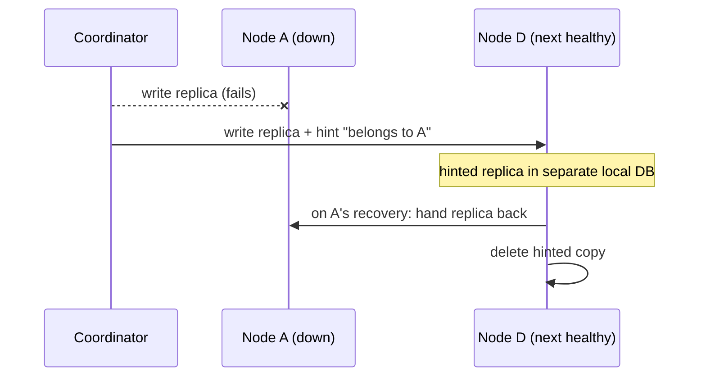

# Dynamo: the ring that taught everyone consistent hashing — and then outgrew it

Dynamo (DeCandia et al., SOSP 2007) is the paper that made consistent hashing the default answer to "how do I shard a key-value store?" — and, less famously, the paper that documented why the textbook version of consistent hashing failed in production and had to be replaced. Amazon built Dynamo around 99.9th-percentile SLAs (a typical one: 99.9% of requests within 300 ms), which forced a "zero-hop DHT" design: every node knows enough routing state to reach the right node directly, because multi-hop routing à la Chord/Pastry adds latency variability exactly at the percentiles the SLA measures.

For this topic, read the paper as a partitioning-and-rebalancing story. The ring, virtual nodes, and especially the strategy 1 → 2 → 3 evolution in §6.2 are the main plot — that evolution ends at "fixed equal partitions, moved as whole files", which is the same destination Redis Cluster hard-coded as 16384 slots (see reading-redis-cluster.md) and the destination the capstone's M36 milestone copies. Vector clocks, quorums, and hinted handoff are supporting cast here; each gets one step, with topic 21 as the deeper home for replication.

## The problem in one sentence

**How do you spread keys over a fleet where nodes constantly join, leave, and fail — moving as little data as possible each time, keeping every node's load near the mean, and never refusing a write?**

Dynamo's answer has two layers that the paper initially conflated and later separated: *partitioning* (how the key space is cut into ranges) and *placement* (which physical node stores each range). The famous ring answers both at once; the production lessons show why answering them together was a mistake.

## The concepts, step by step

### Step 1 — Hash mod N, and why "keys moved" is the metric

The naive scheme — `node = hash(key) mod N` — balances load perfectly and routes in zero hops. Its fatal flaw is rebalancing cost: changing N remaps almost everything. Growing from N to N+1 nodes moves N/(N+1) of all keys; the experiments' lane 1 measured exactly that — 80.0% of keys moved going from 4 to 5 nodes, versus consistent hashing's 1/(N+1).

That single number defines the design space. Every key moved is a disk read, a network transfer, a cache invalidation, and — per topic 35 — load added to a cluster that is probably being expanded *because* it is already overloaded. Dynamo's §2.3 design principles make the requirement explicit: incremental scalability (add one node at a time with minimal impact), symmetry (no distinguished nodes), decentralization, and heterogeneity (work proportional to node capacity). Hash mod N fails the first principle outright.

| Scheme | Keys moved growing N→N+1 | Balance | Heterogeneity-aware |
|---|---|---|---|
| hash mod N | N/(N+1) — 80.0% measured at 4→5 | perfect | no |
| consistent hashing, 1 token/node | 1/(N+1) | poor (random arcs) | no |
| consistent hashing + vnodes | 1/(N+1), spread over all donors | good | yes (token count ∝ capacity) |

Keep Table 1 of the paper at hand while reading — it maps each problem to its technique and the advantage bought: partitioning → consistent hashing → incremental scalability; high write availability → vector clocks with read-time reconciliation; temporary failures → sloppy quorum + hinted handoff; permanent failures → anti-entropy with Merkle trees; membership and failure detection → gossip. This guide walks that table top to bottom.

### Step 2 — The consistent-hashing ring and virtual nodes

Dynamo (§4.2) treats the output range of the hash function as a fixed circular ring. Each node picks a random position on the ring; a key (MD5-hashed to a 128-bit identifier, §4.1) is stored at the first node clockwise from its hash. Now a node's arrival or departure affects only its immediate neighbors — the 1/(N+1) movement cost from Karger et al. (STOC'97).

```
        hash ring (128-bit MD5 space, wraps around)

                 ┌── A ──┐
             ┌───┘       └───┐
             │      key k    │        key k hashes here,
             D       ●───────┼──────▶ walks clockwise,
             │               B        lands on node B
             └───┐       ┌───┘
                 └── C ──┘

   remove B → only keys in (A, B] move (to C); A, C, D keep everything else
```

Two problems remain with one-token-per-node: random positions produce arcs of very different sizes (non-uniform load), and the scheme ignores heterogeneity — a big machine and a small one get statistically identical arcs. The fix is **virtual nodes**: each physical node claims multiple ring positions ("tokens"). Benefits per §4.2: when a node dies, its load disperses evenly across all survivors (each survivor inherits a few small arcs, not one big one); a new or rejoining node accepts roughly equal load from every existing node; and the token count per node can be set proportional to capacity.

Note what a token is at this stage, because it changes later: in the original design a token is *both* a partition boundary and an ownership claim. Holding that dual role in mind now makes the strategy 1 post-mortem (Step 6) read as inevitable rather than surprising.

### Step 3 — Preference lists and N/R/W quorums (supporting cast)

Each key is replicated at N hosts (§4.3): the coordinator stores it locally and replicates to the N−1 clockwise successors. The resulting node list is the key's **preference list** — built by *skipping* ring positions so that it contains N distinct *physical* nodes (two vnodes of the same machine must not count as two replicas), and holding more than N entries to cover failures. The interface above all this is minimal (§4.1): get(key) and put(key, context, object), where the context carries version metadata opaque to the caller.

Reads and writes use quorums (§4.5): R nodes must participate in a read, W in a write; R + W > N gives quorum-like behavior. Operation latency is dictated by the *slowest* of the R (or W) replicas contacted, so both are usually set below N. The common production configuration (§6) is (N, R, W) = (3, 2, 2), chosen to balance performance, durability, consistency, and availability. A write coordinator writes locally and sends to the N highest-ranked reachable nodes, succeeding after W−1 responses.

Concurrent versions are tracked with vector clocks (§4.4) — lists of (node, counter) pairs per object version. When one clock dominates another, reconciliation is syntactic and automatic; when clocks are concurrent, the application merges semantically (the shopping cart takes the union of divergent carts — "add to cart" must never be rejected, and the known cost is that deleted items can occasionally resurface after a merge). Clocks are truncated at a threshold (say 10 pairs) by evicting the pair with the oldest timestamp; the paper reports this never caused a production issue. Depth on quorums and versioning lives in topic 21.

### Step 4 — Sloppy quorum and hinted handoff (supporting cast)

A strict quorum over the key's home replicas would be unavailable whenever those specific nodes fail — unacceptable for a store where "add to cart" must never be rejected. Dynamo's sloppy quorum (§4.6) instead operates on the first N *healthy* nodes found walking the ring. If home node A is down, the write lands on the next node D carrying a **hint** naming A; D stores hinted replicas in a separate local database, scans periodically, delivers them back to A on recovery, and deletes its copy.



The partitioning-relevant point: hints keep the durability count at N without changing the ring, so *temporary* failures never trigger rebalancing. Only membership changes move data.

Two knobs deserve a note. Setting W=1 gives maximum write availability — a write succeeds as long as any single node in the walk is up. And because preference lists span multiple data centers, the same walk-the-ring rule that handles a dead node also handles a dead data center, with no separate mechanism.

### Step 5 — Merkle anti-entropy, and its coupling to partitioning

Hinted replicas can be lost before delivery, so Dynamo also runs anti-entropy (§4.7): each node keeps one Merkle tree **per key range** (per virtual node), with leaves hashing individual keys' values. Two replicas exchange the root for a shared range and descend only into subtrees whose hashes differ — minimizing both bytes transferred and disk reads.

```
        range root                 compare roots: differ → descend
        /        \                 compare children: left equal → prune
   h(left half)  h(right half)     right differs → descend
                  /       \
             h(k5..k6)  h(k7..k8)  → only ship the keys under
                            ▲        the mismatched leaf
                        mismatch
```

The stated disadvantage matters for this topic: a node join or leave *changes the key ranges*, invalidating and forcing recalculation of Merkle trees on many nodes. This is the first thread of the argument that ranges should be fixed — strategy 3 (Step 7) resolves it. Membership itself is gossip-based (§4.8–4.9): every node reconciles membership history with a random peer each second, seed nodes prevent logical ring partitions, and failure detection is purely local (A considers B failed if B stops answering A).

### Step 6 — Strategy 1: tokens as boundaries, and what broke in production

Strategy 1 is the original design: T random tokens per node, and the partition boundaries *are* the token values. Ranges therefore vary in size and change whenever any node joins or leaves. §6.2 lists what this did in production:

| Problem | Mechanism |
|---|---|
| Bootstrapping a node took "almost a day" during the busy holiday season | A new node "steals" key ranges; donors must *scan their local persistence store* to extract the right keys — a heavyweight background task competing with live traffic |
| Merkle-tree recalculation storms | Join/leave changes many ranges (Step 5), so many nodes rebuild trees |
| No whole-keyspace snapshot/archival | Ranges are random per node; there is no clean unit to archive |

The root diagnosis, in the paper's own framing: strategy 1 **intertwines data partitioning and data placement**. The tokens simultaneously decide where the range boundaries fall and which node owns them, so you cannot add capacity (placement) without redrawing boundaries (partitioning).

### Step 7 — Strategies 2 and 3: decouple partitioning from placement

Strategy 2 (the interim step) divides the hash space into Q *equal-size* partitions, with Q much larger than N and Q much larger than S·T (S nodes, T tokens each). Nodes still hold T random tokens, but tokens now decide only *placement*: a partition lives on the first N distinct nodes clockwise from its end. Boundaries never move. This achieves the decoupling — but Figure 8 shows it has the *worst* load-balancing efficiency (mean load / max load) of the three at the evaluated setup (S=30 nodes, N=3, equal metadata budgets).

Strategy 3 (the final design) keeps the Q equal partitions and drops random tokens: each node holds exactly Q/S tokens. When a node leaves, its tokens are randomly redistributed to the survivors preserving the Q/S invariant; a joining node steals tokens likewise. Node addition itself (§4.9) is confirmation-based in every strategy: the nodes that lose ranges to the newcomer offer the keys and transfer them with a confirmation round, which avoids duplicate transfers.

```
strategy 1: boundaries = random tokens        strategy 3: Q fixed equal partitions
  |--A---|-B-|----C----|A|--B--|                |A |B |C |A |B |C |A |B |C |...|
  ranges unequal, move on every join           ranges never move; only ownership
  data extracted by scanning                   of whole partitions changes;
                                               each partition = one file
```

The payoffs listed in §6.2: best load-balancing efficiency of the three; membership metadata reduced by **three orders of magnitude** versus strategy 1; faster bootstrapping and recovery because partitions are fixed ranges stored as *separate files* that transfer as a unit (no scanning, no random I/O); and trivial archival (copy the partition files). The one disadvantage: join/leave now needs coordination to preserve the token invariant — the symmetric, coordination-free ring is gone.

| | Strategy 1 | Strategy 2 | Strategy 3 |
|---|---|---|---|
| Partition boundaries | the T random tokens themselves | Q fixed equal partitions | Q fixed equal partitions |
| Tokens per node | T random | T random (placement only) | exactly Q/S |
| Partitioning ↔ placement | intertwined | decoupled | decoupled |
| Load-balancing efficiency (Fig 8) | middle | worst | best |
| Membership metadata | largest | between | ~1000× smaller than strategy 1 |
| Bootstrap unit | scanned key ranges | fixed ranges | fixed ranges as whole files |

Redis Cluster is strategy 3 with the last step taken: Q fixed at 16384 and slot assignment made fully explicit and operator-visible (see reading-redis-cluster.md); the capstone's M36 milestone does the same.

### Step 8 — Measuring imbalance: the 15% rule and the load paradox

§6.2 defines a node as "in balance" if its request load is within 15% of the fleet average, and tracks the *imbalance ratio* — the fraction of nodes out of balance. The counterintuitive result: imbalance is about 20% during *low* load and drops close to 10% at *high* load. Under high load, many popular keys are active and the hash spreads them evenly; at low load (around 1/8th of peak), only a few hot keys are in play, so their random placement dominates.

The same section's latency numbers explain why balance matters at the tail (§6.1): 99.9th-percentile latencies ran around 200 ms — an order of magnitude above the average — and write buffering (an in-memory object buffer drained by a writer thread) cut the 99.9th percentile by a factor of 5 at peak. The "durable write" variant recovers durability cheaply: the coordinator picks one of the N replicas to perform a durable write, since W responses are needed before acknowledging anyway.

Two takeaways for any sharded system. First, define balance as a measurable ratio against the mean and monitor the *fraction of violating nodes*, not just a max. Second, benchmark balance at low traffic, not just peak — that is where placement randomness shows.

For calibration on how rare divergence was in this design (§6.3), over a 24-hour trace:

| Versions returned | Fraction of requests |
|---|---|
| exactly 1 | 99.94% |
| 2 | 0.00057% |
| 3 | 0.00047% |
| 4 | 0.00009% |

Divergence was driven by concurrent writers — busy robots — not by failures.

### Step 9 — What a graph engine should copy

For the Rust graph-engine capstone, the durable lessons are almost all from Steps 6–8:

- **Fix Q up front.** M36 uses redis-style 16384 slots, so partitioning is decided once and only placement ever changes — strategy 3's core move, taken to its logical end.
- **Make the partition the unit of everything.** Transfer, Merkle tree, archival: one file (or file set) per partition, moved as a unit, so a donor never scans its store during rebalancing.
- **Treat rebalancing traffic as load to be governed.** A partition transfer competes with live queries for disk and network; topic 35's admission-control lens applies directly — strategy 1's day-long bootstrap happened *during the busy holiday season*.
- **Measure balance the Dynamo way.** The 15%-of-mean rule and the imbalance ratio are cheap to compute and directly comparable across load levels.

What a graph store cannot copy blindly is hash partitioning itself — hashing vertex IDs destroys locality for traversals, so the slot-assignment layer (strategy 3's placement freedom) matters even more: it is the knob that lets you co-locate related partitions later without re-hashing. Client-driven coordination (§6.4 — instead of a per-request state machine on a server picked by a load balancer, the client library polls a random node for membership every so often and routes directly) also transfers to a smart-client graph protocol, removing the extra hop from every query.

## How to read the paper (with the concepts in hand)

| Paper section | What to get from it | Step |
|---|---|---|
| §2.3 design principles, §3 (zero-hop DHT, 99.9th-percentile SLAs) | Why incremental scalability and one-hop routing are requirements | 1 |
| §4.1–4.2 + Table 1 | Interface, MD5 ring, virtual nodes; Table 1 is the whole system on one page | 2 |
| §4.3–4.5 | Preference lists (N distinct physical nodes), vector clocks, R/W quorums | 3 |
| §4.6 | Sloppy quorum, hinted handoff, multi-DC preference lists | 4 |
| §4.7–4.9 | Merkle trees per key range; gossip membership; local failure detection | 5 |
| §5 | Skim: pluggable persistence (BDB, MySQL), Java, SEDA pipeline | — |
| §6, §6.1 | (3, 2, 2) config; latency percentiles; write buffering | 3, 8 |
| §6.2 | The core of this reading: strategies 1 → 2 → 3, efficiency, 15% rule | 6, 7, 8 |
| §6.3–6.4 | Divergent-version rates; client-driven coordination | 8, 9 |

Read §6.2 twice: once for the mechanics of each strategy, once asking "which property of strategy 1 causes each of the three production problems?"

## Questions to answer in notes.md

1. Strategy 1 caused three concrete production problems (day-long bootstrap, Merkle recalculation, no archival). Trace each one back to the single root cause the paper names — what exactly does "intertwining partitioning and placement" mean mechanically?
2. In strategy 2, what do the two conditions "Q much larger than N" and "Q much larger than S·T" each buy you? What goes wrong if either fails?
3. Why does a preference list skip ring positions to guarantee N distinct physical nodes, and what failure would occur if it naively took the next N vnodes?
4. Why is the imbalance ratio higher at low load (~20%) than at high load (~10%)? What does this imply about when to measure balance in your own system?
5. Strategy 3 wins on efficiency, metadata size, and transfer speed but loses the coordination-free join/leave of strategy 1. What coordination does it now require, and how does Redis Cluster's fixed-16384-slot design answer the same question?

## Done when

- [ ] You can explain, with the lane-1 numbers (80.0% vs 1/(N+1) at 4→5 nodes), why movement cost — not balance — killed hash mod N.
- [ ] You can state the three production failures of strategy 1 and derive each from "tokens are boundaries".
- [ ] You can describe strategy 3 precisely (Q equal partitions, Q/S tokens per node, partitions as files) and name its one disadvantage.
- [ ] You can define the 15% imbalance ratio and explain the low-load/high-load paradox.
- [ ] Questions 1–5 are answered in notes.md.

## References

- G. DeCandia et al., "Dynamo: Amazon's Highly Available Key-value Store", SOSP 2007.
- D. Karger et al., "Consistent Hashing and Random Trees: Distributed Caching Protocols for Relieving Hot Spots on the World Wide Web", STOC 1997.
- [Topic 36 README](./README.md) — sharding, partitioning & rebalancing (lane 1: hash mod N vs consistent hashing, measured).
