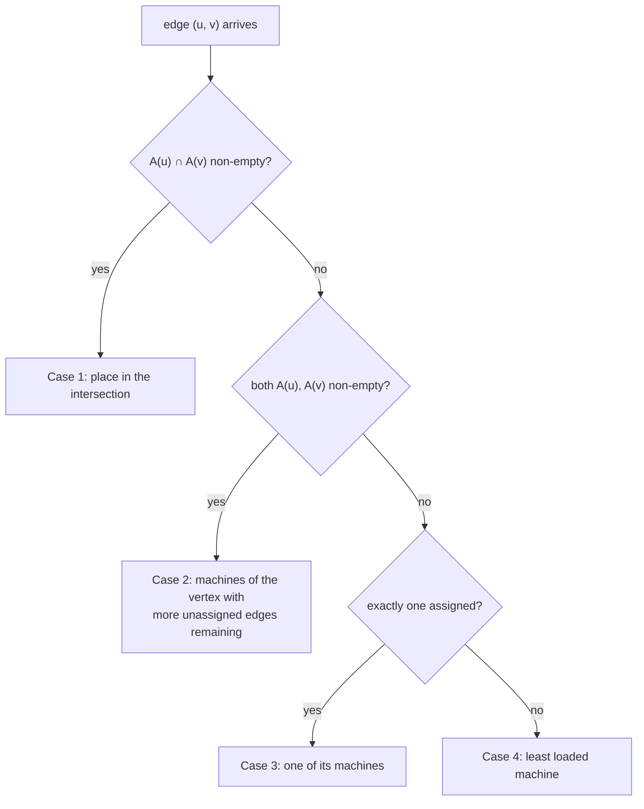

# PowerGraph: cut the vertices, not the edges

Every partitioning scheme in this topic so far — hash rings, range splits — assumes the
objects being placed are roughly interchangeable. Natural graphs break that assumption:
their degree distribution is power-law, so a handful of vertices touch a huge share of
the edges, and any scheme that assigns whole vertices to machines inherits that skew as
cut edges and hot spots. PowerGraph (Gonzalez et al., OSDI 2012) named this failure
precisely and inverted the solution: place **edges**, and let vertices span machines.

For this learning path the paper matters twice: it is the theoretical backbone for lane
3 of the experiments (greedy streaming partitioning vs the random baseline) and the
design input for the M36 capstone, where a sharded Rust graph engine must decide what to
do with high-degree vertices. Read it as a sharding paper first, computation second.

## The problem in one sentence

**On power-law graphs, random (hashed) vertex placement cuts an expected 1 − 1/p
fraction of all edges across p machines — nearly everything — so ghost/message traffic
in Pregel and GraphLab scales with the whole edge set, not a small boundary.**

The fix is a change of variables: a balanced p-way vertex-cut assigns each edge to one
machine and replicates the vertices that span machines; the cost metric becomes replicas
per vertex, and on power-law graphs that number is small and greedily improvable.

## The concepts, step by step

### Step 1 — Natural graphs are power-law, and α is the whole story

The degree distribution of a natural graph follows P(d) ∝ d^−α, typically with α ≈ 2
(Twitter follower graph: in-degree α = 1.7, out-degree α = 2); lower α means a heavier
tail. The consequence that drives the entire paper: under α ≈ 2 a tiny fraction of
vertices is adjacent to a large fraction of edges — one percent of the vertices in the
Twitter web graph are adjacent to nearly half of the edges — so any per-vertex quantity
(work, storage, messages) is wildly unbalanced.

```
count of vertices with degree d (log-log)

 |*
 | *          slope = −α
 |  **        α = 1.7  Twitter in-degree (heavy tail)
 |    ***     α = 2.2  Hollywood (lighter tail)
 |       *****
 |            ********
 +---------------------------→ degree d
   ^ millions of low-degree     ^ a few vertices with
     vertices                     millions of edges
```

### Step 2 — Five ways high-degree vertices break Pregel and GraphLab

The paper lists five challenges, all downstream of degree skew:

1. **Work balance** — per-vertex work is degree-dependent, so vertex-balanced partitions
   are work-imbalanced.
2. **Partitioning** — good edge-cuts are unavailable in practice; both systems fall back
   to hashed random vertex placement on natural graphs.
3. **Communication** — a high-degree vertex floods messages to millions of neighbors.
4. **Storage** — the full adjacency list of a high-degree vertex must fit on one machine.
5. **Computation** — a sequential per-vertex program over a huge neighborhood cannot
   itself be parallelized.

Keep the second in front of you: Steps 4-6 are entirely about what hashed random
placement costs and what replaces it.

### Step 3 — The GAS decomposition (just enough to motivate the partitioning)

PowerGraph splits a vertex program into three phases so work on one vertex can spread
over machines:

- **Gather**: for each adjacent edge compute g(D_u, D_(u,v), D_v) and combine the results
  with a commutative, associative sum ⊕ into an accumulator Σ.
- **Apply**: D_u_new ← a(D_u, Σ). The apply function must be sub-linear (ideally
  constant) in degree, and vertex data must be small.
- **Scatter**: over adjacent edges, update edge data and activate neighbors.

Because ⊕ is commutative and associative, the gather can run in parallel over the
replicas of a vertex, each producing a partial accumulator summed at one designated
replica. This makes vertex replication *semantically free*: the program never sees that
its neighborhood was split. GAS exists so vertex-cuts can exist.

### Step 4 — Edge-cuts and Theorem 5.1: random placement cuts almost everything

Edge-cut systems place vertices and pay (ghosts, storage, network) for every edge whose
endpoints land on different machines. Theorem 5.1: randomly placing |V| vertices on p
machines cuts an expected fraction 1 − 1/p of the edges — at p = 2 half the edges, at
large p nearly all. This is the hash-ring placement celebrated in reading-dynamo.md,
perfect for independent keys, indicted here because edges make keys dependent.
Ghost-based systems store and communicate along every cut edge, so the "boundary" is
effectively the whole graph — in GraphBLAS terms (topics 18/26), random placement makes
almost the whole distributed-SpMV matrix off-diagonal.

### Step 5 — Vertex-cuts: place edges, replicate vertices, masters and mirrors

Invert the assignment. A balanced p-way vertex-cut assigns each **edge** to exactly one
machine. A vertex v then spans the set of machines A(v) that hold at least one of its
edges. The objective: minimize the average replication (1/|V|) Σ_v |A(v)| subject to the
balance constraint that no machine holds more than λ|E|/p edges. One replica of each
vertex is randomly nominated the **master** (canonical vertex data); the rest are
read-only **mirrors** that receive updates from the master after apply.

```
edge-cut (place vertices)              vertex-cut (place edges)

 M1            M2                       M1            M2
 (u)---cut edge---(v)                   (u)--(v)      (u')--(w)
  |  every cut edge is                        ▲         ▲
  |  a ghost + a message                 master u    mirror u'
                                        one vertex, |A(u)| = 2 replicas;
 hub vertex: ALL its edges              hub's edges spread across
 cross machines → flood                 machines → gather in parallel,
                                        one accumulator per mirror
```

The cost model changes from "how many edges cross" to "how many replicas per vertex" —
communication becomes one accumulator and one update per mirror, not one per edge.

### Step 6 — Theorems 5.2 and 5.3: replication is a function of the degree distribution

Theorem 5.2 gives the expected replication factor of *random* edge placement:

```
E[ (1/|V|) Σ_v |A(v)| ]  =  (p/|V|) Σ_v ( 1 − (1 − 1/p)^D[v] )
```

where D[v] is the degree of v. For power-law graphs this is determined entirely by α,
and the punchline is directional: the reduction in replication from vertex-cuts over
edge-cuts *increases as α decreases* — heavier skew, bigger win, an order-of-magnitude
gain in the paper's Figure 6. The pathology of Step 1 becomes the opportunity: a hub's
replication saturates at p while its edge-cut cost would have grown with degree.

Theorem 5.3 closes the argument: for any edge-cut with g ghosts there is a vertex-cut
along the same boundary with strictly fewer than g mirrors — a good vertex-cut exists
wherever a good edge-cut does; the converse is false. Percolation theory adds that
power-law graphs have good vertex-cuts to find.

### Step 7 — Greedy streaming placement: four cases, two implementations

Even random edge placement beats edge-cuts, but a one-pass greedy heuristic does better:
place each edge (u, v) conditioned on the machine sets A(u), A(v) built so far.



The intuition: never create a new replica when an existing one can absorb the edge; when
forced to choose, spend the replica on the vertex likely to need it again (more
unassigned edges left). Two implementations trade cut quality against speed:
**coordinated** keeps A(v) in a distributed table (slower, better cuts); **oblivious**
runs the heuristic independently per machine with no communication (slightly worse
cuts). Compare lane 3 of the experiments: LDG-style streaming greedily places *vertices*
(edge-cut world); PowerGraph's greedy places *edges* (vertex-cut world) — same one-pass
shape, opposite variable.

### Step 8 — Delta caching and sync/async execution (brief)

Two refinements ride on the abstraction. **Delta caching**: the accumulator Σ is cached
per vertex; a scatter returns a delta Δa atomically added to the neighbor's cached
accumulator, skipping redundant gathers — valid when the ⊕ sum forms an Abelian group
(commutative with an inverse; sums qualify, max does not). **Execution modes**:
synchronous runs deterministic bulk-synchronous supersteps; asynchronous executes
vertices as resources free up, with optional serializability via vertex locking. Both
pay the replication factor in network traffic every round.

### Step 9 — What a graph database should copy

For the M36 capstone (sharding a Rust graph engine) the transferable decisions are:

- Store edges with their source vertex, but treat *edge placement* as the primary
  sharding decision — a hub's edge list may be split.
- Replicate high-degree vertices as master + mirrors; route writes to the master and
  propagate to mirrors after apply.
- Use a streaming greedy placer (the four cases) at ingest time; one pass, only A(v)
  bookkeeping, beats hashing without an offline partitioner like METIS.
- Measure replication factor, not edge-cut, as the quality metric — Theorem 5.2 gives
  the random-placement baseline, computable from the degree sequence alone (exercise 5
  in the experiments does exactly this).
- Table 1 is a scale anchor: Twitter 41M vertices / 1.4B edges (α = 1.8), UK web
  132.8M / 5.5B (α = 1.9), LiveJournal 5.4M / 79M (α = 2.1).

## How to read the paper (with the concepts in hand)

- **Sections 1-2 (intro, graph-parallel background)** — Steps 1-2. Get the α ≈ 2 claim
  and the five challenges; skim the Pregel/GraphLab recaps if you know them.
- **Section 3 (PowerGraph abstraction: GAS, delta caching, sync/async)** — Steps 3 and 8.
  Read GAS carefully enough to see why gather parallelizes over replicas; skim the rest.
- **Section 4 (vertex programs as examples)** — optional; PageRank in GAS form is worth
  30 seconds.
- **Section 5 (distributed graph placement)** — the heart, Steps 4-7. Read fully:
  Theorem 5.1 (edge-cut indictment), the vertex-cut objective and master/mirror design,
  Theorems 5.2-5.3, Figure 6 (replication gap vs α), and the greedy heuristic with
  coordinated vs oblivious variants.
- **Sections 6-7 (implementation, evaluation)** — read for Table 1 (the five graphs and
  their α values) and how replication factor tracks runtime; skim the rest.
- **Section 8 (related work)** — skim; note the streaming-partitioning lineage of
  Stanton & Kliot and FENNEL (references below).

## Questions to answer in notes.md

1. Derive Theorem 5.1's expected 1 − 1/p edge-cut in two lines; what does it give at
   p = 2 and at large p? Why doesn't the same argument doom random *edge* placement?
2. What does the vertex-cut objective minimize, and what is the balance constraint
   (include λ)? Why is average replication the right proxy for GAS communication?
3. Why does Theorem 5.2's replication factor depend only on α for a power-law graph, and
   why does the advantage over edge-cuts grow as α falls?
4. Walk one concrete edge stream through the four greedy cases (draw A(u), A(v) at each
   step). Where does the oblivious variant diverge from the coordinated one, at what cost?
5. Which GAS property makes mirrors invisible on the gather side, and which stronger
   property does delta caching require? Give one ⊕ satisfying the first but not the second.

## Done when

- [ ] You can state Theorem 5.1 and reproduce the 1 − 1/p expectation from scratch,
      including the p = 2 sanity check.
- [ ] You can define a balanced p-way vertex-cut (objective + constraint) and explain
      masters vs mirrors without looking at the paper.
- [ ] You can list the four greedy placement cases in order and say why Case 2 prefers
      the vertex with more unassigned edges.
- [ ] You have computed Theorem 5.2's replication factor on the experiments' generated
      degree sequence (lane 3, exercise 5) and compared it to the (k−1)/k baseline.
- [ ] You can name the one sharding decision from Step 9 you will adopt in the M36
      capstone, and the metric to judge it.

## References

- Gonzalez, Low, Gu, Bickson, Guestrin — *PowerGraph: Distributed Graph-Parallel
  Computation on Natural Graphs*, OSDI 2012.
- Stanton, Kliot — *Streaming Graph Partitioning for Large Distributed Graphs*, KDD 2012
  (the LDG heuristic used in lane 3 — greedy *vertex* placement, the edge-cut
  counterpart of PowerGraph's greedy *edge* placement).
- Tsourakakis, Gkantsidis, Radunovic, Vojnovic — *FENNEL: Streaming Graph Partitioning
  for Massive Scale Graphs*, WSDM 2014 (follow-on streaming partitioner).
- [Topic 36 README](README.md) — how this guide fits the topic's lanes.
