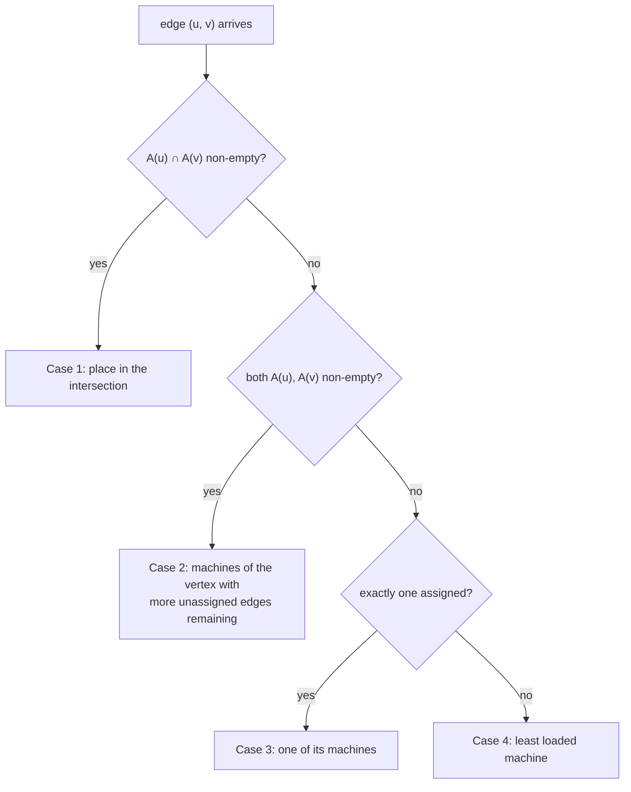

# PowerGraph: cut the vertices, not the edges

Every partitioning scheme in this topic so far — hash rings, range splits — assumes the
objects being placed are roughly interchangeable. Natural graphs break that assumption:
their degree distribution is power-law, so a handful of vertices touch a huge share of
the edges, and any scheme that assigns whole vertices to machines inherits that skew as
cut edges and hot spots. PowerGraph (Gonzalez et al., OSDI 2012) named this failure
precisely and inverted the solution: place **edges**, and let vertices span machines.

For this learning path the paper matters twice: it is the theoretical backbone for lane
3 of the experiments (greedy streaming partitioning vs the random baseline) and the
design input for the M36 capstone, where a sharded Rust graph engine must decide what to
do with high-degree vertices. Read it as a sharding paper first, computation second.

Every theorem, figure and table cited below is from the OSDI 2012 paper as text-extracted
this session; the numbers were checked against it, and where the earlier draft of this
guide had attached power-law exponents to the paper's real-world graphs that the paper
does not state, that has been corrected (Step 9).

## The problem in one sentence

**On power-law graphs, random (hashed) vertex placement cuts an expected 1 − 1/p
fraction of all edges across p machines — nearly everything — so ghost/message traffic
in Pregel and GraphLab scales with the whole edge set, not a small boundary.**

The fix is a change of variables: a balanced p-way vertex-cut assigns each edge to one
machine and replicates the vertices that span machines; the cost metric becomes replicas
per vertex, and on power-law graphs that number is small and greedily improvable.

## The concepts, step by step

### Step 1 — Natural graphs are power-law, and α is the whole story

> **In:** nothing yet — this step fixes the one graph property (the exponent α) that
> every later step depends on.
> **Out:** the fact that a tiny vertex set touches most edges, which is what makes
> per-vertex placement (Step 4) fail and per-edge placement (Step 5) win.

A **power-law degree distribution** means the probability a vertex has degree `d` falls
off as a power of `d`: `P(d) ∝ d^−α`, where the **exponent α** is a positive constant
controlling the skew (§3.1). Higher α ⇒ a lighter tail (most vertices low-degree, few
hubs); lower α ⇒ a heavier tail (denser graph, more and bigger hubs). Most natural graphs
sit around **α ≈ 2** (§3); Faloutsos et al. measured the Internet's inter-domain graph at
α ≈ 2.2. The paper's own illustrative curves (Fig 6) sweep α ∈ {1.65, 1.7, 1.8, 2.0}.

The consequence that drives the entire paper: under α ≈ 2 a tiny fraction of vertices is
adjacent to a large fraction of edges. The paper's headline example (§3): **one percent
of the vertices in the Twitter follower graph are adjacent to nearly half of the edges.**
Figure 1 plots that graph's in- and out-degree distributions in log-log scale; both are
power-law, and the in-degree tail is the heavier of the two — a few celebrities have
millions of followers. So any *per-vertex* quantity (work, storage, messages) is wildly
unbalanced.

```
count of vertices with degree d (log-log)

 |*
 | *          slope = −α
 |  **        smaller α (≈1.7) → heavier tail, more/bigger hubs
 |    ***     larger  α (≈2.2) → lighter tail (e.g. Faloutsos's Internet)
 |       *****
 |            ********
 +---------------------------→ degree d
   ^ millions of low-degree     ^ a few vertices with
     vertices                     millions of edges
```

### Step 2 — Five ways high-degree vertices break Pregel and GraphLab

> **In:** the degree skew from Step 1.
> **Out:** the five named challenges; keep challenge 2 (partitioning) in view, because
> Steps 4–7 are entirely about replacing the hashed placement it falls back to.

The paper lists five challenges, all downstream of degree skew (§3):

1. **Work balance** — per-vertex work is degree-dependent, so vertex-balanced partitions
   are work-imbalanced.
2. **Partitioning** — good edge-cuts are unavailable in practice on natural graphs, so
   both systems fall back to hashed random vertex placement.
3. **Communication** — a high-degree vertex floods messages to millions of neighbors.
4. **Storage** — the full adjacency list of a high-degree vertex must fit on one machine.
5. **Computation** — a sequential per-vertex program over a huge neighborhood cannot
   itself be parallelized.

Keep the second in front of you: Steps 4–6 are entirely about what hashed random
placement costs and what replaces it.

### Step 3 — The GAS decomposition (just enough to motivate the partitioning)

> **In:** a vertex program that would otherwise run on one machine (challenge 5).
> **Out:** the three-phase shape (Gather/Apply/Scatter) that lets one vertex's work
> split across machines — the precondition that makes vertex replication (Step 5)
> *semantically free*.

**GAS** is PowerGraph's decomposition of a vertex program into three phases (§4.1) so
that work on one vertex can spread over machines:

- **Gather**: for each adjacent edge compute `g(D_u, D_(u,v), D_v)` and combine the
  results with a **commutative, associative sum** `⊕` — one whose result is
  order-independent — into an accumulator `Σ`.
- **Apply**: `D_u_new ← a(D_u, Σ)`. The accumulator's size and the apply function's cost
  "should be sub-linear and ideally constant in the degree" (§4.1), and vertex data must
  be small.
- **Scatter**: over adjacent edges, update edge data and activate neighbors.

Because `⊕` is commutative and associative, the gather can run in parallel over the
replicas of a vertex, each producing a partial accumulator that is summed at one
designated replica. This makes vertex replication *semantically free*: the program never
sees that its neighborhood was split. GAS exists so vertex-cuts can exist.

### Step 4 — Edge-cuts and Theorem 5.1: random placement cuts almost everything

> **In:** the hashed vertex placement that challenge 2 (Step 2) falls back to.
> **Out:** Theorem 5.1's expected cut fraction `1 − 1/p`, worked on real p — the number
> that indicts edge-cuts and motivates the whole inversion of Step 5.

An **edge-cut** places *vertices* on machines and pays (ghosts, storage, network) for
every edge whose endpoints land on different machines. A **ghost** is a local read-only
copy of a remote endpoint kept so a machine can evaluate a cut edge. **Theorem 5.1**: if
vertices are assigned to `p` machines uniformly at random, the expected fraction of edges
cut is

```
E[ |Edges Cut| / |E| ]  =  1 − 1/p          (paper Eq. 5.1)

proof sketch: an edge is cut iff its two endpoints land on different machines,
which happens with probability 1 − 1/p.
```

Worked on the machine counts that matter here:

```
p =  2 :  1 − 1/2  = 0.500  → half the edges cross
p =  8 :  1 − 1/8  = 0.875  → 87.5% cross  (lane 3's k = 8 random baseline)
p = 16 :  1 − 1/16 = 0.9375 → 93.75%
p → ∞  :             → 1     → nearly every edge crosses
```

At `p = 8` that is exactly the `(k−1)/k = 7/8 = 87.5%` random-cut baseline lane 3
measures on its generated graphs. Ghost-based systems store and communicate along *every*
cut edge, so the "boundary" is effectively the whole graph. This is the hash-ring
placement celebrated in [reading-dynamo.md](reading-dynamo.md) — perfect for independent
keys, indicted here because edges make keys dependent. In GraphBLAS terms (topics 18/26),
random placement makes almost the whole distributed-SpMV matrix off-diagonal.

### Step 5 — Vertex-cuts: place edges, replicate vertices, masters and mirrors

> **In:** Theorem 5.1's indictment of placing vertices (Step 4).
> **Out:** the inverted scheme — place *edges*, replicate the vertices they span — and
> the new cost metric (replicas per vertex) that Steps 6–7 minimize.

Invert the assignment. A **balanced p-way vertex-cut** assigns each **edge** to exactly
one machine `A(e) ∈ {1,…,p}` (§5.1). A vertex `v` then spans the set of machines `A(v)`
that hold at least one of its edges; the copies of `v` on those machines are its
**replicas**. The objective and its balance constraint, verbatim from the paper (Eq. 5.3–5.4):

```
minimize   (1/|V|) Σ_v |A(v)|                    ← average replication factor
subject to  max_m |{ e ∈ E : A(e) = m }|  <  λ|E|/p

  |A(v)| = number of machines vertex v spans (its replica count)
  λ ≥ 1  = the imbalance factor, a small constant capping the hottest machine's edges
```

One replica of each vertex is randomly nominated the **master** (it holds the canonical
vertex data); the rest are read-only **mirrors** that receive the updated value from the
master after the apply phase (§5.1).

```
edge-cut (place vertices)              vertex-cut (place edges)

 M1            M2                       M1            M2
 (u)---cut edge---(v)                   (u)--(v)      (u')--(w)
  |  every cut edge is                        ▲         ▲
  |  a ghost + a message                 master u    mirror u'
                                        one vertex, |A(u)| = 2 replicas;
 hub vertex: ALL its edges              hub's edges spread across
 cross machines → flood                 machines → gather in parallel,
                                        one accumulator per mirror
```

The cost model changes from "how many edges cross" to "how many replicas per vertex" —
communication becomes one accumulator and one update per mirror, not one message per
cut edge.

### Step 6 — Theorems 5.2 and 5.3: replication is a function of the degree distribution

> **In:** the vertex-cut objective from Step 5.
> **Out:** Theorem 5.2's closed-form expected replication (worked on a hub and a leaf)
> and Theorem 5.3's existence guarantee — together the proof that the inversion pays off,
> and pays off *more* the more skewed the graph.

**Theorem 5.2** gives the expected replication factor of *random* edge placement (Eq. 5.5):

```
E[ (1/|V|) Σ_v |A(v)| ]  =  (p/|V|) Σ_v ( 1 − (1 − 1/p)^D[v] )

  D[v] = degree of vertex v
  per-vertex term:  E[|A(v)|] = p ( 1 − (1 − 1/p)^D[v] )    (Eq. 5.10)
```

Worked per vertex on `p = 8` machines, to see the point — a hub's replication is
*bounded by p* no matter its degree, while its edge-cut cost would have grown with degree:

```
leaf,  D = 1    :  8·(1 − (7/8)^1)    = 8·0.125  = 1.00 replica
       D = 2    :  8·(1 − (7/8)^2)    = 8·0.2344 = 1.88 replicas
       D = 4    :  8·(1 − (7/8)^4)    = 8·0.4138 = 3.31 replicas
hub,   D = 1000 :  8·(1 − (7/8)^1000) = 8·(1−~0) ≈ 8.00 replicas (saturates at p)
```

For a power-law graph the whole average is "determined entirely by the power-law constant
α" (§5, following Eq. 5.5), and the punchline is directional: the reduction in replication
from vertex-cuts over edge-cuts *increases as α decreases* — heavier skew, bigger win, up
to an order-of-magnitude improvement in Figure 6(b). The pathology of Step 1 becomes the
opportunity: a hub's replication saturates at `p` while its edge-cut cost grows with degree.

**Theorem 5.3** closes the argument: for any edge-cut with `g` ghosts, any vertex-cut
along the same partition boundary has **strictly fewer than g mirrors** — a good
vertex-cut exists wherever a good edge-cut does; the converse is not claimed. Percolation
theory adds that power-law graphs have good vertex-cuts to find.

### Step 7 — Greedy streaming placement: four cases, two implementations

> **In:** the random edge placement of Theorem 5.2 (Step 6), which already beats edge-cuts.
> **Out:** the one-pass greedy rule (four cases) that beats *it*, and the coordinated vs
> oblivious trade — the shape lane 3's partitioner and M36 both copy.

Even random edge placement beats edge-cuts, but a **greedy** de-randomization does better
(§5.2): place each edge `(u, v)` on the machine that minimizes the *conditional* expected
replication, given the machine sets `A(u), A(v)` built so far. That reduces to four cases:



The intuition: never create a new replica when an existing one can absorb the edge (Case
1); when forced to choose, spend the replica on the vertex likely to need it again — the
one with more unassigned edges left (Case 2). Two implementations trade cut quality
against speed (§5.2): **coordinated** keeps `A(v)` in a distributed table, periodically
synced (slower, better cuts); **oblivious** runs the heuristic independently per machine
with no communication, each keeping its own estimate of `A` (slightly worse cuts).
Figure 7(a) shows both beating random on every real graph, coordinated best.

Compare lane 3 of the experiments: an LDG-style streaming partitioner greedily places
*vertices* (edge-cut world); PowerGraph's greedy places *edges* (vertex-cut world) — same
one-pass shape, opposite variable.

### Step 8 — Delta caching and sync/async execution (brief)

> **In:** the GAS engine of Step 3 running over the vertex-cut of Steps 5–7.
> **Out:** two refinements that change the per-round cost but not the placement story;
> here so the paper's §4.2–4.3 read as an aside rather than a gap.

Two refinements ride on the abstraction. **Delta caching** (§4.2): the accumulator `Σ` is
cached per vertex; a scatter returns a delta `Δa` atomically added to the neighbor's
cached accumulator, skipping redundant gathers. It is valid only when `⊕` forms an
**Abelian group** — commutative and associative *with an inverse* — so a change can be
subtracted out again: sums qualify (PageRank), set union does not (graph coloring), and
`max` does not either (no inverse). **Execution modes** (§4.3): synchronous runs
deterministic bulk-synchronous supersteps; asynchronous executes vertices as resources
free up, with optional serializability via vertex locking. Both pay the replication factor
in network traffic every round — which is why Steps 5–7 spend it carefully.

### Step 9 — What a graph database should copy

> **In:** the design decisions accumulated across Steps 5–7.
> **Out:** the specific choices M36 adopts, and the scale anchors from Table 1 — read
> exactly as the paper states them.

For the M36 capstone (sharding a Rust graph engine) the transferable decisions are:

- Store edges with their source vertex, but treat *edge placement* as the primary
  sharding decision — a hub's edge list may be split.
- Replicate high-degree vertices as master + mirrors; route writes to the master and
  propagate to mirrors after apply.
- Use a streaming greedy placer (the four cases) at ingest time; one pass, only `A(v)`
  bookkeeping, beats hashing without an offline partitioner like METIS.
- Measure **replication factor**, not edge-cut, as the quality metric — Theorem 5.2 gives
  the random-placement baseline, computable from the degree sequence alone (exercise 5 in
  the experiments does exactly this).

Table 1 is the scale anchor, and it is two separate tables — do not merge them, as an
earlier draft of this guide did. Table 1(a) lists **real-world graphs by size only**; the
paper attaches **no per-graph α** to them:

| Real-world graph (Table 1a) | \|V\| | \|E\| |
|---|---|---|
| Twitter | 41M | 1.4B |
| UK web | 132.8M | 5.5B |
| Amazon | 0.7M | 5.2M |
| LiveJournal | 5.4M | 79M |
| Hollywood | 2.2M | 229M |

Table 1(b) is the *synthetic* generator: ten-million-vertex power-law graphs whose α is
the input and whose edge count is the output — "smaller α produces denser graphs":

| Synthetic α (Table 1b) | # Edges (on 10M vertices) |
|---|---|
| 1.8 | 641,383,778 |
| 1.9 | 245,040,680 |
| 2.0 | 102,838,432 |
| 2.1 | 57,134,471 |
| 2.2 | 35,001,696 |

## How to read the paper (with the concepts in hand)

- **Sections 1–2 (intro, graph-parallel background)** — Steps 1–2. Get the α ≈ 2 claim
  and the five challenges; skim the Pregel/GraphLab recaps if you know them.
- **Section 3 (challenges)** — Step 1's "1% of vertices → half the edges" lives here (§3),
  with Fig 1 (Twitter in/out degree).
- **Section 4 (PowerGraph abstraction: GAS, delta caching, sync/async)** — Steps 3 and 8.
  Read GAS carefully enough to see why gather parallelizes over replicas; skim the rest.
- **Section 5 (distributed graph placement)** — the heart, Steps 4–7. Read fully:
  Theorem 5.1 (edge-cut indictment), the vertex-cut objective and master/mirror design,
  Theorems 5.2–5.3, Figure 6 (replication gap vs α), and the greedy heuristic with
  coordinated vs oblivious variants.
- **Sections 6–7 (implementation, evaluation)** — read for Table 1 (the real graphs and
  the synthetic α sweep) and how replication factor tracks runtime; skim the rest.
- **Section 8 (related work)** — skim; note the streaming-partitioning lineage of
  Stanton & Kliot and FENNEL (references below).

## Questions to answer in notes.md

1. Derive Theorem 5.1's expected 1 − 1/p edge-cut in two lines; what does it give at
   p = 2 and at large p? Why doesn't the same argument doom random *edge* placement?
2. What does the vertex-cut objective minimize, and what is the balance constraint
   (include λ)? Why is average replication the right proxy for GAS communication?
3. Why does Theorem 5.2's replication factor depend only on α for a power-law graph, and
   why does the advantage over edge-cuts grow as α falls?
4. Walk one concrete edge stream through the four greedy cases (draw A(u), A(v) at each
   step). Where does the oblivious variant diverge from the coordinated one, at what cost?
5. Which GAS property makes mirrors invisible on the gather side, and which stronger
   property does delta caching require? Give one ⊕ satisfying the first but not the second.

## Done when

Answer each before unfolding it.

- [ ] You can state Theorem 5.1 and reproduce the 1 − 1/p expectation from scratch,
      including the p = 2 sanity check.

  <details><summary>Answer</summary>

  Theorem 5.1 (Eq. 5.1): placing vertices on `p` machines uniformly at random cuts an
  expected `E[|Edges Cut|/|E|] = 1 − 1/p` of the edges. The derivation is one line: an
  edge is cut iff its two endpoints land on different machines; for a fixed first
  endpoint the second lands elsewhere with probability `1 − 1/p`, and expectation is
  linear over edges.

  Sanity checks: `p = 2 → 1/2` (half the edges cross, obviously right for a coin flip per
  endpoint); `p = 8 → 7/8 = 87.5%` (lane 3's random baseline); `p → ∞ → 1` (almost every
  edge crosses). The same argument does *not* doom random *edge* placement, because there
  each edge sits wholly on one machine by construction — nothing is "cut"; the cost
  reappears only as vertex replicas, which Theorem 5.2 bounds.

  </details>

- [ ] You can define a balanced p-way vertex-cut (objective + constraint) and explain
      masters vs mirrors without looking at the paper.

  <details><summary>Answer</summary>

  A balanced p-way vertex-cut (§5.1, Eq. 5.3–5.4) assigns each edge to one machine
  `A(e) ∈ {1,…,p}`; each vertex `v` then spans `A(v)`, the machines holding its edges.
  It **minimizes** the average replication factor `(1/|V|) Σ_v |A(v)|` **subject to** no
  machine holding more than `λ|E|/p` edges, where `λ ≥ 1` is a small imbalance constant.

  Of the `|A(v)|` replicas of a vertex, one is randomly nominated the **master** and holds
  the canonical vertex data; the rest are read-only **mirrors**. Each round, mirrors send
  partial gather accumulators to the master, the master runs apply, then pushes the new
  value back to the mirrors — so communication per vertex is one accumulator and one
  update per mirror, i.e. proportional to `|A(v)|`, which is exactly what the objective
  minimizes.

  </details>

- [ ] You can list the four greedy placement cases in order and say why Case 2 prefers
      the vertex with more unassigned edges.

  <details><summary>Answer</summary>

  For edge `(u, v)` (§5.2): **Case 1** — if `A(u) ∩ A(v)` is non-empty, place in the
  intersection (adds no replica); **Case 2** — if both are non-empty but disjoint, place
  on a machine of the endpoint with more *unassigned* edges remaining; **Case 3** — if
  only one endpoint is assigned, use one of its machines; **Case 4** — if neither is
  assigned, use the least-loaded machine.

  Case 2 prefers the vertex with more unassigned edges because that vertex will force more
  future placement decisions; keeping the *new* edge near it raises the chance those
  future edges land on an already-used machine (a Case 1 hit), whereas the low-degree
  endpoint is unlikely to be seen again, so pinning it costs little. It is a bet that
  concentrating a busy vertex's edges now avoids replicas later.

  </details>

- [ ] You have computed Theorem 5.2's replication factor on the experiments' generated
      degree sequence (lane 3, exercise 5) and compared it to the (k−1)/k baseline.

  <details><summary>Answer</summary>

  Theorem 5.2 (Eq. 5.5): expected replication `= (p/|V|) Σ_v (1 − (1 − 1/p)^D[v])`, i.e.
  sum the per-vertex `p(1 − (1 − 1/p)^D[v])` over the generated degree sequence and divide
  by `|V|`. On `p = 8`, a degree-1 vertex costs 1.00 replica, degree-2 costs 1.88, and a
  degree-1000 hub costs ≈ 8.00 — replication is *bounded by p* however large the degree.

  The comparison is against the edge-cut world's `(k−1)/k = 7/8 = 87.5%` random-cut
  fraction from Theorem 5.1 at `k = 8`: the vertex-cut spends a handful of replicas per
  vertex where the edge-cut cuts seven of every eight edges, and the gap widens as α falls
  (Fig 6b). Reporting the vertex-cut's replication factor and the edge-cut's cut fraction
  side by side is the point of exercise 5.

  </details>

- [ ] You can name the one sharding decision from Step 9 you will adopt in the M36
      capstone, and the metric to judge it.

  <details><summary>Answer</summary>

  Adopt **edge placement with a one-pass greedy placer** (the four cases) and
  **master/mirror replication of high-degree vertices**: store each edge with its source
  vertex, but let a hub's edge list split across shards, replicating the hub as master +
  mirrors and routing writes to the master. This is the vertex-cut of Steps 5–7 applied to
  the graph engine.

  Judge it by **replication factor** `(1/|V|) Σ_v |A(v)|`, not edge-cut, because that is
  what GAS communication and storage are proportional to. Theorem 5.2 gives the
  random-placement baseline from the degree sequence alone, and the greedy placer must
  beat it — with the gap over a random *edge-cut* (Theorem 5.1) widening as the generated
  graph's α falls.

  </details>

## References

- Gonzalez, Low, Gu, Bickson, Guestrin — *PowerGraph: Distributed Graph-Parallel
  Computation on Natural Graphs*, OSDI 2012. Cited above: §3 (α ≈ 2, "1% of vertices →
  half the edges", Fig 1), §4.1 (GAS, sub-linear apply), §4.2–4.3 (delta caching/Abelian
  group, sync/async), §5.1 (vertex-cut objective Eq. 5.3–5.4, masters/mirrors), Theorem
  5.1 (Eq. 5.1), Theorem 5.2 (Eq. 5.5, 5.10), Theorem 5.3, Fig 6 (replication vs α),
  Fig 7 (random/oblivious/coordinated), Table 1 (real graphs a; synthetic α sweep b).
- Stanton, Kliot — *Streaming Graph Partitioning for Large Distributed Graphs*, KDD 2012
  (the LDG heuristic used in lane 3 — greedy *vertex* placement, the edge-cut
  counterpart of PowerGraph's greedy *edge* placement).
- Tsourakakis, Gkantsidis, Radunovic, Vojnovic — *FENNEL: Streaming Graph Partitioning
  for Massive Scale Graphs*, WSDM 2014 (follow-on streaming partitioner).
- [Topic 36 README](README.md) — how this guide fits the topic's lanes.
