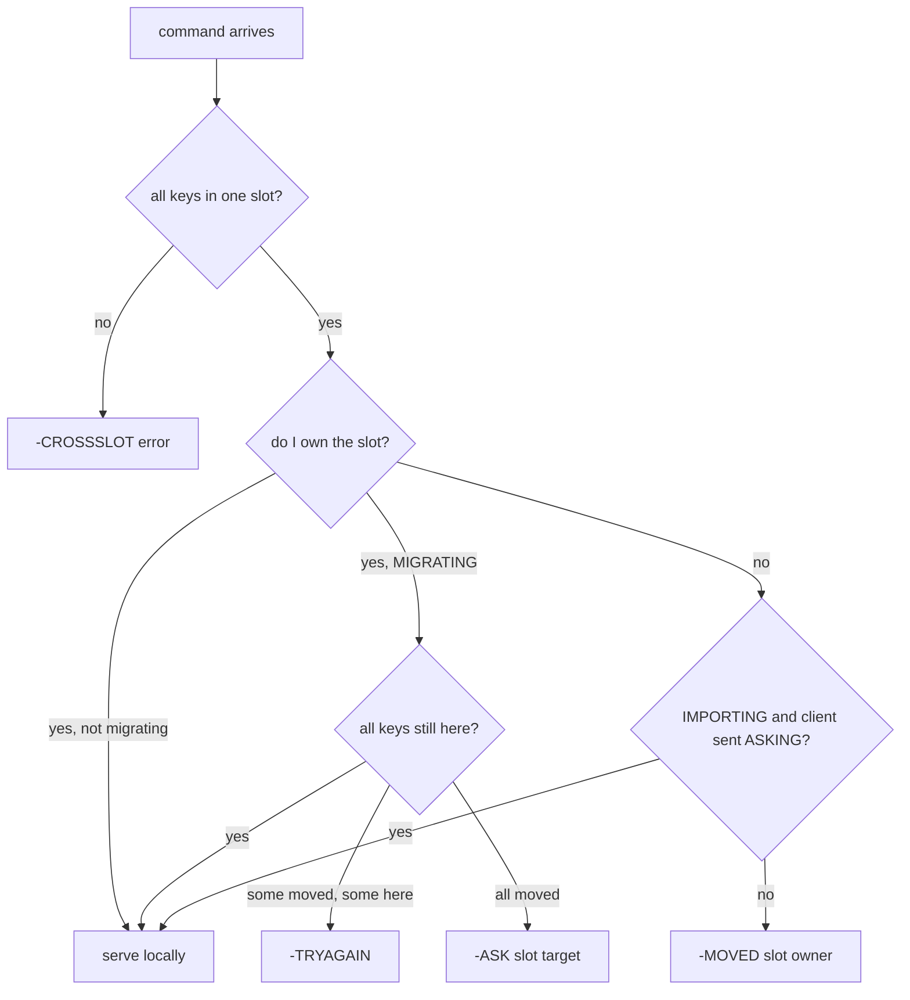
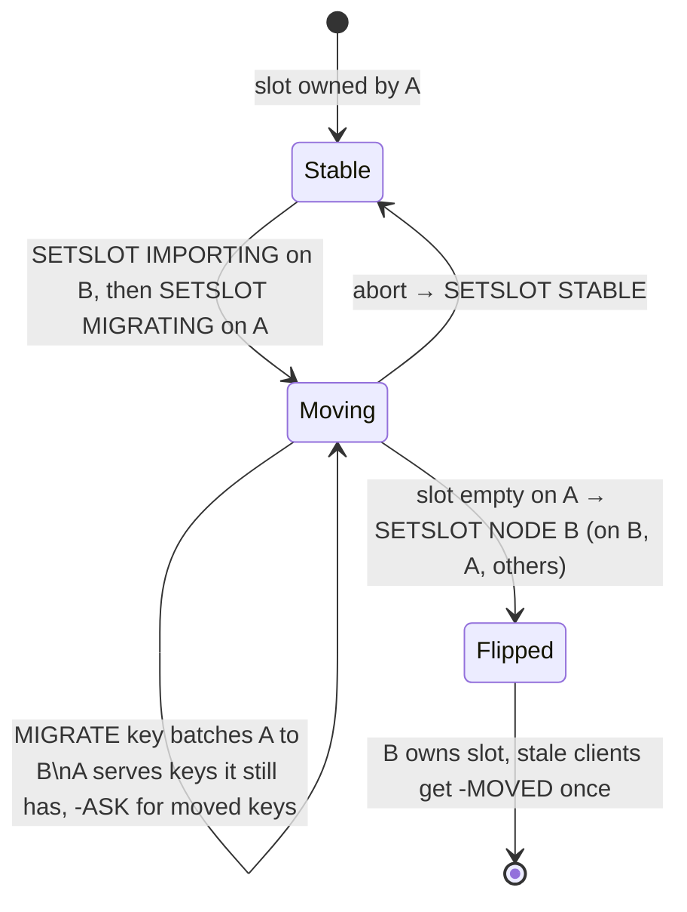

# Redis Cluster: 16384 slots and two ways to say "not here"

Redis Cluster is the most widely deployed implementation of the fixed-partition idea you met
in [reading-dynamo.md](reading-dynamo.md) (Dynamo's "strategy 3"): hard-code the number of
partitions at 16384 slots, make slot ownership movable, and push routing intelligence into the
client. There is no proxy and no routing tier — every node knows the full slot map, and any node
can tell a client where a key really lives. The entire live-migration story is built from just
two error replies (`-MOVED` and `-ASK`), one client command (`ASKING`), and four admin verbs
(`CLUSTER SETSLOT ... MIGRATING/IMPORTING/STABLE/NODE`).

This guide walks the C source in `~/repos/redis/src`. The interesting split: `cluster.h` /
`cluster.c` hold the generic slot math and redirect logic, while `cluster_legacy.h` /
`cluster_legacy.c` hold the concrete node state (per-slot migrating/importing pointers) and the
`SETSLOT` admin machinery.

## The problem in one sentence

**When a key's home moves from node A to node B while both are serving traffic, every request
must get a correct answer — served, or redirected with enough information to retry — without any
central router and without ever blocking the keyspace.**

Mod-N hashing fails this test before migration even starts: the topic README's lane-1 numbers
show growing 4→5 shards remaps about 80% of keys. Redis Cluster's answer is to hash keys into a
fixed universe of 16384 slots and move *slot ownership*, one slot at a time, with a per-slot
state machine that keeps both nodes answering correctly mid-move.

## The concepts, step by step

### Step 1 — Fixed slots decouple partitioning from placement

`cluster.h:23` defines the universe: `CLUSTER_SLOTS` is 2^14 = 16384 (`CLUSTER_SLOT_MASK_BITS`
is 14). A key maps to a slot with `crc16(key) & 0x3FFF` — masking to the low 14 bits. The
slot→node assignment is a separate, mutable table that every node gossips.

```
  key ──crc16──▶ 16-bit hash ──& 0x3FFF──▶ slot (0..16383) ──slot map──▶ node
                                            ▲ fixed forever              ▲ movable
```

Contrast with mod-N: there, adding a shard changes the *function* and remaps most keys. Here the
function never changes; only rows of the slot map change. Rebalancing 4→5 nodes means handing
off roughly 16384/5 ≈ 3276 slots — about 20% of the data, the theoretical minimum — instead of 80%.

### Step 2 — Hash tags: carving the hash input for co-location

`keyHashSlot()` (`cluster.h:59`) doesn't always hash the whole key. If the key contains a `{`
followed by a non-empty section closed by `}`, ONLY the substring between the first `{` and the
next `}` is hashed. An empty `{}` falls back to hashing the whole key.

```
  "user:{42}:cart"     ──▶ hash("42")            ─┐
  "user:{42}:profile"  ──▶ hash("42")            ─┤─▶ same slot, same node
  "user:{42}:orders"   ──▶ hash("42")            ─┘
  "user:42:cart"       ──▶ hash("user:42:cart")  ──▶ some other slot
```

This is the user-facing co-location tool: keys sharing a tag land in one slot, so multi-key
commands, MULTI/EXEC transactions, and Lua scripts over them are legal. There's also a
pattern-matching sibling, `patternHashSlot` (`cluster.c:36`), used when the "key" is a glob
pattern (e.g. pubsub patterns) — it must decide whether a pattern pins to a single slot at all.

### Step 3 — Request routing: getNodeByQuery decides serve / MOVED / ASK

`getNodeByQuery()` (`cluster.c:1191`) is the router. For each arriving command it extracts the
keys, computes their slot, and checks three things: do all keys share one slot (else
`-CROSSSLOT` error), does this node own the slot, and is the slot currently migrating or
importing. The outcome is either "serve locally" or an error code that drives a redirect.



Note the multi-key subtlety mid-migration: if a command touches several keys in a MIGRATING
slot and only *some* have already moved, neither node can serve it — the client gets
`-TRYAGAIN` and must back off and retry.

### Step 4 — MOVED: the durable redirect

When the slot simply belongs to another node, `clusterRedirectClient()` (`cluster.c:1443`)
formats `-MOVED slot host:port` (the MOVED branch of the decision logic is at `cluster.c:1432`).
MOVED means: *the slot's home has permanently changed — update your slot map*. A well-behaved
client rewrites its cached slot→node entry (or refreshes the whole map with `CLUSTER SHARDS`)
and never asks the wrong node for that slot again. MOVED is how a cold client with an empty or
stale map converges: worst case one extra hop per slot, then steady-state direct routing.

### Step 5 — ASK + ASKING: the one-shot redirect during migration

ASK (branch at `cluster.c:1397`, same formatter at `cluster.c:1443`) is the temporary cousin:
*just this once, ask over there — do NOT update your map*. The source node emits it while a slot
is MIGRATING and the requested key has already been transferred. The client must then send two
commands to the target: `ASKING`, then the retried command. `askingCommand()` (`cluster.c:1680`)
sets a client flag permitting exactly ONE subsequent command against an IMPORTING slot. Without
the ASKING flag the target replies `-MOVED` *back to the source* — correct, because ownership
hasn't flipped yet. The one-shot design keeps the invariant: at any instant exactly one node is
the authoritative owner of a slot, and only explicitly-flagged requests may jump the gun.

### Step 6 — The SETSLOT state machine: moving a slot live

Per-node state lives in `cluster_legacy.h:343-344`:

```c
clusterNode *migrating_slots_to[CLUSTER_SLOTS];    /* source side: slot leaving, to whom */
clusterNode *importing_slots_from[CLUSTER_SLOTS];  /* target side: slot arriving, from whom */
```

The four `CLUSTER SETSLOT` verbs (`cluster_legacy.c:6072-6075`) drive the protocol —
MIGRATING, IMPORTING, STABLE (clear migration state), NODE (the final ownership flip):



The operator (e.g. `redis-cli --cluster reshard`) sets IMPORTING on the target first, then
MIGRATING on the source; keys move batch by batch with `MIGRATE` commands. Throughout, the
source serves keys it STILL HAS and ASK-redirects for keys already gone (Step 3's decision
tree). When the slot is empty, `SETSLOT slot NODE target-id` flips ownership; from then on
queries to the old owner get `-MOVED`. No moment exists where a key is unanswerable — the worst
outcomes are one extra network hop or a `-TRYAGAIN` retry.

### Step 7 — What the client library must implement

The server keeps its half of the contract cheap by pushing four obligations onto clients:

1. Maintain a slot→node map (16384 entries) and route directly on the fast path.
2. On `-MOVED`: update the map (or refresh it wholesale), then retry.
3. On `-ASK`: send `ASKING` + the command to the indicated node, *without* touching the map.
4. Design around `-CROSSSLOT`: use hash tags (Step 2) to co-locate keys that must be touched
   atomically together, and treat `-TRYAGAIN` as retryable backoff.

This is exactly the redirect contract planned for the M36 capstone's Rust graph engine
(slot = hash and 0x3FFF, MOVED/ASK-equivalent replies), so read this step as a spec.

### Step 8 — Why 16384?

Two order-of-magnitude pressures meet in the middle. Each node advertises its owned slots as a
bitmap in every gossip heartbeat, and the full slot map is serialized into node config — so
slot-count cost is paid per message and per node: 16384 slots is a 2 KiB bitmap, while 65536
slots would quadruple every heartbeat's slot payload. Pulling the other way, more slots means
finer rebalancing granularity and more headroom for cluster size. At the intended scale (order
of a thousand masters), 16384 still leaves double-digit slots per node, so 2^14 is the sweet
spot: gossip stays small, granularity stays fine. Keep this qualitative — the exact message
layout lives in `cluster_legacy.h` if you want byte-level numbers.

## Where each step lives in the code

| Step | What | Where |
|---|---|---|
| 1 | `CLUSTER_SLOTS` = 2^14 via `CLUSTER_SLOT_MASK_BITS` | `cluster.h:23` |
| 1, 2 | `keyHashSlot()`: `crc16 & 0x3FFF`, hash-tag extraction, empty-`{}` fallback | `cluster.h:59` |
| 2 | `patternHashSlot()` for glob patterns | `cluster.c:36` |
| 3 | `getNodeByQuery()`: slot check, ownership, CROSSSLOT/TRYAGAIN | `cluster.c:1191` |
| 4 | MOVED decision branch; error formatting in `clusterRedirectClient()` | `cluster.c:1432`, `cluster.c:1443` |
| 5 | ASK decision branch; `askingCommand()` one-shot flag | `cluster.c:1397`, `cluster.c:1680` |
| 6 | `migrating_slots_to[]` / `importing_slots_from[]` per-slot state | `cluster_legacy.h:343-344` |
| 6 | `CLUSTER SETSLOT` MIGRATING / IMPORTING / STABLE / NODE verbs | `cluster_legacy.c:6072-6075` |

## Questions to answer in notes.md

1. In `keyHashSlot()` (`cluster.h:59`), trace the exact behavior for the keys `"{}"`,
   `"{user}"`, and `"a{b}c{d}e"` — which bytes get hashed in each case, and why does the
   empty-tag fallback exist?
2. In `getNodeByQuery()` (`cluster.c:1191`), under precisely what combination of conditions
   does a client get `-TRYAGAIN` instead of `-ASK`? Why can't the source just forward or serve?
3. Follow `askingCommand()` (`cluster.c:1680`): where is the client's ASKING flag consumed and
   cleared so that it permits exactly one command? What happens if the client sends ASKING to a
   node whose slot is not importing?
4. Walk the SETSLOT verbs (`cluster_legacy.c:6072-6075`): what does `SETSLOT ... NODE` check
   before flipping ownership, and how does the new owner make sure the rest of the cluster
   learns about the flip rather than trusting stale gossip?
5. During a slot migration, list every reply a client can receive for a single-key GET on that
   slot (from source and from target, with and without ASKING) and confirm each against the
   decision paths in `cluster.c:1397-1443`.

## Done when

- [ ] You can compute a key's slot by hand (crc16, mask, hash-tag rules) and predict which keys
      co-locate.
- [ ] You can state the MOVED vs ASK distinction in one sentence each, including what the client
      does to its slot map in each case.
- [ ] You can draw the SETSLOT state machine from memory and explain why no request is ever
      unanswerable mid-migration.
- [ ] You traced one full redirect in the source: `getNodeByQuery` → error code →
      `clusterRedirectClient` → client obligation.
- [ ] Questions 1-5 are answered in [notes.md](notes.md).

## References

- Source: `~/repos/redis/src/cluster.h`, `~/repos/redis/src/cluster.c`,
  `~/repos/redis/src/cluster_legacy.h`, `~/repos/redis/src/cluster_legacy.c`
- The Redis Cluster specification (the official protocol document; the source above is its
  reference implementation)
- [Topic README](README.md) — lane 1 (mod-N vs fixed slots numbers) and lane context
- [reading-dynamo.md](reading-dynamo.md) — strategy 3: fixed partitions, movable ownership
- Topic 35's [reading-redis-backpressure.md](../35-overload/reading-redis-backpressure.md)
  — same codebase, different subsystem
