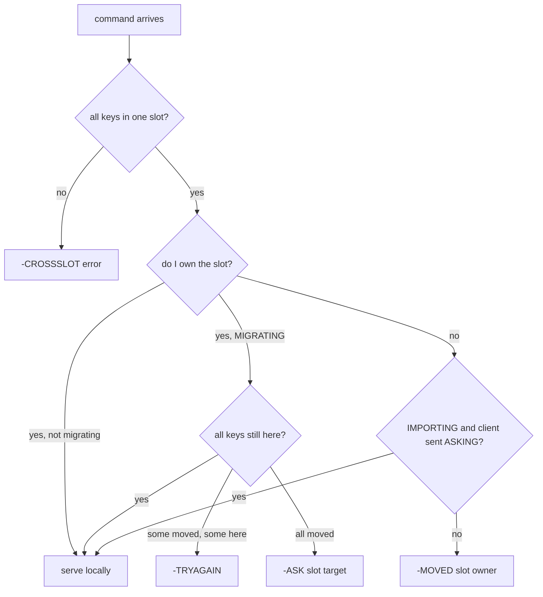
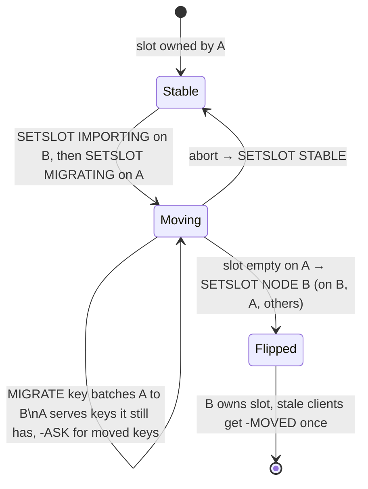

# Redis Cluster: 16384 slots and two ways to say "not here"

Redis Cluster is the most widely deployed implementation of the fixed-partition idea you met
in [reading-dynamo.md](reading-dynamo.md) (Dynamo's "strategy 3"): hard-code the number of
partitions at 16384 slots, make slot ownership movable, and push routing intelligence into the
client. There is no proxy and no routing tier — every node knows the full slot map, and any node
can tell a client where a key really lives. The entire live-migration story is built from just
two error replies (`-MOVED` and `-ASK`), one client command (`ASKING`), and four admin verbs
(`CLUSTER SETSLOT ... MIGRATING/IMPORTING/STABLE/NODE`).

This guide walks the C source in `~/repos/redis/src`, pinned at the SHA in the topic's pin
table. The interesting split: `cluster.h` / `cluster.c` hold the generic slot math and redirect
logic, while `cluster_legacy.h` / `cluster_legacy.c` hold the concrete node state (per-slot
migrating/importing pointers) and the `SETSLOT` admin machinery. Every `file:line` below was
checked against the pinned tree this session.

## The problem in one sentence

**When a key's home moves from node A to node B while both are serving traffic, every request
must get a correct answer — served, or redirected with enough information to retry — without any
central router and without ever blocking the keyspace.**

Mod-N hashing fails this test before migration even starts: the topic's measured headline
(FINDINGS row 36) is that growing 16 shards to 17 moves 94.1% of all keys against an ideal of
5.9%, and lane 1 shows the smaller 4→5 case still remaps about 80%. Redis Cluster's answer is to
hash keys into a fixed universe of 16384 slots and move *slot ownership*, one slot at a time,
with a per-slot state machine that keeps both nodes answering correctly mid-move.

## The concepts, step by step

### Step 1 — Fixed slots decouple partitioning from placement

> **In:** the mod-N remap disaster from the topic headline (94.1% of keys move on a 16→17 grow).
> **Out:** the two-stage `key → slot → node` indirection, where the first arrow is frozen
> forever and only the second moves — the structural reason every later step is possible.

A **slot** is one of a fixed number of hash buckets; a key is assigned to a slot by hashing, and
each slot is *owned* by exactly one node. `cluster.h:23` defines the universe: `CLUSTER_SLOTS` is
`1 << CLUSTER_SLOT_MASK_BITS = 2^14 = 16384` (`CLUSTER_SLOT_MASK_BITS` is 14, `cluster.h:22`). A
key maps to a slot with `crc16(key) & 0x3FFF` — masking a 16-bit CRC to its low 14 bits. The
slot→node assignment is a separate, mutable table that every node gossips.

```
  key ──crc16──▶ 16-bit hash ──& 0x3FFF──▶ slot (0..16383) ──slot map──▶ node
                                            ▲ fixed forever              ▲ movable
```

Contrast with mod-N: there, adding a shard changes the *function* `hash % N` and remaps most
keys (the headline's 94.1%). Here the function never changes; only rows of the slot map change.
Rebalancing 4→5 nodes means handing off roughly 16384/5 ≈ 3276 slots — about 20% of the data,
close to the theoretical minimum — instead of 80%.

### Step 2 — Hash tags: carving the hash input for co-location

> **In:** the `key → slot` hash from Step 1, which by default scatters related keys.
> **Out:** the hash-tag rule that lets a user *force* chosen keys into one slot — the
> precondition for the multi-key commands that Step 3's `-CROSSSLOT` check otherwise forbids.

A **hash tag** is a substring of the key, delimited by `{` … `}`, that is hashed *instead of* the
whole key. `keyHashSlot()` (`cluster.h:59`) implements it: if the key contains a `{` followed by
a non-empty section closed by `}`, ONLY the substring between the first `{` and the next `}` is
hashed. An empty `{}` (nothing between the braces) falls back to hashing the whole key, and so
does a `{` with no following `}`.

```
  "user:{42}:cart"     ──▶ crc16("42") & 0x3FFF     ─┐
  "user:{42}:profile"  ──▶ crc16("42") & 0x3FFF     ─┤─▶ same slot, same node
  "user:{42}:orders"   ──▶ crc16("42") & 0x3FFF     ─┘
  "user:42:cart"       ──▶ crc16(whole key) & 0x3FFF ──▶ some other slot
```

This is the user-facing co-location tool: keys sharing a tag land in one slot, so multi-key
commands, MULTI/EXEC transactions, and Lua scripts over them are legal (Step 3 rejects
cross-slot multi-key commands with `-CROSSSLOT`). There's also a pattern-matching sibling,
`patternHashSlot` (`cluster.c:35`), used when the "key" is a glob pattern (e.g. pubsub patterns):
it decides whether a pattern pins to a single slot at all by finding a `{`…`}` tag inside the
pattern.

### Step 3 — Request routing: getNodeByQuery decides serve / MOVED / ASK

> **In:** a command carrying one or more keys, each resolved to a slot by Steps 1–2.
> **Out:** exactly one of {serve locally, `-CROSSSLOT`, `-MOVED`, `-ASK`, `-TRYAGAIN`} — the
> decision that Steps 4–6 each pick up one branch of.

`getNodeByQuery()` (`cluster.c:1191`) is the router.
For each arriving command it extracts the keys, computes their slot, and checks three things: do
all keys share one slot (else `-CROSSSLOT` error), does this node own the slot, and is the slot
currently migrating or importing. The outcome is either "serve locally" or an error code that
drives a redirect. **MOVED** means the slot's home has permanently changed; **ASK** means only
this one request should hop, because a live migration is mid-flight (Steps 4–5 draw the line).



Note the multi-key subtlety mid-migration: if a command touches several keys in a MIGRATING
slot and only *some* have already moved (`multiple_keys && missing_keys` at `cluster.c:1409`),
neither node can serve it — the client gets `-TRYAGAIN` (`CLUSTER_REDIR_UNSTABLE`) and must back
off and retry.

### Step 4 — MOVED: the durable redirect

> **In:** the "I don't own this slot, and no migration is in flight" branch from Step 3.
> **Out:** the `-MOVED` reply and the *permanent* client-map update it demands — the mechanism
> by which a cold or stale client converges to direct routing.

When the slot simply belongs to another node, the base case at `cluster.c:1432` sets
`CLUSTER_REDIR_MOVED`, and `clusterRedirectClient()` (`cluster.c:1443`) formats
`-MOVED slot host:port`. **MOVED** means: *the slot's home has permanently changed — update your
slot map.* A well-behaved client rewrites its cached slot→node entry (or refreshes the whole map
with `CLUSTER SHARDS` / `CLUSTER SLOTS`) and never asks the wrong node for that slot again. MOVED
is how a cold client with an empty or stale map converges: worst case one extra hop per slot,
then steady-state direct routing.

### Step 5 — ASK + ASKING: the one-shot redirect during migration

> **In:** the "I own this slot but the key already migrated away" branch from Step 3.
> **Out:** the `-ASK`/`ASKING` two-command dance and the single invariant it protects — that at
> every instant exactly one node authoritatively owns a slot, MOVED's permanence notwithstanding.

**ASK** is the temporary cousin of MOVED: *just this once, ask over there — do NOT update your
map.* The ASK branch is at `cluster.c:1397` (`CLUSTER_REDIR_ASK`, returning
`getMigratingSlotDest(slot)`), formatted by the same `clusterRedirectClient()` at
`cluster.c:1443`. The source node emits it while a slot is MIGRATING and the requested key has
already been transferred. The client must then send two commands to the target: `ASKING`, then
the retried command. `askingCommand()` (`cluster.c:1680`) sets `CLIENT_ASKING` (`cluster.c:1685`),
a flag permitting exactly ONE subsequent command against an IMPORTING slot; the flag is cleared
right after that command runs, in `commandProcessed()` at `networking.c:2891-2896`. Without the
ASKING flag the target replies `-MOVED` *back to the source* — correct, because ownership hasn't
flipped yet (the importing-slot serve path at `cluster.c:1406-1414` requires the flag). The
one-shot design keeps the invariant: at any instant exactly one node is the authoritative owner
of a slot, and only explicitly-flagged requests may jump the gun.

The distinction in one line each: **MOVED = permanent, update your map, applies to every future
request; ASK = transient, do not update your map, applies to exactly this one request.**

### Step 6 — The SETSLOT state machine: moving a slot live

> **In:** the ASK/MOVED replies of Steps 4–5, which are only *correct* if backed by per-slot
> migration state.
> **Out:** the two state arrays and four admin verbs that produce that state, and the proof that
> no instant leaves a key unanswerable.

Per-node state lives in the `clusterState` struct at `cluster_legacy.h:343-344`:

```c
// src/cluster_legacy.h:343-344 — per-slot migration pointers inside clusterState
343  clusterNode *migrating_slots_to[CLUSTER_SLOTS];    /* source side: slot leaving, to whom */
344  clusterNode *importing_slots_from[CLUSTER_SLOTS];  /* target side: slot arriving, from whom */
```

The four `CLUSTER SETSLOT` verbs (documented at `cluster_legacy.c:6072-6075`, dispatched from
`cluster_legacy.c:6071`) drive the protocol — MIGRATING, IMPORTING, STABLE (clear migration
state), NODE (the final ownership flip):



The operator (e.g. `redis-cli --cluster reshard`) sets IMPORTING on the target first, then
MIGRATING on the source; keys move batch by batch with `MIGRATE` commands. Throughout, the source
serves keys it STILL HAS and ASK-redirects for keys already gone (Step 3's decision tree). When
the slot is empty, `SETSLOT slot NODE target-id` flips ownership; from then on queries to the old
owner get `-MOVED`. No moment exists where a key is unanswerable — the worst outcomes are one
extra network hop or a `-TRYAGAIN` retry.

### Step 7 — What the client library must implement

> **In:** the server-side contract of Steps 3–6, deliberately kept cheap.
> **Out:** the four client obligations that pay for that cheapness — read this as the spec the
> M36 capstone's Rust client must satisfy.

The server keeps its half of the contract cheap by pushing four obligations onto clients:

1. Maintain a slot→node map (16384 entries) and route directly on the fast path.
2. On `-MOVED`: update the map (or refresh it wholesale), then retry.
3. On `-ASK`: send `ASKING` + the command to the indicated node, *without* touching the map.
4. Design around `-CROSSSLOT`: use hash tags (Step 2) to co-locate keys that must be touched
   atomically together, and treat `-TRYAGAIN` as retryable backoff.

This is exactly the redirect contract planned for the M36 capstone's Rust graph engine
(slot = `crc16 & 0x3FFF`, MOVED/ASK-equivalent replies), so read this step as a spec.

### Step 8 — Why 16384?

> **In:** the fixed slot count `2^14` asserted in Step 1.
> **Out:** the two opposing cost pressures that pick that exact number — so the constant reads as
> an engineering trade, not a magic value.

Two order-of-magnitude pressures meet in the middle. Each node advertises its owned slots as a
bitmap in every gossip heartbeat, and the full slot map is serialized into node config — so
slot-count cost is paid per message and per node: 16384 slots is a 2 KiB bitmap
(16384 / 8 = 2048 bytes), while 65536 slots would quadruple every heartbeat's slot payload.
Pulling the other way, more slots means finer rebalancing granularity and more headroom for
cluster size. At the intended scale (order of a thousand masters), 16384 still leaves double-digit
slots per node, so `2^14` is the sweet spot: gossip stays small, granularity stays fine. Keep
this qualitative — the exact message layout lives in `cluster_legacy.h` if you want byte-level
numbers.

## Where each step lives in the code

| Step | What | Where |
|---|---|---|
| 1 | `CLUSTER_SLOTS` = 2^14 via `CLUSTER_SLOT_MASK_BITS` | `cluster.h:22-23` |
| 1, 2 | `keyHashSlot()`: `crc16 & 0x3FFF`, hash-tag extraction, empty-`{}` fallback | `cluster.h:59` |
| 2 | `patternHashSlot()` for glob patterns | `cluster.c:35` |
| 3 | `getNodeByQuery()`: slot check, ownership, CROSSSLOT/TRYAGAIN | `cluster.c:1191` |
| 4 | MOVED base-case branch; error formatting in `clusterRedirectClient()` | `cluster.c:1432`, `cluster.c:1443` |
| 5 | ASK decision branch; `askingCommand()` one-shot flag set / cleared | `cluster.c:1397`, `cluster.c:1685`, `networking.c:2891-2896` |
| 6 | `migrating_slots_to[]` / `importing_slots_from[]` per-slot state | `cluster_legacy.h:343-344` |
| 6 | `CLUSTER SETSLOT` MIGRATING / IMPORTING / STABLE / NODE verbs | `cluster_legacy.c:6072-6075` |

## Questions to answer in notes.md

1. In `keyHashSlot()` (`cluster.h:59`), trace the exact behavior for the keys `"{}"`,
   `"{user}"`, and `"a{b}c{d}e"` — which bytes get hashed in each case, and why does the
   empty-tag fallback exist?
2. In `getNodeByQuery()` (`cluster.c:1191`), under precisely what combination of
   conditions does a client get `-TRYAGAIN` instead of `-ASK`? Why can't the source just forward
   or serve? (Look at `multiple_keys && missing_keys`, `cluster.c:1409`.)
3. Follow `askingCommand()` (`cluster.c:1680`): where is the client's ASKING flag consumed and
   cleared so that it permits exactly one command (`networking.c:2891-2896`)? What happens if the
   client sends ASKING to a node whose slot is not importing?
4. Walk the SETSLOT verbs (`cluster_legacy.c:6072-6075`): what does `SETSLOT ... NODE` check
   before flipping ownership, and how does the new owner make sure the rest of the cluster learns
   about the flip rather than trusting stale gossip?
5. During a slot migration, list every reply a client can receive for a single-key GET on that
   slot (from source and from target, with and without ASKING) and confirm each against the
   decision paths in `cluster.c:1397-1443`.

## Done when

Answer each before unfolding it.

- [ ] You can compute a key's slot by hand (crc16, mask, hash-tag rules) and predict which keys
      co-locate.

  <details><summary>Answer</summary>

  Slot = `crc16(H) & 0x3FFF`, where `H` is the *hash input* chosen by `keyHashSlot()`
  (`cluster.h:59`): for a key with a `{`…`}` tag whose contents are non-empty, `H` is the bytes
  between the first `{` and the next `}`; otherwise `H` is the whole key. Worked on the three
  probe keys:

  - `"{}"` → the braces are empty, so the fallback fires and `H = "{}"` (the whole key is hashed).
  - `"{user}"` → non-empty tag, `H = "user"`.
  - `"a{b}c{d}e"` → first `{` then next `}` bracket just `"b"`, so `H = "b"`; the later `{d}` is
    ignored.

  So keys co-locate iff their chosen `H` is byte-identical: `user:{42}:cart` and
  `user:{42}:orders` both hash `"42"` → same slot; `user:42:cart` hashes the whole key → a
  different slot. The empty-`{}` fallback exists so a literal `{}` in a key can't collapse every
  such key onto one slot.

  </details>

- [ ] You can state the MOVED vs ASK distinction in one sentence each, including what the client
      does to its slot map in each case.

  <details><summary>Answer</summary>

  **MOVED** (`cluster.c:1432`, formatted at `:1443`): the slot's home has *permanently* changed —
  the client updates its slot→node map (or refreshes it wholesale) and routes all future requests
  for that slot to the new owner. **ASK** (`cluster.c:1397`): a migration is in flight and *this
  one key* has already moved — the client sends `ASKING` + the command to the named target for
  *this request only* and leaves its slot map untouched, because ownership has not flipped yet.
  The map change is the whole difference: MOVED mutates it, ASK must not.

  </details>

- [ ] You can draw the SETSLOT state machine from memory and explain why no request is ever
      unanswerable mid-migration.

  <details><summary>Answer</summary>

  States: Stable (A owns) → Moving (operator runs `SETSLOT IMPORTING` on B, then
  `SETSLOT MIGRATING` on A, setting `importing_slots_from[]` / `migrating_slots_to[]`,
  `cluster_legacy.h:343-344`) → Flipped (`SETSLOT ... NODE B` once the slot is empty), with an
  abort edge `SETSLOT STABLE` back to Stable. The four verbs live at `cluster_legacy.c:6072-6075`.

  No request is unanswerable because during Moving the source serves every key it still holds and
  `-ASK`-redirects only keys already transferred; the target serves an ASK-flagged request and
  otherwise `-MOVED`s back to the source; a partially-migrated multi-key command gets a retryable
  `-TRYAGAIN`. Every case yields either an answer or a redirect carrying enough information to
  retry — never a dropped or silently-wrong reply.

  </details>

- [ ] You traced one full redirect in the source: `getNodeByQuery` → error code →
      `clusterRedirectClient` → client obligation.

  <details><summary>Answer</summary>

  A cold client GETs a key whose slot B now owns. `getNodeByQuery()` (`cluster.c:1191`)
  computes the slot, finds this node (A) is not the owner and no ASKING applies, and hits the base
  case at `cluster.c:1432`, setting `CLUSTER_REDIR_MOVED` and returning node B.
  `clusterRedirectClient()` (`cluster.c:1443`) formats `-MOVED <slot> <B host:port>`. The client's
  obligation (Step 7 rule 2) is to update its slot→node map to point that slot at B and retry
  there — after which it routes directly, one extra hop amortized away. The ASK path is the same
  chain but via `cluster.c:1397` and leaves the map untouched.

  </details>

- [ ] Questions 1-5 are answered in [notes.md](notes.md).

  <details><summary>Answer</summary>

  Done when `notes.md` contains your worked answers to all five questions above, each grounded in
  a real `file:line` from this guide's "Where each step lives" table (not paraphrased from
  memory), and cross-checked against the source with `tools/pinned-source.py show redis <path>`.

  </details>

## References

- Source: `~/repos/redis/src/cluster.h`, `~/repos/redis/src/cluster.c`,
  `~/repos/redis/src/cluster_legacy.h`, `~/repos/redis/src/cluster_legacy.c` (pinned SHA in the
  topic's `resources/codebases.md` pin table).
- The Redis Cluster specification (the official protocol document; the source above is its
  reference implementation).
- [Topic README](README.md) — lane 1 (mod-N vs fixed slots numbers) and lane context.
- [reading-dynamo.md](reading-dynamo.md) — strategy 3: fixed partitions, movable ownership.
- Topic 35's [reading-redis-backpressure.md](../35-overload/reading-redis-backpressure.md)
  — same codebase, different subsystem.
