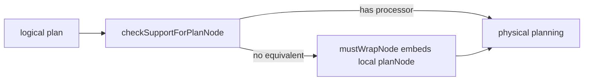
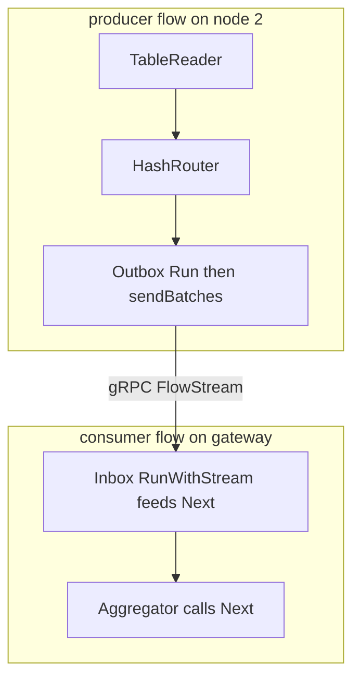

# CockroachDB DistSQL: Volcano's Exchange Operator, Stretched Over a Cluster

DistSQL is what happens when you take Volcano's exchange operator — the one trick that made
single-box parallelism invisible to every other operator — and replace its shared-memory packet
queues with gRPC streams, its `fork()` with flow specs shipped to remote nodes, and its support
functions with protobuf router enums. This guide walks the code path from "can this plan
distribute?" through span partitioning, physical planning, flows, and the Outbox/Inbox pair that
is exchange's producer and consumer half. Everything below is anchored to the CockroachDB source
cloned at `~/repos/cockroach`.

## The problem in one sentence

**A query's data lives on many nodes, so the plan must be cut into per-node fragments that scan
locally and exchange rows over the network — without any join or aggregation operator ever
knowing the network exists.** Volcano solved this on one machine with the exchange operator;
DistSQL's bet is that the same encapsulation survives a network hop if the receiving end still
looks like an ordinary iterator.

## The concepts, step by step

### Step 1 — First, decide whether the plan can distribute at all

> **In:** a logical plan — the tree of planNodes the optimizer produced.
> **Out:** a per-node verdict (distributable, local-only, or wrapped) so physical
> planning knows what can fan out.

Not every logical operator has a distributed-processor equivalent. `checkSupportForPlanNode`
walks the logical plan and votes on each node: distributable, local-only, or somewhere in
between. Nodes with no DistSQL processor equivalent are not a dead end — `mustWrapNode` wraps
the local planNode so it can be embedded inside a distributed flow as an opaque row source. The
decision is per-node, so a mostly-distributable plan with one awkward operator still distributes
around it.



### Step 2 — Data placement becomes the parallelism plan

> **In:** the table spans a scan needs, plus the range→leaseholder placement map
> from topic 36.
> **Out:** per-node scan work — each node assigned exactly the spans whose ranges
> it already leads, so placement *is* the parallelism.

This is the bridge from topic 36. `PartitionSpans` takes the table spans a scan needs, consults
range ownership — the placement map you built in the sharding topic — and partitions the spans
by the node holding each range's leaseholder. There is no separate scheduling decision: each
node scans exactly what it already owns, so the sharding layout literally *is* the degree and
shape of parallelism.

```
table spans      [a ──────── e) [e ──────── m) [m ──────── z)
leaseholder           node 1         node 2         node 3
                        │              │              │
PartitionSpans          ▼              ▼              ▼
per-node work    node1: scan a-e  node2: scan e-m  node3: scan m-z
```

The consequence cuts both ways: co-located data means zero data movement for the scan, but
fan-out width now equals the number of nodes owning relevant ranges — Step 7 collects the bill.

### Step 3 — The physical plan: processors connected by streams

> **In:** the logical plan plus Step 2's per-node span assignment.
> **Out:** a `PhysicalPlan` — processors (typed by spec) wired by location-agnostic
> `StreamEndpointSpec` streams that may be a local queue or a remote gRPC hop.

`createPhysPlan` and `createPhysPlanForPlanNode` recursively turn the logical plan into a
`PhysicalPlan` — the under-construction distributed plan, which is nothing more than a set of
processors (typed by spec) plus the streams wiring their outputs to inputs. A stream endpoint is
described by `StreamEndpointSpec` and is deliberately location-agnostic: it may resolve to a
local in-memory queue or a remote gRPC stream, and no processor can tell the difference. That is
Volcano's anonymous-input discipline encoded in the plan representation itself.

```
PhysicalPlan (under construction, gateway-side)

  node1: [TableReader]──router──┐
                                ├── stream ──▶ [Aggregator] on gateway
  node2: [TableReader]──router──┤
                                │        each edge = StreamEndpointSpec
  node3: [TableReader]──router──┘        local queue OR remote gRPC — same spec
```

The recursion in `createPhysPlanForPlanNode` mirrors the logical plan bottom-up: scans become
per-node TableReaders positioned by Step 2's span partitioning, and each parent operator either
merges the partial results on the gateway or — when a router can repartition by key — stays
distributed and runs a copy on every node that already has a flow.

### Step 4 — Routers: Volcano's partitioning policies as protobuf enums

> **In:** a processor's output rows and a required distribution.
> **Out:** an `OutputRouterSpec` policy — PASS_THROUGH, MIRROR, BY_HASH, or
> BY_RANGE — that decides which output stream each row takes.

Where Volcano's exchange took C support functions to decide which consumer gets each row,
DistSQL declares the policy in `OutputRouterSpec` and the wire format enumerates exactly the
classic options:

```
Volcano exchange policy          OutputRouterSpec enum
-----------------------          ---------------------
single consumer, no routing  →   PASS_THROUGH
broadcast to all consumers   →   MIRROR
hash of key picks consumer   →   BY_HASH   (joins, aggregations)
range of key picks consumer  →   BY_RANGE
```

The runtime implementations live twice — `hashRouter` in the row-based engine and `HashRouter`
in the vectorized engine — because routing a whole column batch amortizes per-row costs the
row engine pays every time. `BY_HASH` is the workhorse: it is how a distributed hash join gets
matching keys onto the same node without any join-side awareness.

### Step 5 — Flows: one fragment per node replaces fork()

> **In:** the `PhysicalPlan` from Step 3, sliced into the processors and streams
> that belong to one node.
> **Out:** a running `Flow` per node — processors instantiated from spec,
> goroutines launched, the last processor run inline in the caller's goroutine.

A `Flow` is the set of processors and streams scheduled on ONE node for one query — the unit the
gateway ships out instead of forking worker processes. `Setup` instantiates processors from the
spec, `StartInternal` launches the internal goroutines, and `Run` executes the *last* processor
synchronously in the caller's goroutine while the rest run async — saving one goroutine per flow
on the hottest path.

```
gateway node                         remote node 2          remote node 3
┌─────────────────────────┐          ┌───────────────┐      ┌───────────────┐
│ flow: final Aggregator  │  specs   │ flow: scan +  │      │ flow: scan +  │
│       + Inboxes         │ ───────▶ │ router+Outbox │      │ router+Outbox │
│ Run: last proc inline   │          │ Setup / Start │      │ Setup / Start │
└─────────────────────────┘          └───────────────┘      └───────────────┘
```

### Step 6 — The exchange's two halves: Outbox and Inbox over gRPC

> **In:** a router's output on the producer node and a consumer waiting on another
> node.
> **Out:** an `Outbox` → gRPC `FlowStream` → `Inbox` pipe whose consumer end,
> `Inbox.Next`, is an ordinary operator iterator — the network hidden.

The vectorized engine splits exchange across the wire. The producer half is `Outbox`: its `Run`
dials the consumer node and opens a FlowStream RPC, then `sendBatches` serializes record batches
onto the stream. The consumer half is `Inbox`: `RunWithStream` is where the gRPC handler hands
the incoming stream to the reader, and `Next` is a plain operator iterator — the downstream join
or aggregator pulls batches from the Inbox exactly as it would from a local scan. Volcano's
encapsulation survives the network hop intact. The signature is the whole point — no stream, no
node, just a batch:

```go
// pkg/sql/colflow/colrpc/inbox.go — Inbox.Next, the consumer half of the exchange
333 func (i *Inbox) Next() (coldata.Batch, *execinfrapb.ProducerMetadata) {
334 	if i.done {
335 		return coldata.ZeroBatch, nil
336 	}
```

Read the two halves in this order, and the symmetry becomes obvious:

1. `Outbox` struct (`outbox.go:50`) — what state the producer half carries.
2. `Outbox.Run` (`outbox.go:218`) — dial the consumer node, open the FlowStream RPC.
3. `sendBatches` (`outbox.go:323`) — the serialize-and-ship loop.
4. `Inbox` struct (`inbox.go:57`) — the mirror image on the consumer side.
5. `RunWithStream` (`inbox.go:212`) — the gRPC handler hands the stream to the reader.
6. `Inbox.Next` (`inbox.go:333`) — and here the network disappears: it is just an operator.

What replaced what, relative to the 1990 single-machine design:

```
Volcano exchange, 1990              DistSQL, over a cluster
----------------------              ------------------------
fork a producer process        →    ship a FlowSpec, node runs Setup + StartInternal
shared-memory packet queue     →    gRPC FlowStream carrying record batches
support function per policy    →    OutputRouterSpec enum value
consumer's anonymous input     →    Inbox.Next — still anonymous, now remote
```



### Step 7 — The price: fan-out width is tail-latency exposure

> **In:** the fan-out width `PartitionSpans` derived from placement (Step 2).
> **Out:** the tail-latency bill — a query over ranges on N nodes waits for its
> slowest flow, exactly topic 37's fan-out math.

Because `PartitionSpans` derives fan-out from placement, a query over ranges on N nodes waits
for its slowest flow. This is exactly topic 37's fanout lane from "The Tail at Scale": if each
node is slow 1 time in 100, a 100-way fan-out query is slow 63% of the time — the per-node p99
becomes roughly the query median. DistSQL buys locality and parallel scan bandwidth at the cost
of multiplying your exposure to every straggling node; hedging, smaller fan-out via better
placement, and per-flow admission control are the countermeasures, not faster operators.

## Where each step lives in the code

Paths are relative to `~/repos/cockroach`.

| Step | Anchor | What to look at |
|---|---|---|
| 1 | `pkg/sql/distsql_check.go:214` | `checkSupportForPlanNode` — per-node distributability walk |
| 1 | `pkg/sql/distsql_physical_planner.go:312` | `mustWrapNode` — embedding planNodes with no processor equivalent |
| 2 | `pkg/sql/distsql_physical_planner.go:971` | `PartitionSpans` — spans partitioned by leaseholder node |
| 3 | `pkg/sql/distsql_physical_planner.go:3604` | `createPhysPlan`; `createPhysPlanForPlanNode` at `:3632` |
| 3 | `pkg/sql/physicalplan/physical_plan.go:125` | `PhysicalPlan` — processors + streams under construction |
| 4 | `pkg/sql/execinfrapb/data.proto:72` | `StreamEndpointSpec` — local queue or remote gRPC stream |
| 4 | `pkg/sql/execinfrapb/data.proto:149` | `OutputRouterSpec`; enum at `:152` `PASS_THROUGH`, `:154` `MIRROR`, `:157` `BY_HASH`, `:160` `BY_RANGE` |
| 4 | `pkg/sql/rowflow/routers.go:538` | `hashRouter` — row-based engine |
| 4 | `pkg/sql/colflow/routers.go:443` | `HashRouter` — vectorized engine |
| 5 | `pkg/sql/flowinfra/flow.go:72` | `Flow` interface; `Setup` at `:272`, `StartInternal` at `:463`, `Run` at `:566` |
| 6 | `pkg/sql/colflow/colrpc/outbox.go:50` | `Outbox`; `Run` dials at `:218`, `sendBatches` at `:323` |
| 6 | `pkg/sql/colflow/colrpc/inbox.go:57` | `Inbox`; `RunWithStream` at `:212`, `Next` at `:333` |
| 7 | `pkg/sql/distsql_physical_planner.go:971` | `PartitionSpans` — fan-out width falls out of placement |

## Questions to answer in notes.md

1. Which planNodes does `checkSupportForPlanNode` reject, and what does `mustWrapNode`'s wrapping
   cost at runtime — where does the wrapped local planNode execute, and what parallelism is lost?
2. Trace `PartitionSpans` for a three-node table: what happens when the gateway's leaseholder
   cache is stale and a flow is scheduled on a node that no longer holds the range's lease?
3. Why does `Flow.Run` execute the last processor synchronously in the caller's goroutine instead
   of spawning it like the others — what does that save per query, and per node, under high QPS?
4. Follow `sendBatches` in the Outbox: what provides backpressure so a fast producer cannot
   overrun a slow Inbox — gRPC stream flow control, an explicit window, or buffering in between?
5. Using the Step 7 model: with 1-in-100 per-node slowness, what fraction of queries are slow at
   20-way fan-out versus 100-way, and what does that imply for range placement of hot tables?

## Done when

Answer each before unfolding it.

- [ ] You can narrate the full path — logical plan → `checkSupportForPlanNode` →
      `PartitionSpans` → `PhysicalPlan` → per-node `Flow` — without looking at the code.

  <details><summary>Answer</summary>

  `checkSupportForPlanNode` (distsql_check.go:214) votes each planNode
  distributable / local-only / wrapped, and `mustWrapNode`
  (distsql_physical_planner.go:312) embeds the ones with no processor equivalent.
  `PartitionSpans` (:971) splits the scan's spans by leaseholder node, so placement
  sets the fan-out. `createPhysPlan` / `createPhysPlanForPlanNode` (:3604 / :3632)
  build the `PhysicalPlan` (physicalplan/physical_plan.go:125) — processors joined
  by `StreamEndpointSpec` streams (execinfrapb/data.proto:72). The gateway then ships
  each node its slice as a `Flow` (flowinfra/flow.go:72), set up and started per node.
  Placement → fragments → streams → flows.

  </details>

- [ ] You can point at the line where the consumer side of a network exchange becomes an
      ordinary iterator, and explain why that keeps every other operator network-oblivious.

  <details><summary>Answer</summary>

  `Inbox.Next` (colflow/colrpc/inbox.go:333) returns
  `(coldata.Batch, *execinfrapb.ProducerMetadata)` — the exact signature of any
  vectorized operator, with no stream or node in it. The downstream join or
  aggregator calls `Next` and cannot tell whether the batch arrived from a local
  queue or a gRPC `FlowStream` (opened by `Outbox.Run`, outbox.go:218; fed by
  `sendBatches` :323; handed to the reader in `Inbox.RunWithStream` :212). Because the
  network hides behind the same iterator contract, every other operator is unchanged
  from the single-node case — Volcano's anonymous input, now remote.

  </details>

- [ ] You can map all four `OutputRouterSpec` policies to their Volcano exchange ancestors and
      name which one a distributed hash join uses and why.

  <details><summary>Answer</summary>

  From `execinfrapb/data.proto`: PASS_THROUGH (:152) = single consumer, no routing;
  MIRROR (:154) = broadcast to all consumers (Volcano's broadcast-by-pinning);
  BY_HASH (:157) = hash of key columns picks the stream; BY_RANGE (:160) = preset key
  boundaries pick the stream. They are Volcano's support-function policies
  (round-robin / range / hash, plus broadcast) written as a protobuf enum. A
  distributed hash join uses **BY_HASH**: hashing the join keys routes matching keys
  from both inputs to the same node, so each node joins its own partition with no
  join-side awareness — the runtime router is `hashRouter` (rowflow/routers.go:538)
  or `HashRouter` (colflow/routers.go:443).

  </details>

- [ ] You have answered all five questions above in `notes.md`, with file:line evidence.

  <details><summary>Answer</summary>

  Each answer should carry the anchor a reader can check against `~/repos/cockroach`:
  (1) `checkSupportForPlanNode`:214 + `mustWrapNode`:312 — the wrapped planNode runs
  locally on the gateway, losing distribution; (2) `PartitionSpans`:971 and the
  stale-leaseholder re-route; (3) `Flow.Run`:566 runs the last processor inline,
  saving one goroutine per flow per node; (4) `sendBatches`:323 — backpressure is
  gRPC stream flow control, not an explicit window; (5) the Step 7 model,
  1 − 0.99^20 ≈ 18.2% at 20-way fan-out versus 63.4% at 100-way, so keeping hot tables
  on fewer nodes shrinks the tail exposure.

  </details>

## References

- **Code**: `~/repos/cockroach` — all anchors above are relative to the repo root.
- **Conceptual ancestor**: Goetz Graefe, *Encapsulation of Parallelism in the Volcano Query
  Processing System* (SIGMOD 1990) — the exchange operator DistSQL stretches over gRPC.
- **The placement side**: [topic 36's sharding guide](../36-sharding/README.md) — where the
  range/leaseholder map that `PartitionSpans` consults comes from.
- **Local stub**: [`experiments/src/exchange.rs`](experiments/src/exchange.rs) — build the
  single-process exchange first; DistSQL is that plus serialization and a dial.
