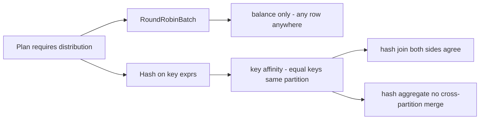
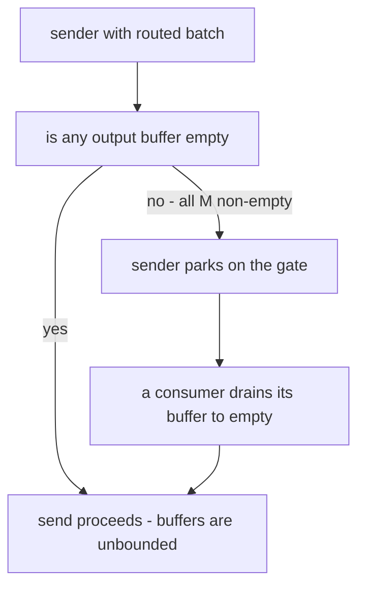

# DataFusion's RepartitionExec: Volcano's Exchange Operator, One Process at a Time

RepartitionExec is DataFusion's in-process exchange operator: it takes N input partitions and redistributes their
batches across M output partitions, using either round-robin (for balance) or hash (for key affinity) routing.
It is the direct descendant of Volcano's exchange — the operator that made parallelism invisible to every other
operator — squeezed into one process with tokio tasks instead of OS processes. This guide walks the routing core,
the deterministic hash contract that joins depend on, and a flow-control design that is deliberately not a bounded queue.

## The problem in one sentence

**Every other operator in the plan wants to pretend it is single-threaded, so one operator must own all
data movement between partitions — routing, buffering, backpressure, and order preservation.**
Volcano called this "anonymous inputs": a hash join reading partition 3 neither knows nor cares that its rows
came from eight different producers. RepartitionExec is where that pretense is manufactured.

## The concepts, step by step

### Step 1 — The N-to-M fan: what the operator actually is

> **In:** N input partitions of `RecordBatch`es (from the child plan) and a target
> output-partition count M.
> **Out:** M output partitions, each a stream a downstream operator drains as if it
> were the only consumer of a single-threaded child.

`RepartitionExec` (mod.rs:1150) maps N input partitions to M output partitions. `execute` (:1329) is called once
per *output* partition; on first call it spawns one `pull_from_input` task (:1742) per *input* partition. Each task
drains its input stream, routes every batch, and pushes into per-output channels. Consumers just poll their channel.

```text
 input part 0 ──┐                       ┌── output part 0
 input part 1 ──┤   pull_from_input     ├── output part 1
 input part 2 ──┤ ──► BatchPartitioner ─┤       ...
     ...        │   (route each batch)  │
 input part N-1─┘                       └── output part M-1

 N producer tasks          N x M channel matrix          M consumer streams
```

The key structural fact: there are N×M logical channels, not one shared queue. That matrix is what makes both
flow control (Step 5) and order-preserving merge (Step 6) possible. It also localizes contention: a producer
and a consumer only ever synchronize on their own channel plus one shared gate, never on a global lock over all
in-flight batches. `consume_input_streams` (:393) is the entry point on the producing side that wires this up.

### Step 2 — Routing policy is a plan-time property

> **In:** a plan node's required input distribution (what Step 7's rule computes).
> **Out:** a `Partitioning` enum value — `RoundRobinBatch(M)` or `Hash(exprs, M)` —
> that fixes routing before a single batch moves.

The `Partitioning` enum (partitioning.rs:117) declares the contract: `RoundRobinBatch(usize)` (:119) says
"any batch anywhere, just balance the load"; `Hash(Vec&lt;Arc&lt;dyn PhysicalExpr&gt;&gt;, usize)` (:122) says
"rows with equal key expressions must land in the same output partition." Round-robin is what you use to widen
a single-partition scan to all cores; hash is what a partitioned hash join or hash aggregate demands, because
correctness — not just balance — depends on co-locating keys.



### Step 3 — Deterministic hashing: the seeds are zero on purpose

> **In:** the `Hash(exprs, M)` policy from Step 2 and a batch's key columns.
> **Out:** a deterministic per-row partition index — identical across runs,
> operators, and (in a distributed setting) nodes.

`BatchPartitioner` (mod.rs:560) is built for hash mode by `new_hash_partitioner` (:679), whose `Hash`
state carries a strength-reduced reducer, `StrengthReducedU64::new(num_partitions)` (:691), and hashes
with `REPARTITION_RANDOM_STATE` (:592) — not a per-instance `RandomState` but a
`SeededRandomState::with_seed(0)`, i.e. FIXED seeds of 0. This is not laziness; it is a
correctness contract. A hash join repartitions *both* inputs by the join keys: if the build side and the probe
side hashed with different per-instance random seeds, key `42` could go to partition 1 on one side and partition 5
on the other, and the join would silently drop matches. Fixed seeds make routing deterministic across runs, across
operators, and (in a distributed setting) across nodes. The partition index is not a visible `hash % M`: the
routing loop calls `partition_reducer.partition_indices(hash_buffer, indices)` (:862), and the reducer built at
:691 turns each hash into `hash % M` without a division in the hot loop (the reason is documented at :594 — M is a
runtime value, not a power of two you can mask with).

The flip side of determinism: adversarial or pathological key sets that collide will collide *every* run — skew is
reproducible, which is good for debugging and bad if your workload hits it.

### Step 4 — Batch economics: whole batches round-robin, per-row scatter for hash

> **In:** one input `RecordBatch` and the routing policy from Step 2.
> **Out:** for round-robin, that whole batch handed to the next output in rotation;
> for hash, M smaller batches, one per output partition.

`partition_iter` (mod.rs:825) is the routing loop, and it treats the two policies asymmetrically:

- **Round-robin** forwards the *entire* RecordBatch to the next output in rotation
  (`*next_idx = (*next_idx + 1) % *num_partitions`, :836; the whole batch is yielded at :837). Zero per-row work,
  zero copies — the batch is just a bundle of Arc'd arrays changing queues.
- **Hash** must look at every row: `create_hashes` (:854), seeded by `REPARTITION_RANDOM_STATE.random_state()`
  (:856), computes one hash per row over the key columns; the reducer buckets rows into a per-partition index list
  (`partition_reducer.partition_indices`, :862); then `Self::partition_grouped_take` (:868) runs arrow's `take` per
  bucket to gather one new batch per partition.

This is Volcano's packet-economics lesson restated. Graefe measured 171 s at 1 record per exchange packet versus
13.7 s at 83 records per packet — a 12x swing purely from amortizing per-transfer cost. DataFusion's RecordBatch
*is* the packet; round-robin keeps the packet intact, while hash pays a per-row scatter but immediately
re-materializes results as full columnar batches so every downstream operator still sees good packets.

```text
 round-robin:  [batch 8192 rows] ──────────────► output (i mod M)   no row work

 hash:         [batch 8192 rows]
                   │ create_hashes per row
                   ▼
               indices: p0:[0,5,9...] p1:[2,3...] ... pM-1:[1,4...]
                   │ arrow take per partition
                   ▼
               M smaller batches, one per output   per-row cost, then columnar again
```

### Step 5 — Flow control: unbounded channels behind one global gate

> **In:** routed `(partition, batch)` pairs from the N producer tasks.
> **Out:** M per-output channels plus one shared `Gate` that applies backpressure
> only when *every* output buffer is non-empty.

The channels are built by `channels()` (distributor_channels.rs:55) — M linked per-output buffers sharing one
`Gate` whose `empty_channels` counter starts at M (`AtomicUsize::new(n)`, :62). `DistributionSender::send`
(:121, :131) implements the unusual semantics: each per-output buffer is individually *unbounded*, and a sender
parks only when *all* M output buffers are non-empty. If any single channel is empty, every send proceeds. The
rule is one branch in `SendFuture::poll` — when the counter of empty channels is zero, the sender registers a
waker and yields:

```rust
// datafusion/physical-plan/src/repartition/distributor_channels.rs — SendFuture::poll
226              if this.gate.empty_channels.load(Ordering::SeqCst) == 0 {
227                  let mut guard = this.gate.send_wakers.lock();
228                  if let Some(send_wakers) = guard.deref_mut() {
229                      send_wakers.push((cx.waker().clone(), this.channel.id));
230                      return Poll::Pending;
231                  }
232              }
```

Why not M bounded queues? Deadlock and starvation in join plans. With per-channel bounds, one slow consumer
(say, a join output partition blocked on its other input) would block the producer, which would then stop feeding
the *fast* consumers too — and in cyclic-ish plan shapes that stall can become a distribution deadlock. The global
gate inverts the condition: backpressure engages only when *everyone* has data waiting, so a fast consumer can
never be starved by pressure aimed at a slow one, while total buffering stays bounded in the common case where at
least one consumer keeps draining.

The trade-off is honest: in the worst case (all consumers stalled except one that never fills), buffering can
grow past what a bounded design would allow. DataFusion accepts that memory risk in exchange for liveness — the
same call Volcano made when it favored keeping producers running over strict per-flow limits.



### Step 6 — preserve_order: the merging exchange

> **In:** N input partitions that are each already sorted, and a plan that needs
> that order kept.
> **Out:** M output streams, each a k-way merge over its N per-input channels —
> Volcano's merging exchange, one process at a time.

When each input partition is already sorted and the plan needs that order, the `preserve_order` flag (mod.rs:1160)
switches RepartitionExec into merge mode — Volcano's MERGING exchange. Records from different producers must be
kept *distinct* per producer and merged by sort key, never dumped into one bag. The machinery at :398-538 keeps a
dedicated channel per (input, output) pair — including spill-to-disk channel variants for memory pressure — and
`consume_input_streams` (:393) drives the input side. Each output partition then runs a streaming k-way merge over
its N per-input channels instead of interleaving arrival order. Cost model: you buy a global sort order for the
price of a per-output merge heap and stricter buffering (a merge cannot emit until every input channel has shown
its next head), which is exactly why the flag is opt-in rather than default.

```text
 plain mode:   in0, in1, in2  ──►  one channel per output  ──►  arrival-order interleave
 merge mode:   in0 ─► ch(0,j) ─┐
               in1 ─► ch(1,j) ─┼─►  k-way streaming merge  ──►  output j, globally sorted
               in2 ─► ch(2,j) ─┘    per-input identity preserved
```

### Step 7 — Who inserts RepartitionExec: EnforceDistribution is retired

> **In:** a plan whose nodes declare required input distributions (hash on join
> keys, or a single partition).
> **Out:** the same plan with a `RepartitionExec` inserted wherever a child's
> distribution does not already satisfy the requirement.

You will read blog posts saying "the EnforceDistribution rule inserts RepartitionExec." That rule was RETIRED and
folded into `EnsureRequirements`, a struct at `physical-optimizer/src/ensure_requirements/mod.rs:166` (the doc
comment at :157 says it "combines the functionality of `EnforceDistribution` and `EnforceSorting`"). The old
standalone file did not merely lose its rule — it *moved*: the helpers now live at
`physical-optimizer/src/ensure_requirements/enforce_distribution.rs`, whose retirement note is spelled out in a
doc comment (:18) and again at :76. `EnsureRequirements::optimize` (mod.rs:176) calls `ensure_distribution`
(enforce_distribution.rs:1053) bottom-up; when a plan node declares a required input distribution that a child does
not meet, that pass inserts the RepartitionExec — round-robin via `add_roundrobin_on_top` (:674, building
`RepartitionExec::try_new` at :688) or hash via the `should_add_hash_repartition` branch (:1281) building
`RepartitionExec::try_new` at :1291. Do not be confused when you grep for the rule the old guides mention and find
only helpers behind a moved path.

## Where each step lives in the code

| Step | What | Anchor |
|------|------|--------|
| 1 | Operator struct, N→M | datafusion/physical-plan/src/repartition/mod.rs:1150 |
| 1 | Per-output execute | datafusion/physical-plan/src/repartition/mod.rs:1329 |
| 1 | Per-input pull task | datafusion/physical-plan/src/repartition/mod.rs:1742 |
| 2 | Partitioning enum | datafusion/physical-expr/src/partitioning.rs:117 |
| 2 | RoundRobinBatch / Hash variants | datafusion/physical-expr/src/partitioning.rs:119, :122 |
| 3 | Fixed-seed SeededRandomState::with_seed(0) | datafusion/physical-plan/src/repartition/mod.rs:592 |
| 3 | Hash constructor (`new_hash_partitioner`) | datafusion/physical-plan/src/repartition/mod.rs:679 |
| 3 | Strength-reduced reducer built (`StrengthReducedU64::new`) | datafusion/physical-plan/src/repartition/mod.rs:691 |
| 3 | `hash % M` applied (`partition_reducer.partition_indices`) | datafusion/physical-plan/src/repartition/mod.rs:862 |
| 4 | Routing core struct (`BatchPartitioner`) | datafusion/physical-plan/src/repartition/mod.rs:560 |
| 4 | Round-robin constructor (`new_round_robin_partitioner`) | datafusion/physical-plan/src/repartition/mod.rs:710 |
| 4 | partition_iter routing loop; round-robin next_idx at :836 | datafusion/physical-plan/src/repartition/mod.rs:825 |
| 4 | Per-row create_hashes (with `.random_state()` :856) | datafusion/physical-plan/src/repartition/mod.rs:854 |
| 4 | Per-partition gather (`partition_grouped_take`, arrow `take`) | datafusion/physical-plan/src/repartition/mod.rs:868 |
| 5 | channels constructor | datafusion/physical-plan/src/repartition/distributor_channels.rs:55 |
| 5 | Gate with empty_channels | datafusion/physical-plan/src/repartition/distributor_channels.rs:62 |
| 5 | DistributionSender::send | datafusion/physical-plan/src/repartition/distributor_channels.rs:121, :131 |
| 5 | Gate park branch (`SendFuture::poll`) | datafusion/physical-plan/src/repartition/distributor_channels.rs:226 |
| 6 | preserve_order flag | datafusion/physical-plan/src/repartition/mod.rs:1160 |
| 6 | Merge-mode channel machinery | datafusion/physical-plan/src/repartition/mod.rs:398-538 |
| 6 | consume_input_streams | datafusion/physical-plan/src/repartition/mod.rs:393 |
| 7 | EnsureRequirements struct (doc :157) | datafusion/physical-optimizer/src/ensure_requirements/mod.rs:166 |
| 7 | optimize → ensure_distribution | datafusion/physical-optimizer/src/ensure_requirements/mod.rs:176 |
| 7 | Retirement notes (moved path) | datafusion/physical-optimizer/src/ensure_requirements/enforce_distribution.rs:18, :76 |
| 7 | Hash RepartitionExec inserted | datafusion/physical-optimizer/src/ensure_requirements/enforce_distribution.rs:1291 |
| 7 | Round-robin RepartitionExec inserted | datafusion/physical-optimizer/src/ensure_requirements/enforce_distribution.rs:688 |

## Questions to answer in notes.md

1. Why must `REPARTITION_RANDOM_STATE` use fixed seeds — walk through exactly how a hash join breaks if the
   build-side and probe-side RepartitionExec instances used per-instance random seeds.
2. Round-robin forwards whole batches while hash scatters per row and rebuilds batches with `take`. What are the
   CPU and memory costs of each, and why does the local stub's row-at-a-time model show hash routing *faster*
   (543.0 M rows/s vs 229.6 M rows/s at k=8) while DataFusion's batch model favors round-robin for cheapness?
3. Describe a concrete plan shape where M per-channel *bounded* queues could deadlock or starve a fast consumer,
   and explain how the single Gate with the `empty_channels` counter avoids it. What is the worst-case buffering
   the gate design permits?
4. In preserve_order mode, why does correctness require a channel per (input, output) pair rather than one channel
   per output? What extra latency does the k-way merge introduce before the first row can be emitted?
5. After the EnforceDistribution → EnsureRequirements consolidation, trace how a hash join's required input
   distribution causes a `Hash` RepartitionExec to appear — which rule sees the requirement, and what does it insert?

## Done when

Answer each before unfolding it.

- [ ] You can sketch the N×M channel matrix from memory and explain why it is not one shared MPMC queue.

  <details><summary>Answer</summary>

  `execute` (mod.rs:1329) is called once per *output* partition; its first call spawns
  one `pull_from_input` task (:1742) per *input* partition. So there are N producer
  tasks and M consumer streams, wired by N×M logical channels (`channels()`,
  distributor_channels.rs:55). It is not one shared MPMC queue for two reasons:
  order preservation (Step 6) needs each (input, output) pair kept distinct so the
  k-way merge can tell producers apart; and a single global lock over all in-flight
  batches would re-serialize every producer and consumer, throwing away the
  parallelism — the matrix confines contention to one channel plus the shared gate.

  </details>

- [ ] You can state the deterministic-hashing contract and name two operators whose correctness depends on it.

  <details><summary>Answer</summary>

  `REPARTITION_RANDOM_STATE` is a `SeededRandomState::with_seed(0)` (mod.rs:592) —
  fixed zero seeds — so `create_hashes` (:854) followed by the strength-reduced
  `partition_reducer.partition_indices` (:862) maps a given key to the *same*
  partition on every instance, run, and node. A **hash join** depends on it (build
  and probe sides must send equal join keys to the same partition, or matches are
  silently dropped) and so does a **hash aggregate** (equal group keys must co-locate,
  or one group is split across partitions and never merged).

  </details>

- [ ] You can explain the Gate flow-control rule ("park only when all buffers are non-empty") and its failure mode
      trade-off versus per-channel bounds.

  <details><summary>Answer</summary>

  Each per-output buffer is individually unbounded; `SendFuture::poll` parks the
  sender only when `gate.empty_channels == 0` — every output already has data waiting
  (distributor_channels.rs:226). If any channel is empty the send proceeds, so a fast
  consumer is never starved by backpressure aimed at a slow one. Per-channel bounds
  would let one blocked consumer (say a join output waiting on its other input) stall
  the producer, which then stops feeding the fast consumers too — a distribution
  deadlock. The trade-off is honest: in the worst case (every consumer stalled except
  one that never fills) buffering can grow past what a bounded design would allow;
  DataFusion accepts that memory risk in exchange for liveness.

  </details>

- [ ] You can explain when preserve_order forces merge mode and what it costs relative to interleaving.

  <details><summary>Answer</summary>

  When each input partition is already sorted and the plan requires that order, the
  `preserve_order` flag (mod.rs:1160) switches `consume_input_streams` (:393; the
  preserve-order branch spans :398–538) to a dedicated channel per (input, output)
  pair, and each output runs a streaming k-way merge over its N per-input channels
  instead of interleaving in arrival order. The cost: a per-output merge heap plus
  stricter buffering — the merge cannot emit until *every* input channel has shown its
  next head — so first-row latency rises. That is why the flag is opt-in, not default.

  </details>

- [ ] You have run the local exchange stub and compared its routing throughput numbers against your own reasoning
      about DataFusion's batch-level costs.

  <details><summary>Answer</summary>

  The stub (`experiments/src/exchange.rs`) routes row-at-a-time, so at k=8 hash
  (543.0 M rows/s) *beats* round-robin (229.6 M rows/s): hashing is cheap and
  round-robin's per-row bookkeeping dominates when there is no batch to amortize.
  DataFusion inverts this because it works on whole batches — round-robin forwards a
  `RecordBatch` with zero per-row work (Step 4, :836–837), while hash pays
  `create_hashes` + `partition_grouped_take` per row before re-materializing batches.
  Same operation, opposite verdict: what looks cheap depends on whether you measure
  per row or per batch — the packet-economics lesson from Volcano's §5.

  </details>

## References

- Repo: `~/repos/datafusion` — `datafusion/physical-plan/src/repartition/` (operator + channels),
  `datafusion/physical-expr/src/partitioning.rs` (policy enum),
  `datafusion/physical-optimizer/src/ensure_requirements/` (insertion rule).
- Goetz Graefe, *Encapsulation of Parallelism in the Volcano Query Processing System*, TR CS/E 89-007 — the
  exchange operator, anonymous inputs, packet economics (171 s at 1 record/packet vs 13.7 s at 83), and the
  MERGING exchange variant.
- Local stub: `experiments/src/exchange.rs` — reimplements the routing (round-robin + deterministic hash) and
  merge contracts in miniature; reference numbers at k=8: 229.6 M rows/s round-robin, 543.0 M rows/s hash.
