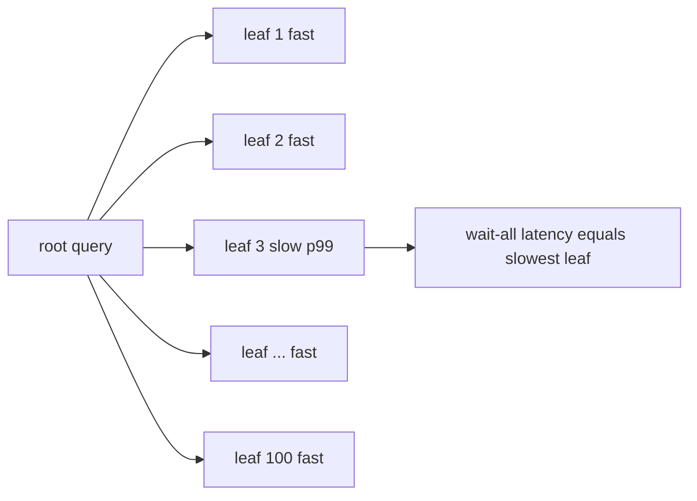
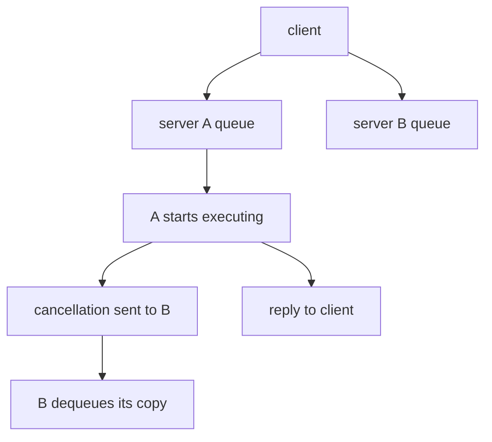

# The Tail at Scale: Why Fan-Out Turns Rare Slowness into Common Slowness

Dean and Barroso's 2013 CACM article is the canonical statement of why distributed query
execution is a latency problem before it is a throughput problem. Its core move is an analogy:
just as fault-tolerant systems mask unreliable components, **tail-tolerant** systems mask
unavoidable latency variability. For a database engineer building scatter-gather query plans,
this paper is the reason your p99 is dominated by machines you have never heard of.

## The problem in one sentence

**When a request fans out to many servers and must wait for all of them, the rare tail latency
of each server becomes the common-case latency of the whole service.**
Variability cannot be engineered away — shared resources, daemons, and hardware guarantee it —
so the system must tolerate the tail rather than try to eliminate it.

## The concepts, step by step

### Step 1 — Individual machines are irreducibly variable

> **In:** one server, one request.
> **Out:** the premise every later step rests on — a single machine's latency
> distribution has a long tail you cannot engineer to zero.

Before any distributed effect, a single server's latency already has a long tail, caused by:

- **Shared resources**: CPU cores, processor caches, memory and network bandwidth contended by
  other applications and other requests on the same box.
- **Background daemons** and **maintenance activities** — log compaction, garbage collection.
- **Global resource sharing**: network switches, shared file systems.
- **Queueing at multiple layers** — each queue amplifies variability from the layer below.
- **Hardware**: power limits and CPU throttling, energy-management state transitions, and SSD
  garbage collection, which can inflate read latency by roughly 100x.

The paper's stance: you can trim these, but you cannot remove them all. Plan accordingly.

### Step 2 — The fan-out arithmetic

> **In:** a per-leaf slow probability `p` and a fan-out width `n` — Step 1 said
> `p` is irreducible, not that it is large.
> **Out:** `P(at least one slow) = 1 − (1 − p)^n`, the probability a wait-for-all
> query is slow.

The headline calculation. **Fan-out** means one request splits into `n` sub-requests, one per leaf
server; **wait-for-all** (a scatter-gather) means the query cannot answer until every leaf has. If a
leaf is slow independently with probability `p`, the query is fast only when *all* `n` leaves are
fast — probability `(1 − p)^n` — so it is slow with probability `1 − (1 − p)^n`. Work it on the
pairs the topic's crate pins, and the shape appears:

```
P(at least one leaf is slow) = 1 − (1 − p)^n      p = per-leaf slow prob, n = fan-out

  p = 1/100,   n = 100:   1 − 0.99^100    = 1 − 0.3660 = 0.6340  → 63.4%
  p = 1/1000,  n = 100:   1 − 0.999^100   = 1 − 0.9048 = 0.0952  →  9.5%
  p = 1/1000,  n = 1000:  1 − 0.999^1000  = 1 − 0.3677 = 0.6323  → 63.2%
  p = 1/10000, n = 2000:  1 − 0.9999^2000 = 1 − 0.8187 = 0.1813  → 18.1%
```

Read the pairs against each other: driving `p` down 10× (1/100 → 1/1000) buys back the fan-out you
lost, but only until `n` climbs to match — 1/1000 slowness at 1,000 leaves is the *same* 63% as
1/100 at 100. Fan-out converts rare slowness into common slowness: **the component's tail becomes
the service's median**. Even heroic per-machine engineering (1-in-10,000) does not save a
2,000-leaf query. The topic's crate pins two of these exactly: `p_any_slow(0.01, 100) = 0.633968`
and `p_any_slow(0.0001, 2000) = 0.1813` (`experiments/src/fanout.rs`).



### Step 3 — Table 1: what this looks like in a real Google service

> **In:** one leaf's latency distribution (the p50/p95/p99 of a single random leaf).
> **Out:** the end-to-end distribution of a 100-leaf fan-out under two gather
> policies — wait for 95% of leaves, or wait for 100%.

The paper measures a real service, per-leaf versus end-to-end:

```
                                p50      p95      p99
  One random leaf              1 ms     5 ms    10 ms
  Wait for 95% of leaves      12 ms    32 ms    70 ms
  Wait for 100% of leaves     40 ms    87 ms   140 ms
```

Read the last row against the middle row: **the slowest 5% of leaf requests account for half
of the 99th-percentile end-to-end latency** (140 ms vs 70 ms). This single table motivates
every technique that follows — and the "95% row" is itself a technique (Step 7). The local
simulation reproduces the shape, and its full gather table is worth staring at because it also
shows the *cost* of good-enough (all three rows measured, `experiments/src/fanout.rs`):

```
   wait for            p50        p95        p99
   one leaf            5.6 ms     9.6 ms    10.0 ms
   95% of 100          9.6 ms     9.9 ms     9.9 ms
   all 100          1000.0 ms  1000.0 ms  1000.0 ms
```

Three readings, and the third is the honest one:
- **Wait for all 100 is catastrophic**: every percentile is a full 1000 ms stall, because 63.4%
  of queries hit at least one slow leaf (Step 2) — even the *median* query stalls.
- **Waiting for 95% rescues the tail**: dropping the slowest 5% removes the stall, so p99 falls
  to 9.9 ms — essentially the single-leaf p99 (10.0 ms).
- **But 95% is not free at the median**: p50 rises from 5.6 ms (one leaf) to 9.6 ms, because you
  now always wait for the 95th-fastest of 100 fast leaves instead of one random leaf. This is the
  measured headline (`FINDINGS.md`): p99 10.0 → 9.9 ms, **p50 5.6 → 9.6 ms**. Partial response
  trades median latency for tail latency; it is a choice, not a win.

### Step 4 — Hedged requests: pay a little extra load to cut the tail

> **In:** one outstanding request plus a delay budget — the paper's budget is the
> **95th-percentile expected latency** for that request class.
> **Out:** at most one extra ("hedged") copy and the first answer to return, with
> the added load bounded to ~5% because only the slowest requests ever hedge.

The simplest within-request technique. Send the request to one replica. If no reply arrives
within a delay — they use the **95th-percentile expected latency** — send a secondary request
to another replica, take the first answer, and cancel the loser. Deferring the hedge until p95
bounds the extra load to about 5%.

```
time →
replica A: |--------------------------------- slow ---------✗ cancelled
                     ^ p95 delay elapses
replica B:           |---- fast ----✓  answer returned
extra load: only the ~5% of requests that outlive the delay hedge at all
```

Real benchmark from the paper: reading 1,000 keys spread over 100 BigTable servers, hedging
after 10 ms cut p99.9 from **1,800 ms to 74 ms** while sending just **2% more requests**. The
local `hedge.rs` stub targets the same effect: its reference solution takes p99.9 from
1000 ms to 18.3 ms at +0.5% extra requests with a 10 ms hedge.

### Step 5 — Tied requests: cancel at queue-entry, not at completion

> **In:** one request, enqueued on **two** servers at once, each copy tagged with
> the identity of its twin.
> **Out:** exactly one execution plus one cross-server cancellation — the duplicate
> is dequeued before it runs, so the extra work is queue slots, not CPU.

Hedging still waits out the delay. Tied requests go further: enqueue the request on **two**
servers immediately, each copy tagged with the identity of its twin. When one server **starts
executing**, it sends a cross-server cancellation to the other, which dequeues the still-queued
copy. The client staggers the two sends by twice the average network message delay — 1 ms or
less in their networks — so both servers do not start simultaneously.



Table 2 (BigTable uncached reads, latency mostly disk):

```
                       p50                  p99.9
  Idle cluster:    19 ms → 16 ms (−16%)   98 ms → 61 ms (−38%)
  With terasort:   24 ms → 19 ms          159 ms → 108 ms (−32%)
```

The remarkable point: tied requests **on a cluster running a concurrent terasort** perform
about as well as unhedged requests on an **idle** cluster — the technique erases the
interference. Disk-read overhead from duplicate dequeues stays under 1%.

### Step 6 — Why not just probe queue lengths and pick the shorter queue?

> **In:** the tied-request design from Step 5, and its obvious-looking rival —
> ask both servers how busy they are, then send once to the shorter queue.
> **Out:** three reasons the probe loses, so tying (commit to both, cancel one)
> wins.

The obvious alternative — ask both servers how busy they are, then send once — is worse, for
three reasons:

1. **Staleness**: load changes between the probe and the request's arrival.
2. Request service times are hard to estimate from queue length alone.
3. **Herding**: clients all pile onto the momentarily-least-loaded server, creating the very
   queue they tried to avoid.

Tied requests sidestep all three by committing to both queues and letting execution order
decide.

### Step 7 — Cross-request, longer-term techniques

> **In:** slower-moving imbalance — skew and hot spots that persist across many
> requests, not the per-request jitter Steps 4–6 attack.
> **Out:** five cross-request tools (micro-partitions, selective replication,
> latency-induced probation, good-enough results, canary requests).

Within-request tricks handle transient variability; these handle slower-moving imbalance:

- **Micro-partitions**: many more partitions than machines (about 20 per machine; BigTable
  runs 20-1,000 tablets per machine). Load moves in ~5% increments, and a failed machine's
  work has many donors instead of one.
- **Selective replication**: extra copies of hot micro-partitions.
- **Latency-induced probation**: temporarily stop sending traffic to a slow server, keep
  issuing shadow requests to it, reinstate when it recovers. Counterintuitively, **removing
  capacity improves latency** during overload.
- **Good-enough results**: once enough leaves respond, answer with what you have — Table 1's
  95% row shows the payoff (p99 70 ms instead of 140 ms; in the paper's smooth distribution the
  p50 also improves, 12 ms vs 40 ms). But the payoff is distribution-dependent: on the local
  two-mode model (Step 3), 95% rescues the p99 yet *raises* the p50 (5.6 → 9.6 ms). Reach for it
  when the alternative is waiting on stragglers, not as a universal speed-up.
- **Canary requests**: on every large fan-out, send to 1-2 leaves first; fan out fully only if
  the canaries succeed in reasonable time. This guards against an untested code path crashing
  thousands of servers at once. Google applies canaries to every large fan-out query.

### Step 8 — Mutations are the easy case, and the thesis restated

> **In:** the write (mutation) path, plus every read-side technique from Steps 4–7.
> **Out:** why writes are the easy case, and the paper's thesis restated — build
> tail-*tolerant* systems, do not try to erase the tail.

Writes are much easier than reads: they can be taken off the critical path (acknowledge after
a durable log write, apply asynchronously), and quorum-based systems such as Paxos with 3-5
replicas are **inherently tail-tolerant** — they only need the fastest majority, so the
slowest replica never gates latency. The closing thesis mirrors the opening: variability at
scale is a systems property, like component failure. You do not eliminate it; you build
tail-tolerant systems that mask it, exactly as fault-tolerant systems mask failures.

## How to read the paper (with the concepts in hand)

- **Opening sections (why variability exists)** → Step 1. Skim the list of causes; the point
  is their inevitability, not the catalog.
- **"Component-Level Variability Amplified by Scale" and Table 1** → Steps 2-3. Do the
  1 − 0.99^100 arithmetic yourself, then check the 63% and 18% figures. Sit with Table 1 until
  the half-of-p99 observation is obvious.
- **"Within Request Short-Term Adaptations"** → Steps 4-6: hedged requests (and the p95-delay
  load bound), tied requests with Table 2, and the queue-probing counterargument.
- **"Cross-Request Long-Term Adaptations"** → Step 7: micro-partitions, selective replication,
  probation.
- **"Large Information Retrieval Systems"** → Step 7's good-enough results and canary requests.
- **"Mutations"** → Step 8.
- Throughout, map each technique back to the fan-out arithmetic: every one either lowers the
  per-leaf tail or breaks the wait-for-all coupling.

## Questions to answer in notes.md

1. Reproduce the arithmetic: with per-leaf slow probability 1/100 and fan-out 100, derive the
   ~63% figure; with 1/10,000 and 2,000 leaves, derive ~18%. What does this say about the
   maximum useful fan-out for a given per-leaf p99?
2. In Table 1, why does waiting for 95% of leaves (p99 70 ms) halve the p99 of waiting for
   100% (140 ms)? Which of your own query paths could tolerate a 95% answer?
3. Hedged vs tied requests: what exactly does tying buy over hedging at p95, and why does the
   client stagger tied sends by twice the average network message delay?
4. Why is probing queue lengths before dispatch worse than tied requests? Relate the three
   failure modes (staleness, service-time estimation, herding) to load balancing in a
   distributed query engine's scatter phase.
5. Why are quorum-based mutation paths inherently tail-tolerant, and what is the analogous
   design for the read path of a graph database fanning out over partitions?

## Done when

Answer each before unfolding it.

- [ ] You can derive 1 − 0.99^100 ≈ 63% and explain "the tail becomes the median" without
      looking at the paper.

  <details><summary>Answer</summary>

  Each leaf is fast with probability 0.99, so all 100 are fast with probability
  0.99^100 = 0.3660, and a wait-for-all query is slow with probability
  1 − 0.3660 = 0.6340 — 63.4%. "The tail becomes the median": the crate's leaf is
  a two-mode mixture — fast (uniform 1–10 ms) or, with probability 0.01, a 1000 ms
  stall. One leaf's p50 is ~5.6 ms, but the *max* over 100 leaves has a p50 of a
  full 1000 ms stall (`fanout.rs::the_leaf_tail_becomes_the_service_median`), so
  the leaf's 1-in-100 tail event is the *median* outcome of the fan-out. The
  closed form is pinned at `p_any_slow(0.01, 100) = 0.633968`
  (`experiments/src/fanout.rs`).

  </details>

- [ ] You can state Table 1's half-of-p99 observation and the BigTable hedging result
      (1,800 ms → 74 ms at +2% requests) from memory.

  <details><summary>Answer</summary>

  Table 1 (a real Google service): one random leaf p99 = 10 ms; wait for 95% of
  leaves p99 = 70 ms; wait for 100% p99 = 140 ms. The slowest 5% of leaf requests
  are responsible for half the 99th-percentile end-to-end latency (140 − 70 = 70,
  half of 140). Hedging benchmark: reading 1,000 keys spread over 100 BigTable
  servers, sending a secondary request after a 10 ms delay cut the 99.9th-percentile
  from 1,800 ms to 74 ms while sending just 2% more requests — because 98% of
  requests finished before the hedge fired (paper, "Hedged requests").

  </details>

- [ ] You can explain tied-request cancellation and why it beats queue-length probing.

  <details><summary>Answer</summary>

  Tied requests enqueue on two servers, each copy tagged with its twin's identity;
  the moment one server *dequeues to start executing*, it sends a cancellation to
  the twin, which drops the still-queued copy. Sends are staggered by ~2× the
  average network message delay (≤1 ms) so both do not start at once. It beats
  probe-then-send because probing suffers staleness (load moves between probe and
  arrival), hard service-time estimation from queue length alone, and herding (every
  client piles onto the momentarily-idle server). Tying commits to both queues and
  lets execution order decide. Table 2: idle-cluster p99.9 98 → 61 ms (−38%); with a
  concurrent terasort 159 → 108 ms (−32%); tied-under-terasort ≈ unhedged-on-idle.

  </details>

- [ ] The local fan-out simulation's pinned numbers (63.4%, 18.1%, wait-95% p99 9.9 ms) match
      your hand-derived expectations.

  <details><summary>Answer</summary>

  `p_any_slow(0.01, 100) = 0.633968` and `p_any_slow(0.0001, 2000) = 0.1813`
  (`fanout.rs` tests); the seed-7, 20k-trial simulation lands within 0.02 of 0.634.
  The gather table: one-leaf p50 5.6 / p99 10.0 ms; 95%-of-100 p50 9.6 / p99 9.9 ms;
  all-100 p50 = p99 = 1000 ms. Note the trade the numbers force: wait-95% holds the
  tail at the single-leaf level (p99 10.0 → 9.9) but nearly doubles the median
  (p50 5.6 → 9.6). Partial response buys tail latency with median latency — do not
  sell it as free.

  </details>

- [ ] You have completed the hedging stub and observed a tail reduction comparable to the
      reference solution (p99.9 1000 ms → 18.3 ms at +0.5% requests).

  <details><summary>Answer</summary>

  Implement `request_with_hedge` in `experiments/src/hedge.rs`: draw the primary
  latency; with `hedge_delay = Some(d)`, if the primary exceeds `d` fire a second
  draw and return `(min(primary, d + secondary), 2)`, otherwise `(primary, 1)`; with
  `None` return `(primary, 1)`. At `P_SLOW = 0.005` the unhedged p99.9 *is* the
  1000 ms stall; a 10 ms hedge replaces it with "delay + a second draw" — both draws
  must stall to stay slow and `p_slow²` is negligible — so p99.9 falls to ~18.3 ms at
  about +0.5% requests. The pinned contracts: a 10 ms hedge cuts p99.9 by ≥10×; the
  extra-request fraction stays under 10%; a zero-delay hedge degenerates into sending
  every request twice.

  </details>

## References

- Jeffrey Dean and Luiz André Barroso. "The Tail at Scale." *Communications of the ACM*,
  vol. 56, no. 2, February 2013.
- Local code: the topic's crate implements the fan-out simulation in
  `experiments/src/fanout.rs` (provided, with the 63.4%/18.1% arithmetic and the Table 1-shaped
  wait-all vs wait-95% simulation) and the hedging model in `experiments/src/hedge.rs` (stub —
  implement hedged dispatch and compare against the reference numbers above).
