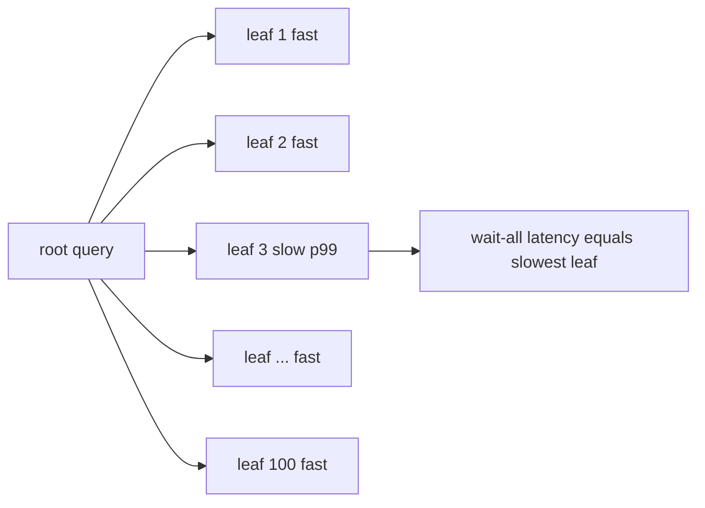
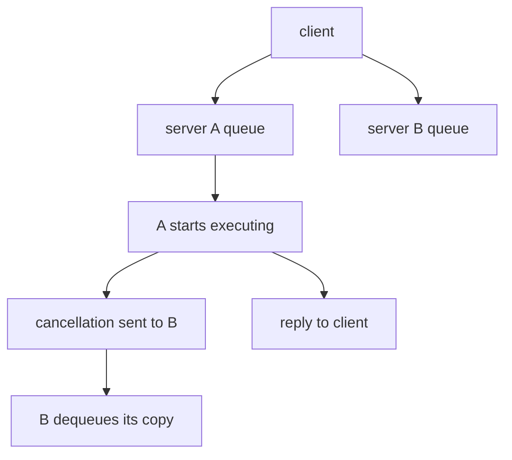

# The Tail at Scale: Why Fan-Out Turns Rare Slowness into Common Slowness

Dean and Barroso's 2013 CACM article is the canonical statement of why distributed query
execution is a latency problem before it is a throughput problem. Its core move is an analogy:
just as fault-tolerant systems mask unreliable components, **tail-tolerant** systems mask
unavoidable latency variability. For a database engineer building scatter-gather query plans,
this paper is the reason your p99 is dominated by machines you have never heard of.

## The problem in one sentence

**When a request fans out to many servers and must wait for all of them, the rare tail latency
of each server becomes the common-case latency of the whole service.**
Variability cannot be engineered away — shared resources, daemons, and hardware guarantee it —
so the system must tolerate the tail rather than try to eliminate it.

## The concepts, step by step

### Step 1 — Individual machines are irreducibly variable

Before any distributed effect, a single server's latency already has a long tail, caused by:

- **Shared resources**: CPU cores, processor caches, memory and network bandwidth contended by
  other applications and other requests on the same box.
- **Background daemons** and **maintenance activities** — log compaction, garbage collection.
- **Global resource sharing**: network switches, shared file systems.
- **Queueing at multiple layers** — each queue amplifies variability from the layer below.
- **Hardware**: power limits and CPU throttling, energy-management state transitions, and SSD
  garbage collection, which can inflate read latency by roughly 100x.

The paper's stance: you can trim these, but you cannot remove them all. Plan accordingly.

### Step 2 — The fan-out arithmetic

The headline calculation. Suppose a server answers slowly 1 time in 100. Alone, that is fine.
Now fan a query out to 100 such servers and wait for **all** of them:

```
P(at least one leaf is slow) = 1 - 0.99^100 ≈ 63%

  1-in-100 slow, 100 leaves, wait-all  →  63% of queries slow
  1-in-10,000 slow, 2,000 leaves       →  1 - 0.9999^2000 ≈ 18% slow
```

Fan-out converts rare slowness into common slowness: **the component's tail becomes the
service's median**. Even heroic per-machine engineering (1-in-10,000) does not save a
2,000-leaf query. The topic's crate pins these exact numbers in tests: 63.4% and 18.1%.



### Step 3 — Table 1: what this looks like in a real Google service

The paper measures a real service, per-leaf versus end-to-end:

```
                                p50      p95      p99
  One random leaf              1 ms     5 ms    10 ms
  Wait for 95% of leaves      12 ms    32 ms    70 ms
  Wait for 100% of leaves     40 ms    87 ms   140 ms
```

Read the last row against the middle row: **the slowest 5% of leaf requests account for half
of the 99th-percentile end-to-end latency** (140 ms vs 70 ms). This single table motivates
every technique that follows — and the "95% row" is itself a technique (Step 7). The local
simulation reproduces the shape: one-leaf p50 5.6 ms vs 100-leaf-wait-all p50 1000 ms, while
waiting for only 95% of leaves gives p99 9.9 ms.

### Step 4 — Hedged requests: pay a little extra load to cut the tail

The simplest within-request technique. Send the request to one replica. If no reply arrives
within a delay — they use the **95th-percentile expected latency** — send a secondary request
to another replica, take the first answer, and cancel the loser. Deferring the hedge until p95
bounds the extra load to about 5%.

```
time →
replica A: |--------------------------------- slow ---------✗ cancelled
                     ^ p95 delay elapses
replica B:           |---- fast ----✓  answer returned
extra load: only the ~5% of requests that outlive the delay hedge at all
```

Real benchmark from the paper: reading 1,000 keys spread over 100 BigTable servers, hedging
after 10 ms cut p99.9 from **1,800 ms to 74 ms** while sending just **2% more requests**. The
local `hedge.rs` stub targets the same effect: its reference solution takes p99.9 from
1000 ms to 18.3 ms at +0.5% extra requests with a 10 ms hedge.

### Step 5 — Tied requests: cancel at queue-entry, not at completion

Hedging still waits out the delay. Tied requests go further: enqueue the request on **two**
servers immediately, each copy tagged with the identity of its twin. When one server **starts
executing**, it sends a cross-server cancellation to the other, which dequeues the still-queued
copy. The client staggers the two sends by twice the average network message delay — 1 ms or
less in their networks — so both servers do not start simultaneously.



Table 2 (BigTable uncached reads, latency mostly disk):

```
                       p50                  p99.9
  Idle cluster:    19 ms → 16 ms (−16%)   98 ms → 61 ms (−38%)
  With terasort:   24 ms → 19 ms          159 ms → 108 ms (−32%)
```

The remarkable point: tied requests **on a cluster running a concurrent terasort** perform
about as well as unhedged requests on an **idle** cluster — the technique erases the
interference. Disk-read overhead from duplicate dequeues stays under 1%.

### Step 6 — Why not just probe queue lengths and pick the shorter queue?

The obvious alternative — ask both servers how busy they are, then send once — is worse, for
three reasons:

1. **Staleness**: load changes between the probe and the request's arrival.
2. Request service times are hard to estimate from queue length alone.
3. **Herding**: clients all pile onto the momentarily-least-loaded server, creating the very
   queue they tried to avoid.

Tied requests sidestep all three by committing to both queues and letting execution order
decide.

### Step 7 — Cross-request, longer-term techniques

Within-request tricks handle transient variability; these handle slower-moving imbalance:

- **Micro-partitions**: many more partitions than machines (about 20 per machine; BigTable
  runs 20-1,000 tablets per machine). Load moves in ~5% increments, and a failed machine's
  work has many donors instead of one.
- **Selective replication**: extra copies of hot micro-partitions.
- **Latency-induced probation**: temporarily stop sending traffic to a slow server, keep
  issuing shadow requests to it, reinstate when it recovers. Counterintuitively, **removing
  capacity improves latency** during overload.
- **Good-enough results**: once enough leaves respond, answer with what you have — Table 1's
  95% row shows the payoff (p99 70 ms instead of 140 ms).
- **Canary requests**: on every large fan-out, send to 1-2 leaves first; fan out fully only if
  the canaries succeed in reasonable time. This guards against an untested code path crashing
  thousands of servers at once. Google applies canaries to every large fan-out query.

### Step 8 — Mutations are the easy case, and the thesis restated

Writes are much easier than reads: they can be taken off the critical path (acknowledge after
a durable log write, apply asynchronously), and quorum-based systems such as Paxos with 3-5
replicas are **inherently tail-tolerant** — they only need the fastest majority, so the
slowest replica never gates latency. The closing thesis mirrors the opening: variability at
scale is a systems property, like component failure. You do not eliminate it; you build
tail-tolerant systems that mask it, exactly as fault-tolerant systems mask failures.

## How to read the paper (with the concepts in hand)

- **Opening sections (why variability exists)** → Step 1. Skim the list of causes; the point
  is their inevitability, not the catalog.
- **"Component-Level Variability Amplified by Scale" and Table 1** → Steps 2-3. Do the
  1 − 0.99^100 arithmetic yourself, then check the 63% and 18% figures. Sit with Table 1 until
  the half-of-p99 observation is obvious.
- **"Within Request Short-Term Adaptations"** → Steps 4-6: hedged requests (and the p95-delay
  load bound), tied requests with Table 2, and the queue-probing counterargument.
- **"Cross-Request Long-Term Adaptations"** → Step 7: micro-partitions, selective replication,
  probation.
- **"Large Information Retrieval Systems"** → Step 7's good-enough results and canary requests.
- **"Mutations"** → Step 8.
- Throughout, map each technique back to the fan-out arithmetic: every one either lowers the
  per-leaf tail or breaks the wait-for-all coupling.

## Questions to answer in notes.md

1. Reproduce the arithmetic: with per-leaf slow probability 1/100 and fan-out 100, derive the
   ~63% figure; with 1/10,000 and 2,000 leaves, derive ~18%. What does this say about the
   maximum useful fan-out for a given per-leaf p99?
2. In Table 1, why does waiting for 95% of leaves (p99 70 ms) halve the p99 of waiting for
   100% (140 ms)? Which of your own query paths could tolerate a 95% answer?
3. Hedged vs tied requests: what exactly does tying buy over hedging at p95, and why does the
   client stagger tied sends by twice the average network message delay?
4. Why is probing queue lengths before dispatch worse than tied requests? Relate the three
   failure modes (staleness, service-time estimation, herding) to load balancing in a
   distributed query engine's scatter phase.
5. Why are quorum-based mutation paths inherently tail-tolerant, and what is the analogous
   design for the read path of a graph database fanning out over partitions?

## Done when

- [ ] You can derive 1 − 0.99^100 ≈ 63% and explain "the tail becomes the median" without
      looking at the paper.
- [ ] You can state Table 1's half-of-p99 observation and the BigTable hedging result
      (1,800 ms → 74 ms at +2% requests) from memory.
- [ ] You can explain tied-request cancellation and why it beats queue-length probing.
- [ ] The local fan-out simulation's pinned numbers (63.4%, 18.1%, wait-95% p99 9.9 ms) match
      your hand-derived expectations.
- [ ] You have completed the hedging stub and observed a tail reduction comparable to the
      reference solution (p99.9 1000 ms → 18.3 ms at +0.5% requests).

## References

- Jeffrey Dean and Luiz André Barroso. "The Tail at Scale." *Communications of the ACM*,
  vol. 56, no. 2, February 2013.
- Local code: the topic's crate implements the fan-out simulation in
  `experiments/src/fanout.rs` (provided, with the 63.4%/18.1% arithmetic and the Table 1-shaped
  wait-all vs wait-95% simulation) and the hedging model in `experiments/src/hedge.rs` (stub —
  implement hedged dispatch and compare against the reference numbers above).
