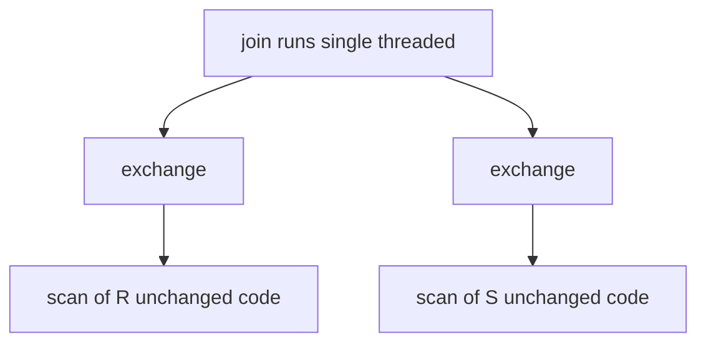

# Volcano's exchange operator: parallelism as just another iterator

Every parallel query engine you have ever profiled — DataFusion, DistSQL, Presto, Spark — routes rows
between threads through some descendant of one 1989 idea. Graefe's insight was that if every operator
is an iterator with anonymous inputs, then parallelism does not need to be woven into each operator's
code: it can be *encapsulated* in one new operator, exchange, and everything else runs unchanged.
This guide walks the mechanics — forking, packets, counted end-of-stream, the merging variant — and
the measurements that priced batching two decades before "vectorized execution" was a slogan.

## The problem in one sentence

**How do you parallelize a query engine without rewriting a single scan, join, or sort — keeping
query semantics completely separate from parallel execution mechanics?**

Before Volcano, parallel systems like GAMMA baked data-flow scheduling into the engine itself;
every operator had to know about processes, queues, and partitions.

## The concepts, step by step

### Step 1 — Anonymous inputs: the iterator contract does the heavy lifting

> **In:** an operator (scan, join, sort) and whatever feeds it.
> **Out:** the discipline that an operator never knows *what* produces its input —
> the one precondition that lets Step 2 encapsulate parallelism in a new operator.

Volcano makes every operator an iterator with `open`/`next`/`close`. The crucial discipline is that
inputs are **anonymous**: an operator never knows or cares what produces its input — it just calls
`next` on an opaque handle. A join pulling from a scan is indistinguishable, from the join's point
of view, from a join pulling from an exchange that is secretly draining a queue fed by another
process. That indistinguishability is the entire trick. Parallelism becomes not a property of
operators but *one more operator*.

### Step 2 — Exchange: drop-in parallelism

> **In:** a working single-threaded plan of anonymous-input iterators (Step 1).
> **Out:** the same plan with one `exchange` operator spliced between two operators
> — now parallel, with every scan/join/sort's code unchanged.

Because inputs are anonymous, you can splice an exchange operator between any two operators in a
plan. Scan, join, and sort code runs unchanged, single-threaded, inside each process; exchange forks
processes, routes records between them, and hides all synchronization behind the same
`open`/`next`/`close` interface.



The optimizer reasons about query semantics; exchange placement is a separate, mechanical decision.

### Step 3 — What happens on open: forks, packets, queues (§4.2)

> **In:** an `exchange` operator's `open` call, driven from its consumer side.
> **Out:** a forked producer process (or group) shipping **packets** — arrays of
> records, 1–32,000 per packet — through shared-memory queues to the consumer.

Exchange's consumer side is an ordinary iterator. On `open`, it forks a producer process (or a
group of them). Producer and consumer exchange data as **packets** — batches of records — through
shared-memory queues. `next` on the consumer side just unpacks the current packet and blocks on
the queue when it runs dry.

Process groups are master/slave: the first (master) process forks the others. Forking propagates
down the tree — "propagation-tree" forking — because, as Graefe notes citing Gerber, centralized
forking from one coordinator is suboptimal. Processes can also be "primed" (pre-forked, as in
GAMMA) so query start does not pay fork latency.

### Step 4 — Three kinds of parallelism from one operator

> **In:** the fork-and-route machinery from Step 3, plus a per-record *support
> function* that picks an output queue.
> **Out:** all three classic parallel forms — vertical (pipelining), bushy, and
> intra-operator — from that single operator.

Exchange gives all three classic forms:

- **Vertical parallelism** — pipelining: producer and consumer subtrees run concurrently in
  different processes, overlapping their work.
- **Bushy parallelism** — different subtrees of the plan run in different processes.
- **Intra-operator parallelism** — k copies of an operator, each working on one partition of the
  data. The producer's *support function* picks an output queue per record: round-robin, key
  range, or hash.

```text
              consumers (k = 4)
        C0      C1      C2      C3
        ^^      ^^      ^^      ^^
        ||......||......||......||     shared-memory queues,
        ||      ||      ||      ||     packets of records
        P0      P1      P2
              producers (j = 3)

   support function per record: round-robin | range | hash
```

Note the shape: every producer can reach every consumer. That j × k mesh is exactly what makes
termination interesting.

### Step 5 — Counted end-of-stream, not assumed (§4.3)

> **In:** the j-producers × k-consumers mesh from Step 4, each producer finishing
> at its own time.
> **Out:** correct termination — every consumer counts one end-of-stream packet
> from each producer before it reports end-of-stream upward.

End-of-stream is **counted, not assumed**. Each producer, when done, sends a flagged end-of-stream
packet to *every* consumer; each consumer must count one from every producer before it reports
end-of-stream upward. The paper's example: 3 producers × 4 consumers = 12 end-of-stream packets.
Get this wrong and a consumer either hangs forever or truncates results when one fast producer
finishes early. Flow control and shutdown are self-scheduling via semaphores — no central
coordinator watches the pipeline.

### Step 6 — The §4.4 variants: broadcast, merging, exchange-in-the-middle

> **In:** the basic exchange from Steps 3–5.
> **Out:** four refinements — broadcast-by-pinning, the merging exchange,
> exchange-in-the-middle (the paper's *interchange*), and run-time fork-vs-reuse.

Four refinements, each with a lasting lesson:

1. **Broadcast by pinning, not copying.** To send one packet to multiple consumers, exchange pins
   the same packet in the shared buffer pool for all of them. Zero-copy fan-out, 1989.
2. **The merging exchange.** For parallel sort, exchange fuses k sorted streams into one — and it
   *must* keep records from different producers separate, merging by producer stream rather than
   draining queues into one big bag. Mixing streams destroys the sort order each producer worked
   to establish. This is the lesson the topic's stub test pins.
3. **Exchange-in-the-middle.** An exchange that does not fork at all but re-routes partitions
   between processes created by other exchanges — the paper calls this variant **interchange**.
   This variant makes flow control obsolete — and makes vertical parallelism optional.
4. **Fork vs reuse is a run-time switch**, not a compile-time decision.

```text
   merging exchange (k sorted producer streams):

   P0: 1  4  9        keep streams separate,
   P1: 2  5  7   -->  merge by producer  -->  1 2 3 4 5 7 8 9
   P2: 3  8

   WRONG: dump all packets in one bag, then "merge"  -->  order lost
```

### Step 7 — A buffer manager built for many processes (§4.5)

> **In:** many producer and consumer processes contending on one shared buffer pool.
> **Out:** a deadlock-free, two-level-locking buffer manager that never becomes the
> serialization bottleneck the parallelism was meant to remove.

Shared-memory parallelism needs a buffer manager that will not become the bottleneck or deadlock.
Volcano uses two-level locking: a pool lock that is **never held during I/O**, plus per-descriptor
locks; a restart scheme removes hold-and-wait, making the buffer manager deadlock-free by design.
Spin-locks are effective because critical sections are only about 100 instructions — sleeping
would cost more than spinning. A read-ahead/write-behind daemon serves FLUSH, READ_AHEAD, and
QUIT requests, decoupling I/O from the query processes.

### Step 8 — The numbers: exchange overhead and the 12× batching swing (§5)

> **In:** the exchange implementation of Steps 3–7, benchmarked on a Sequent
> Symmetry over 100K-record inputs.
> **Out:** the measured price of an exchange (25.73 µs/record) and a ~12× batching
> swing — the economics that drove vectorized execution two decades later.

Measured on a Sequent Symmetry — 12 CPUs, 16 MHz Intel 80386, 100K-record inputs:

| Configuration | Time |
|---|---|
| Single process, no exchange | 20.28 s |
| Same plan, 3 exchanges in no-fork mode | 28.00 s |
| Forked 4-process pipeline, with flow control | 16.21 s |
| Forked 4-process pipeline, no flow control | 16.16 s |

The no-fork run prices exchange overhead at **25.73 µs per record per exchange** — yet the forked
pipeline is *faster* than the single-process plan: pipelining pays despite the overhead. Also note
how little flow control costs here (16.21 s vs 16.16 s): the semaphore-based self-scheduling of
Step 5 is nearly free when producers and consumers are balanced.

Packet-size sweep (records per packet → total time): 1 → 171 s; 2 → 94 s; 50 → 15.0 s;
83 (the default, one page's worth) → 13.7 s. The cost curve is linear on log-log below roughly
10 records/packet. Batching is a **12× swing** — the same economics that later drove vectorized
execution.

Modern echoes: DataFusion's `RepartitionExec` is exchange verbatim (`BatchPartitioner`,
round-robin/hash, `preserve_order` = the merging exchange); CockroachDB DistSQL routers
(`PASS_THROUGH`/`MIRROR`/`BY_HASH`/`BY_RANGE`) are Volcano's routing policies as a protobuf enum.

## How to read the paper (with the concepts in hand)

| Paper section | What it covers | Steps |
|---|---|---|
| §1–3 (intro, iterator model) | open/next/close, anonymous inputs | Steps 1–2 |
| §4.2 | Fork on open, packets, queues, master/slave groups, propagation-tree forking, priming | Steps 3–4 |
| §4.3 | Counted end-of-stream, semaphore flow control | Step 5 |
| §4.4 | Broadcast pinning, merging exchange, exchange-in-the-middle, fork vs reuse | Step 6 |
| §4.5 | Two-level buffer locking, restart scheme, spin-locks, I/O daemon | Step 7 |
| §4.6 | Volcano vs GAMMA: shared-memory vs shared-nothing, demand-driven top-down vs data-driven bottom-up, bushy vs left-deep, optional vertical parallelism | Steps 2, 6 |
| §5 | Overhead and packet-size measurements | Step 8 |

Reading order tip: skim §4.6 right after §4.2 if you know GAMMA — the contrast (iterators pulling
top-down vs a scheduler pushing bottom-up) sharpens why exchange needs no scheduler at all.

## Questions to answer in notes.md

1. Why does the counted end-of-stream protocol require producers to send a flagged packet to
   *every* consumer, and what specifically breaks (hang vs truncation) if a consumer stops after
   the first flag it sees?
2. The merging exchange must merge by producer stream, never one big bag. Where in FalkorDB's
   parallel execution would the equivalent mistake corrupt an ordered result, and how would a test
   catch it?
3. Exchange in no-fork mode costs 25.73 µs per record per exchange, yet the forked pipeline beats
   the single-process plan (16.21 s vs 20.28 s). Decompose where the win comes from and when it
   would evaporate.
4. Exchange-in-the-middle makes flow control obsolete and vertical parallelism optional. Trace how
   that maps onto §4.6's Volcano-vs-GAMMA comparison — which GAMMA property does it recover?
5. Packet size 1 → 171 s, 83 → 13.7 s. What per-packet fixed costs dominate at small sizes, and
   how does the same argument reappear in Arrow batch sizing for `RepartitionExec`?

## Done when

Answer each before unfolding it.

- [ ] You can sketch the j × k producer/consumer mesh and state the end-of-stream packet count for
      any j and k without looking it up.

  <details><summary>Answer</summary>

  Each of the `j` producers fills packets destined for any of the `k` consumers,
  chosen per record by the support function, so every producer can reach every
  consumer — a full `j × k` mesh. On termination each producer sends one flagged
  end-of-stream packet to *every* consumer, so there are `j × k` end-of-stream
  packets in total (the paper's example: 3 × 4 = 12). Each consumer must count one
  from every producer — `j` flags each — before it reports end-of-stream upward.
  Stop after the first flag and you truncate (a still-working producer's rows are
  dropped); the symmetric mistake — never reaching the count — hangs forever
  (§4.3).

  </details>

- [ ] You can explain, in two sentences, why anonymous inputs are the precondition for
      encapsulating parallelism in one operator.

  <details><summary>Answer</summary>

  Because every operator pulls from an opaque input handle and never learns what
  produces it, an exchange can be spliced between any two operators and neither
  notices — a join draining a shared-memory queue fed by another process is
  indistinguishable from a join draining a local scan. If inputs were typed or
  known, every operator would need process-, queue-, and partition-awareness (as in
  GAMMA's bracket model), and parallelism could not be confined to one new operator.

  </details>

- [ ] You can name all four §4.4 variants and the failure mode the merging exchange avoids.

  <details><summary>Answer</summary>

  (1) **Broadcast by pinning** — send one packet to many consumers by pinning it in
  the shared buffer for each, no copy; (2) the **merging exchange** — fuse `k`
  sorted producer streams, kept grouped by producer; (3) **exchange-in-the-middle /
  interchange** — no fork, just re-route partitions among existing processes, which
  makes flow control obsolete; (4) **fork-vs-reuse** as a run-time switch. The
  merging exchange avoids *order loss*: dumping every producer's packets into one bag
  and "merging" destroys the sort order each producer established. The merge iterator
  must distinguish records by their producer — the paper: "it is crucial to
  distinguish the input records by their producer in order to merge multiple sorted
  streams correctly."

  </details>

- [ ] You can quote the batching swing (1 vs 83 records/packet) and connect it to vectorized
      execution economics.

  <details><summary>Answer</summary>

  Packet-size sweep: 1 record/packet → 171 s; 2 → 94 s; 50 → 15.0 s; 83 (one page's
  worth, the default) → 13.7 s — roughly a 12× swing purely from amortizing the
  per-packet fixed costs (a semaphore signal, one linked-list insertion into the
  port, buffer fix/unfix) over more records. That is the vectorized-execution
  argument two decades early: do one synchronization and dispatch per *batch*, not
  per row. DataFusion's `RecordBatch` is exactly this packet, and round-robin
  forwards it intact (§5).

  </details>

- [ ] The merging-exchange test against the stub in `experiments/src/exchange.rs` passes with a
      per-producer-stream merge and fails with a single-bag merge.

  <details><summary>Answer</summary>

  The stub's merging-exchange contract pins Step 6's lesson. Implement the merge by
  keeping one cursor per producer stream and repeatedly emitting the smallest current
  head (a streaming k-way merge) and the globally sorted output is correct.
  Implement it by concatenating every producer's packets into one buffer and emitting
  arrival order, and the per-producer sort order is lost and the test fails. It is the
  same distinction DataFusion draws between `preserve_order` (its merging
  `RepartitionExec`) and the default arrival-order interleave.

  </details>

## References

- Goetz Graefe. *Encapsulation of Parallelism in the Volcano Query Processing System.* SIGMOD 1990.
  Also available as Oregon Graduate Center TR CS/E 89-007.
- Local stub: `experiments/src/exchange.rs` implements the routing (round-robin/range/hash) and
  merging-exchange contracts this guide describes; see the topic [README](README.md) and keep your
  answers in [notes.md](notes.md).
