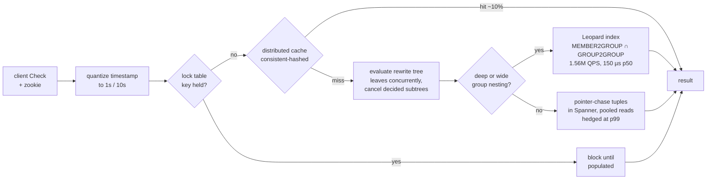

# Topic 40 — Security & Attack Graphs

Third of six graph use-case deep dives: the workload where the graph
*is* the answer and the list is the lie. **BloodHound** (2016–): "who is
a Domain Admin?" returns five names; "who can *become* one?" is a
reachability query that returns most of the company, and the attacker
is the one asking the second question. **Ammann et al.** (CCS'02) and
**MulVAL** (CCS'06): attack-graph generation was exponential until
somebody noticed attackers never backtrack — monotonicity turns state
enumeration into a Datalog fixpoint. **Zanzibar** (ATC'19) and SpiceDB:
"can this user read this document?" is the same reachability question
at >2 trillion relation tuples and 3.0 ms p50, which forces a
denormalized closure index, a galloping intersect, cache-key
canonicalization and a stampede lock table. **SLEUTH** (USENIX
Sec'17): the same graph, after the breach — 38.5M audit events reduced
to a 130-event attack story by tag-guided pruning.

## The problem, measured (bench lane 1, provided — runs today)

```
   1% of users (20 of 2000) are in one over-privileged group.
   sessions collected   direct   MemberOf closure   attack-path reachable
                    0        5                  8           39 (  1.9%)
                  100        5                  8         1969 ( 98.5%)
                  250        5                  8         1987 ( 99.3%)
                  500        5                  8         2000 (100.0%)
                 2000        5                  8         2000 (100.0%)

   Domain Admin tokens left on ordinary workstations (gateway shut):
                    0 -> 8      1 -> 2000      2 -> 2000      4 -> 2000
```

Column two is the compliance report and it never moves: five accounts
in Domain Admins, eight if you expand the one nested group. Column four
is the same directory read as a graph. Nobody granted that privilege;
it is emergent. Twenty over-privileged users expose 39 people with no
session data and 1969 with a hundred sessions, because each newly
exposed user's own sessions drag in everyone who is local admin on
those machines, and that cascades. Two dials, two lessons: privilege
composes, and **your exposure number is a function of how long you ran
the collector**, not of how much privilege exists. Mean shortest path:
6.03 hops, worst 8 — the exposure is not remote.

## Attack paths: every right is an edge

```
   user ──MemberOf──▶ group ──AdminTo──▶ computer ──HasSession──▶ user' ──▶ ... ──▶ TIER ZERO
        "I'm in Staff"      "Staff is    "an operator's         "and their
                             local admin"  token is here"        groups are..."
```

An edge means *control of the source yields control of the target*.
That single rule makes 104 Active Directory concepts into one graph
with 64 traversable edge kinds, and it makes the pentest report a
shortest-path query. `HasSession` is the edge that ruins everything: a
privileged token sitting on a workstation makes every local admin of
that box a domain admin, transitively — measured above, two misplaced
tokens take exposure from 8 users to 2000 with nothing else changed.
BloodHound's real engineering trick is that 31 of its edge kinds are
**not collected but derived** — `AdminTo`, `CanRDP`, the ADCS
`ESC1..ESC13` certificate-abuse paths — computed once by a
post-processing pipeline so query time stays a plain traversal. That is
a materialized view, and it is the same bet Leopard makes below.

## Choke points are dominators

```
   reverse the graph, root it at tier zero:

        TIER ZERO
            │            d dominates u  ⟺  every path TZ⇝u crosses d
            ▼            ⟺  every attack path u⇝TZ crosses d
        [  d  ]          ⟹  deleting d disconnects EXACTLY d's subtree
         ╱    ╲
       u1      u2   ... so blast_radius(d) = |users in dom-subtree(d)|
```

"90% of the directory can reach Domain Admin" is a finding, not a work
order. The work order is *which few nodes, if removed, delete the most
paths* — Ammann et al.'s cut-set question (CCS'02 §2.3: "what set of
exploits or attributes must be removed to disconnect the goal state
from the initial state", followed by "standard graph analysis
algorithms can be applied"). The naive answer costs one reachability
re-run per node. The exact answer is one dominator tree, because
dominance in the reversed graph is precisely "every attack path crosses
here". Measured lane 2, 3400 nodes / 11.5k edges: **0.8 ms vs 543 ms**
for 3400 re-runs, agreeing on every single node. The iterative
Cooper–Harvey–Kennedy formulation — compiler control-flow analysis,
pointed at a directory.

The result that matters more than the speedup:

| directory | exposed | top choke point | greedy remediation |
|---|---|---|---|
| tiered | 2000 | staff / helpdesk, **1992 users (99.6%)** | 2000 → 8 → 5 |
| flat | 2000 | **none** — no single cut frees one user | 2000 (nothing to cut) |

Same exposure number, two different worlds. In the flat directory three
unmanaged service-account groups and two Domain Admin tokens on
workstations route around every gateway, so the blast radius of *every*
single-node cut is zero, and cutting the whole gateway set one node at
a time shows 2000 → 2000 → 2000 → 2000 → 2000 → 8: no progress at all
until the last piece. Remediation is a set problem, and the dominator
pass returning all zeros *is* the report. Tiering is not merely good
hygiene — it is what makes the graph *have* choke points.

## Monotonicity: why attack graphs are polynomial

```
   state enumeration        monotone attribute graph
   ─────────────────        ────────────────────────
   node = whole network     node = one attribute ("root on host 2")
   5 hosts, 8 exploits →    229 bits of state →
     5,948 nodes            at most 229 nodes
    68,364 edges            layers = BFS over attributes
     2 hours (NuSMV)        O(|A|² · |E|), converges in ≤ |A| layers
```

Sheyner's model checker encoded "which states can the attacker reach",
and the state space is exponential in the number of system variables.
Ammann et al.'s observation is almost embarrassingly simple: *the
attacker never needs to backtrack*. A precondition, once satisfied,
never becomes unsatisfied; so preconditions carry no negation,
`preConds(e) ∩ postConds(e) = ∅`, and the analysis becomes a monotone
fixpoint over attributes — linear in system variables, not exponential.
MulVAL then writes that fixpoint as tabled Datalog (`execCode(A,H,U) :-
networkService(...), vulExists(...), netAccess(...)`), which gets
cycle handling and memoization for free from XSB, proves the graph is
O(N²), and generates attack graphs for **1000 fully-connected hosts**
where Sheyner's tool blew up at 10. A logical attack graph is a
derivation graph: rectangles are derivation nodes (AND, one rule
application), circles are fact nodes (OR, several ways to be true) —
which is topic 27's incremental-view-maintenance machinery wearing a
different hat.

## Authorization is the same query, at Google scale

```
   CHECK(U, object#relation) =
       ∃ tuple ⟨object#relation@U⟩
     ∨ ∃ tuple ⟨object#relation@U'⟩, U' = ⟨object'#relation'⟩, CHECK(U, U')
```

That is pointer chasing, and the paper says so: expensive when groups
are deep or wide. Leopard is the fix — two flattened sets as ordered
integer lists, `GROUP2GROUP(s)` (all descendant groups) and
`MEMBER2GROUP(u)` (direct parent groups), with membership as
`MEMBER2GROUP(U) ∩ GROUP2GROUP(G) ≠ ∅`, "O(min(|A|,|B|)) skip-list
seeks". Measured lane 3:

```
   nesting depth   tuple reads   check µs   index probes   index µs   index entries
               2            19       0.46              4       0.00             443
               4            55       0.99              6       0.00             921
               8           127       2.91              8       0.01            1986
              16           271       5.68             10       0.01            4544
              32           559      11.28             12       0.01           11393
```

Everything else in Zanzibar exists to keep that recursion off the
storage layer:



Pointer chasing pays for the shape of the graph; the index is flat in
depth and ~1000× cheaper at depth 32. The tax: 6672 stored tuples
become 11393 index entries (1.7×, and the closure grows quadratically
in chain depth), and it must be maintained — Zanzibar runs Leopard as
an offline snapshot pipeline plus an incremental layer fed by Watch,
~500 index updates/sec at the median. Topic 1's RUM conjecture, wearing
a badge. Production numbers to anchor the trade: >2 trillion relation
tuples over ~100 TB, >10M client QPS, Check Safe p50/p95/p99 =
**3.0 / 9.46 / 15.0 ms**, availability >99.999% over three years,
Leopard itself at 1.56M QPS and a **150 µs** median.

## Production shape: BloodHound (`~/repos/bloodhound` @ 1968388)

| anchor (`packages/go/`) | what to see |
|---|---|
| `graphschema/ad/ad.go:28` | 104 `StringKind` node and edge kinds — the whole ontology as constants |
| `graphschema/ad/ad.go:1160` | `PathfindingRelationships` — the 64 kinds an attacker may traverse |
| `graphschema/ad/ad.go:1172` | `PostProcessedRelationships` — 31 kinds that are *derived*, not collected |
| `analysis/analysis.go:346` | `newPipeline` — AD post-processing → Azure → tagging → data quality |
| `analysis/analysis.go:104` | `ExpandGroupMembershipPaths` — nesting expansion as a path query |
| `analysis/ad/post.go:84` | `PostDCSync` — a derived edge built from two ACL predicates |
| `analysis/ad/post.go:244` | `FetchNodeIDsByKind` — principal sets as **roaring bitmaps** (`cardinality.Duplex[uint64]`) |
| `analysis/ad/membership.go:81` | `FetchPathMembers` — parallel BFS with a thread-safe bitmap as the visited set |
| `analysis/tiering/tiering.go:37` | `IsTierZero` — the label the whole product is organised around |
| `analysis/agt.go:137` | `FetchNodesFromSeeds` — asset-group selectors, expanded and diffed for minimal writes |

## Production shape: SpiceDB (`~/repos/spicedb` @ 8422483)

| anchor (`internal/`) | what to see |
|---|---|
| `graph/check.go:99` → `:165` → `:304` | `Check` → `checkInternal` → `checkDirect`: the recursion, one level at a time |
| `graph/check.go:539` / `:567` | `checkUsersetRewrite` / `runSetOperation` — union, intersection, exclusion, evaluated concurrently |
| `graph/check.go:623` / `:699` | `checkComputedUserset`, `TraitsForArrowRelation` — Zanzibar's `computed_userset` and the `tuple_to_userset` arrow |
| `graph/membershipset.go:122/:132/:156` | `UnionWith` / `IntersectWith` / `Subtract` — set algebra *with caveats*, so a result can be "maybe" |
| `graph/lookupsubjects.go:430` | `lookupViaTupleToUserset` — the reverse traversal (Expand / LookupSubjects) |
| `dispatch/caching/caching.go:59` | the check cache; `dispatch/keys/computed.go:58` hashes a *canonicalized* relation expression into one `uint64` |
| `dispatch/singleflight/singleflight.go:47` | Zanzibar's lock table, exactly: concurrent identical checks collapse to one |
| `dispatch/graph/graph.go:49` | `defaultConcurrencyLimit = 50` — the fan-out bound from topic 37 |

## Reading guides

1. [reading-bloodhound.md](reading-bloodhound.md) — code read: the edge ontology, derived edges as materialized views, bitmap traversal, Tier Zero.
2. [reading-attack-graph-monotonicity.md](reading-attack-graph-monotonicity.md) — Ammann CCS'02 + MulVAL CCS'06: exponential → polynomial, and attack graphs as Datalog derivations.
3. [reading-zanzibar.md](reading-zanzibar.md) — Zanzibar ATC'19 with SpiceDB anchors: Check as reachability, Leopard, zookies, hot spots.
4. [reading-sleuth.md](reading-sleuth.md) — SLEUTH USENIX Sec'17: provenance graphs, dependency explosion, tags as edge costs.

## Experiments

```
cd experiments
cargo test              # 3 provided tests pass; 9 fix the contract for your stubs
cargo run --release --bin attack_bench
```

- `ad_graph.rs` (PROVIDED) — synthetic AD-shaped identity graph: users ×
  groups × computers, five edge kinds, a planted over-privileged group,
  planted service accounts and planted policy violations; plus the
  list-view baselines (`direct_tier_zero_members`,
  `memberof_reachable_users`) and `attack_path_reachable_users`.
  `AdConfig::tiered()` is the same directory with the violations removed.
- `chokepoint.rs` (stub) — `immediate_dominators` (Cooper–Harvey–Kennedy
  over the reverse graph) and `blast_radius` (subtree accumulation).
  `exposure`, `rank_chokepoints` and the `blast_radius_naive` oracle are
  provided.
- `authz.rs` (stub) — `check_pointer` (Zanzibar rewrite expansion with
  cycle protection and optional memoization), `LeopardIndex::build`
  (the two flattened closures), `intersect_galloping`. The store
  generator and the linear-merge straw man are provided.

Bench lanes: 1 = the exposure table (provided, above). 2 = choke points
(reference: dominator tree 0.8 ms vs 543 ms for 3400 re-runs, exact
match; tiered top choke point 1992/2000 users, flat directory none). 3 =
Check cost by nesting depth (reference: 19→559 tuple reads and
0.46→11.28 µs pointer-chasing vs 4→12 probes and ~0.01 µs indexed, at a
1.7× entry tax).

## Exercises

1. Implement the stubs until all 12 tests pass and lanes 2–3 print.
2. **Edge choke points.** Domination as written prices *node* removals,
   but the real remediation is "remove this group from that group" — an
   edge. Subdivide every edge with a synthetic node and re-run
   `blast_radius`; confirm against `blast_radius_naive` extended to edge
   deletion, and report which of the two framings finds the cheaper fix
   on the tiered directory.
3. **Where the flat directory breaks.** Sweep `service_groups` 0→3 and
   `da_on_workstation` 0→2 independently and find the exact point at
   which the top blast radius collapses to zero. Explain in two
   sentences why it is a cliff and not a slope.
4. **Monotonicity by hand.** Encode lane 1's graph as Ammann's attribute
   model (attributes = "principal X is controlled") and run
   `markAttributes`; verify the layer numbers equal the BFS distances
   `attack_path_lengths` already reports, and state where the
   monotonicity assumption would break if `HasSession` edges expired.
5. **The incremental index.** Add `LeopardIndex::add_membership(user,
   group)` and `add_nesting(parent, child)` that keep the closure
   correct without a rebuild. Measure per-write cost against rebuild
   cost at depth 32, and find the crossover write rate. Which one is
   Zanzibar's Watch-fed incremental layer?
6. **Negative checks.** Lane 3 measures a positive Check. Re-measure
   with a user who is in *no* group: pointer chasing must exhaust the
   whole subtree. Where does the index's advantage land now, and why
   does Zanzibar's cache hit rate for checks (10% on the delegate side)
   still pay for itself?
7. **Tags as edge costs.** Implement SLEUTH's backward analysis over
   lane 1's graph: mark a handful of nodes `unknown`, assign
   unknown→benign edges cost 0 and benign→benign a high cost, and run
   Dijkstra from an "alarm" node. Compare the entry points it finds
   against plain BFS ancestry.

## Cross-topic threads

- **Topic 26 (probabilistic & indexing)**: BloodHound stores principal
  sets as roaring bitmaps (`cardinality.Duplex[uint64]`) and does set
  algebra on them — the same structure as topic 23's postings lists,
  doing security analysis.
- **Topic 23 (full-text)**: Leopard's `O(min(|A|,|B|))` set
  intersection is exactly the galloping intersect from the roaring
  guide. Authorization and search have the same inner loop.
- **Topic 27 (streaming & IVM)**: MulVAL's attack graph is the
  derivation graph of a tabled Datalog query, and BloodHound's 31
  derived edge kinds are materialized views over the collected graph —
  both raise the same question this book keeps asking, which is when to
  recompute.
- **Topic 1 (RUM conjecture)**: Leopard is a pure read-optimization
  bought with space and update cost. The lane-3 table is a RUM triangle
  with a security label on it.
- **Topic 37 (distributed query)**: SpiceDB's dispatcher is a
  scatter-gather with a concurrency bound (50), a cache in front, and a
  singleflight lock table — Zanzibar's own answer to hot spots and the
  tail.
- **Topic 18 (GPU / CSR)**: the dominator pass and the reachability
  sweep are both CSR traversals; a 10M-edge directory is a small
  frontier-based BFS.

## Capstone M40 — attack-path primitives on the Rust graph engine

- Variable-length reachability with an **edge-kind filter** as a Cypher
  procedure over M31's storage; the traversable-kind mask is a roaring
  set (topic 26), the frontier a CSR sweep (topic 18).
- **Dominator-tree choke points** as a procedure returning (node, blast
  radius) for every node in one pass, with the `blast_radius_naive`
  oracle kept as a test-only cross-check.
- **Zanzibar-shaped `check(subject, resource#relation)`** with a
  maintained transitive-closure index on the property layer, plus the
  singleflight/lock-table behaviour for concurrent identical checks.
- Deliverable numbers: reachability throughput on a 10M-edge directory
  vs `attack_bench` lane 1; dominator pass vs |V| BFS runs at 1M nodes;
  check p50/p99 at nesting depth 32 with and without the index; index
  maintenance cost per membership write.
