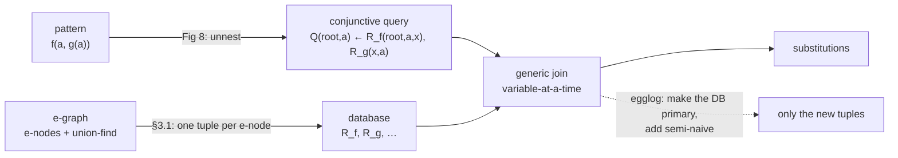

# Topic 44 — E-graphs as a Database: Relational E-matching & egglog

Topic 21 built the e-graph and measured the thing it repairs: a
hand-ordered rewriter that answers `(a*2)/2` with `(a << 1) / 2` and
stops. This topic is the sequel, and it belongs in a database course
rather than a compilers one — because the fix for the *next* bottleneck
turned out to be ours. E-matching, which the egg paper measured at
**60–90% of equality saturation's run time** (POPL'22 §1, citing
Willsey et al.), is a **conjunctive query**. The e-graph is a database.
The pattern is a query. The right algorithm was published in the
database literature and is called **generic join**.

Then egglog (PLDI'23) took the last step: stop maintaining an e-graph
that gets copied into a database whenever you want to match, and make
the database the primary structure — with Datalog's semi-naive
evaluation on top, so an iteration only looks at what changed.



## The problem, measured (bench lane 1, provided — runs today)

`cargo run --release --bin ematch_bench` — the e-graph of POPL'22
Figure 2 (N constants, one e-class of `g(1)..g(N)`, one e-class of
`f(1,i_g)..f(N,i_g)`, so **3N e-nodes** standing for **N² + 2N terms**),
matched against `f(a, g(a))` two ways: egg's backtracking VM, and the
same pattern compiled to a conjunctive query and run with generic join.

```
-- lane 1: f(a, g(a)) — one equality constraint, N matches --
   Q(?0, a) <- R_f(?0, a, ?1), R_g(?1, a)
   variable ordering: [a, ?1, ?0]

      N   e-nodes     matches     bt visits        bt µs     gj probes   index µs      gj µs   speedup
    100       300         100         10101        137.9           500       71.7       24.8     1.43x
    200       600         200         40201        398.9          1000      101.8       39.0     2.83x
    400      1200         400        160401       1119.8          2000       92.4       37.2     8.64x
    800      2400         800        640801       2586.1          4000      180.4       85.0     9.75x
   1600      4800        1600       2561601      10152.5          8000      322.4      145.0    21.72x
```

**There are N matches and the backtracking matcher does N² + N + 1 units
of work to find them** — 2,561,601 at N = 1600, against 1600 answers.
The join does 5N: 8,000. Both columns are exact, not approximate; the
generators are seeded and the counters count the same unit (one e-node
stepped over, or one key looked at in an intersection).

The reason is the whole topic in one line. The pattern `f(a, g(a))`
carries two kinds of constraint, and backtracking can only use one of
them early:

- a **structural constraint** — the root is an `f`, its second child is
  a `g` — which is about the *shape* of the pattern;
- an **equality constraint** — both occurrences of `a` must land in the
  same e-class — which backtracking cannot check until it has walked far
  enough to bind both, i.e. after it has already built the candidate.

So the walk enumerates every `f(i, g(j))` and throws away the N² − N
pairs where `i ≠ j`. The relational view has no such distinction:
after unnesting, `a` is simply a variable occurring in two atoms, which
is to say a **join key**, and a join algorithm's entire job is to not
enumerate the non-matching pairs.

## When the join loses (same lane, second table)

```
-- lane 1: f(a, g(b)) — linear pattern, N^2 matches --
   Q(?0, a, b) <- R_f(?0, a, ?1), R_g(?1, b)
   variable ordering: [?1, ?0, a, b]

      N   e-nodes     matches     bt visits        bt µs     gj probes   index µs      gj µs   speedup
    100       300       10000         10101         29.2         10103       12.8       48.4     0.48x
    400      1200      160000        160401        423.4        160403       41.9      714.7     0.56x
   1600      4800     2560000       2561601       6476.3       2561603      175.9    11290.4     0.56x
```

Rename the second `a` to `b` and the pattern becomes **linear** — no
variable occurs twice, so there is no equality constraint left to
exploit. Now every candidate the walk builds *is* a match: N² work for
N² answers, which is optimal, and the join has nothing to win. It does
the same N² + N + 3 probes, pays for a trie it did not need, and comes
out **1.8× slower**.

This is not a defect in the implementation; it is the shape of the
result, and the paper reports it too. POPL'22 Table 1's "Worst" column
is **0.03** in the `+ math 8,205` row — that is, with index building
charged, there was a pattern on which their generic join came out
**33× slower** than egg's matcher. §5.2 says why in one sentence — "Speedup tends to be greater when the output
size is smaller". A dense output means backtracking wastes nothing.
The technique's win is *avoided* work, so where there is no waste there
is no win.

Keep both tables in view. The interesting engineering question is never
"is generic join faster" but "how much of this query's candidate space
is thrown away", and that is a property of the pattern and the data.

## Step 1 — the e-graph is already a database

POPL'22 §3.1: every e-node with symbol `f` and arity k becomes one tuple
of a relation `R_f` of arity k+1 — the e-class id that contains it,
then its children, all canonicalised through the union-find.

```
   e-graph (Figure 2)                 database
   ─────────────────                  ────────
                                      R_f: | id  | arg1 | arg2 |      R_g: | id  | arg1 |
   i_f: { f(1,i_g) … f(N,i_g) }             | i_f |  1   | i_g  |            | i_g |  1   |
   i_g: { g(1)    … g(N)     }             | i_f |  2   | i_g  |            | i_g |  2   |
   1..N: { 1 } … { N }                     |  …  |  …   |  …   |            |  …  |  …   |
                                            | i_f |  N   | i_g  |            | i_g |  N   |
```

Nothing is invented in the translation: the e-graph's own invariant
("no two e-nodes with the same symbol and children") is a **functional
dependency** from the children columns to the id column (§4.3), and
canonical ids are why nested patterns join directly on the auxiliary
variable instead of needing an extra join against the equivalence
relation (§3.2).

## Step 2 — the pattern is a conjunctive query

Figure 8's `Aux` gives every non-variable subpattern a fresh variable
and emits one atom for it:

```
   Aux(f(p1..pk)) = v ~ R_f(v, v1..vk), A1..Ak     where Aux(pi) = vi ~ Ai
   Aux(x)         = x ~ []                        (a variable is itself)

   f(a, g(a))  ⇒  Q(root, a) ← R_f(root, a, x), R_g(x, a)
```

`x` is the structural constraint ("the second child is a `g`-class") and
`a` is the equality constraint ("both positions are the same class").
In the query they are the same kind of thing — a variable shared by two
atoms — which is precisely why one algorithm can exploit both. This is
also why **multi-patterns are free** (§1): several patterns sharing
variables is just more atoms in one body, and lane 3's triangle is
exactly that.

## Step 3 — generic join, and why it is variable-at-a-time

A binary-join plan processes two relations at a time and materialises an
intermediate. Generic join (Algorithm 1, from Ngo et al.) processes one
*variable* at a time: intersect the values every atom allows for it,
then recurse.

```
   for a ∈ R_f.arg1 ∩ R_g.arg1          ← the equality constraint, up front
       for x ∈ R_f(_, a, x).x ∩ R_g(x, a).x
           for root ∈ R_f(root, a, x).root
               output (root, a)
```

Two requirements make the bound hold (§2.3): the intersection must cost
`O(min_j |R_j.x|)` — iterate the smallest set, probe the others — and a
residual relation like `R_f(v, y)` must be reachable in constant time,
which is what the **trie** index buys (Figure 5). Our
`relational.rs::gj` does both, and the 5N in the table is the receipt:
2N to intersect `a`, 2N for `x`, N for `root`.

The payoff is a bound no backtracking algorithm has: run time linear in
the **AGM bound** of the query, the tight worst-case output size derived
from a fractional edge cover of the query hypergraph. For the triangle
query with |R| = |S| = |T| = M, the AGM bound is M^1.5 while a binary
plan's intermediate can reach M² — lane 3's exercise.

## Step 4 — the loop, and the tuples it should not look at again

Equality saturation runs the same queries against a database that only
grows. Naive evaluation re-derives every old match on every iteration;
**semi-naive** evaluation expands each rule into one *delta rule* per
body atom, ranging that atom over the new tuples and the rest over
everything (PLDI'23 §4.3, Algorithm 1):

```
   A :- A₁, …, A_m      ⇒      A :- A₁, …, ΔA_j, …, A_m      for each j
```

Lane 2 prices the version we do not want:

```
-- lane 2: one more iteration of saturation — re-derive, or take the delta --
   e-graph 60000 tuples + delta of 24 tuples (8 new constants)

    evaluation     matches        probes         µs
         naive       20008        100040    11004.8
    semi-naive        STUB             -          -
```

Twenty-four new tuples arrived and the naive iteration re-derived
**20,008 matches** at a cost of 100,040 probes. Eight of those matches
were new. That ratio is the PLDI'23 microbenchmark in miniature: §5.3
measures egglog against egg on the `math` suite for 100 iterations and
reports **3.34×** for the non-incremental egglog (better joins alone)
and **9.27×** with semi-naive turned on.

The mechanism in the real system is a column. Every row carries a
timestamp, and a delta rule is the same cached plan with one extra
constraint (`core-relations/src/query.rs:252`):

> "an egglog rule is compiled once into a `CachedPlan` and then added to
> a fresh `RuleSet` each iteration with timestamp constraints (e.g.
> `GeConst` on the focus atom) that select only new tuples."

If you have read topic 4, you have met this before: a monotonically
increasing sequence number per row, and readers that ask for "everything
since". `GeConst` is a range predicate over a sorted column.

## Production shape — egglog's `core-relations`

egglog is no longer "an e-graph library with a query engine bolted on".
Read the crate list and it is a database: tables with sorted writes,
hash indexes, a query planner, an execution engine, a union-find.
Anchors are `egraphs-good/egglog` at the commit pinned in
`resources/codebases.md`.

| piece | where | what to notice |
|---|---|---|
| query planner | `core-relations/src/free_join/plan.rs:1-45` | two phases: **hypertree decomposition** (variable elimination with a min-fill heuristic, Yannakakis-style bags) then per-bag join planning |
| plan strategies | `plan.rs:32-38` | `PlanStrategy::Gj` is textbook generic join; `PureSize`/`MinCover` are **Free Join**, which "degenerates to a hash join" when a cover is a whole atom |
| the table | `core-relations/src/table/mod.rs:1-5` | "timestamp" and "merge function" are deliberately *outside* the table: it is a general sorted-write table, and the e-graph semantics live above it |
| semi-naive | `core-relations/src/query.rs:252-256` | one cached plan + a `GeConst` timestamp constraint per iteration |
| union-find | `union-find/src/lib.rs:1-12` | **union by min id**, not by rank — chosen to perturb fewer ids during congruence closure, and the crate says outright that it gives up the textbook asymptotics |

That last row is the one to sit with. Two independent implementations
(egg's `unionfind.rs`, egglog's `union-find`) both decline the textbook
optimisation, for reasons that only exist because this union-find is
inside an e-graph.

## Reading guides

1. [reading-relational-ematching.md](reading-relational-ematching.md) — POPL'22: e-matching is a conjunctive query, and generic join answers it in worst-case optimal time.
2. [reading-egglog-pldi23.md](reading-egglog-pldi23.md) — PLDI'23: Datalog ∪ equality saturation, `:merge` as a lattice, and semi-naive evaluation over a congruence.
3. [reading-egglog-source.md](reading-egglog-source.md) — the implementation: tables, timestamps, the planner's two phases, and rebuilding as a query.
4. [reading-free-join.md](reading-free-join.md) — SIGMOD'23: why worst-case optimal joins lost to binary joins in practice, and the plan space that contains both.

## Experiments

```
cd experiments
cargo test              # 6 provided tests pass; 4 fix the contract for your stubs
cargo run --release --bin ematch_bench
```

- `egraph.rs` (PROVIDED) — union-find, hashcons, e-class map, rebuild to
  fixpoint. Small enough to read in one sitting, which is the point:
  both matchers work on the same visible structure.
- `pattern.rs` (PROVIDED) — Figure 8's unnesting, `Pat` → `Query`.
- `backtrack.rs` (PROVIDED) — egg's `Bind`/`Compare`/`Scan` VM, with
  the op index, so the baseline is a real strategy and not a strawman.
- `relational.rs` (PROVIDED) — e-graph → tables, trie indexes,
  most-constrained-first variable ordering, generic join.
- `semi_naive.rs` (stub, lane 2) — `delta_matches`: the m delta rules,
  and the deduplication they require.
- `binary_join.rs` (stub, lane 3) — a left-deep hash-join plan for the
  triangle multi-pattern, reporting its largest intermediate.

Lane 3 today (generic join only; the binary-join column is your stub):

```
      V       E     matches     gj probes      gj µs bj intermediate     bj probes      bj µs
    200    1000         129         10155       94.0            STUB             -          -
    400    2000         123         20163      198.3            STUB             -          -
    800    4000         123         39865      353.8            STUB             -          -
   1600    8000         138         79416      839.5            STUB             -          -
```

Note what the generator does: edges scale with vertices, so the answer
size does not move while the graph grows 8×. For a uniform random
directed graph on V vertices with E edges, the expected number of
3-cycles is `E³/3V³`, and each is reported three times (once per
rotation), so the expected match count is `(E/V)³` — **125** for every
row here, against a measured 123–138. Generic join's work grows
linearly in E and the answer does not grow at all.

The column you are going to fill is the one that makes the point. A
binary plan must first join two edge relations on `y`, materialising
`Σ_v indeg(v)·outdeg(v)` tuples — about `E²/V` for this generator, so
roughly **40,000** at the last row, to return 138 answers. That is an
arithmetic estimate from the generator, not a measurement; lane 3 turns
it into one.

## Exercises

1. Implement both stubs until all 10 tests pass and lanes 2–3 print.
2. **Find the crossover.** Lane 1's two patterns are the extremes. Build
   an e-graph where `f(a, g(a))` has a *tunable* match density (make
   only a fraction p of the `f` e-nodes agree with a `g` child) and
   sweep p. At what selectivity does generic join stop paying? Compare
   your answer with POPL'22 §5.2's explanation.
3. **The ordering is the plan.** `relational::plan` is one heuristic.
   Force the reverse ordering and re-run lane 1: any ordering is still
   worst-case optimal, so what exactly got worse, and by how much?
4. **Index amortisation.** The `index µs` column is charged on every
   call. In a saturation loop it would not be. Cache the tries across
   iterations, invalidate only the relations that changed, and re-run
   lane 2 — this is the difference between POPL'22's `+`/`−` rows in
   Table 1, and the reason egglog stopped copying the e-graph into a
   database at all.
5. **Congruence as a rule.** Rebuilding is congruence closure; in a
   relational engine it is a query: `R_f(i, x), R_f(j, x) ⇒ i = j` for
   a unary `f`. Write it as a rule over your database, run it to
   fixpoint, and check it agrees with `EGraph::rebuild`. Then measure
   which is faster on the Figure 2 graph, and say why.
6. **Free Join by hand.** For the triangle query, write the plan that
   uses one atom as a *cover* and probes the other two (SIGMOD'23 §4),
   and compare its probe count with both generic join and your binary
   plan. Which of the three is worst-case optimal, and which is fastest
   here?

## Cross-topic threads

- **Topic 21 → 44.** Topic 21's `eqsat_bench` shows *why* an e-graph;
  this topic shows what it costs to search one. The `Bind`/`Compare` VM
  measured here is the same `machine.rs` that guide reads.
- **Topic 10 / 11 ↔ 44.** Join ordering, cardinality-driven plan choice,
  hash join build/probe, worst-case optimal joins: the entire content of
  this topic is topic 10's optimizer and topic 11's operators, applied
  to a workload that is not SQL. `plan.rs`'s min-fill variable
  elimination is a join-order search with a different objective.
- **Topic 27 (streaming / IVM) ↔ 44.** Semi-naive evaluation *is*
  incremental view maintenance for a monotone query, and the delta rules
  are the same expansion DBSP derives for a join. Different literature,
  identical algebra.
- **Topic 4 (LSM) ↔ 44.** Row timestamps + `GeConst` = sequence numbers
  + "everything since". Deferred rebuilding = deferred compaction.
- **Topic 13 (graph engines) ↔ 44.** Lane 3's triangle query is the
  triangle count from topic 24, run by the join engine instead of by a
  graph kernel. The AGM bound is the reason a graph database and a
  relational one converge on the same algorithm here.
- **Topic 16 (testing) ↔ 44.** An e-graph saturated over sound rewrite
  rules is a generator of provably equivalent queries — which is an
  oracle. See the metamorphic testing table in topic 16.

## Capstone M44 — the rewrite stage, priced

- [ ] Replace the capstone planner's hand-ordered rewrite pass with an
      e-graph stage, and match its patterns relationally rather than by
      walking. Report both: plan cost against the hand-ordered pass, and
      match time against a backtracking matcher.
- [ ] Timestamp the e-node table and run the saturation loop
      semi-naively. Measure iterations-to-saturation and total probes
      against the naive loop, on the same rule set.
- [ ] One cyclic pattern in the rule set (a join-shaped rewrite over
      three atoms), with the binary-join plan measured next to generic
      join so the AGM bound is not a claim but a column.
